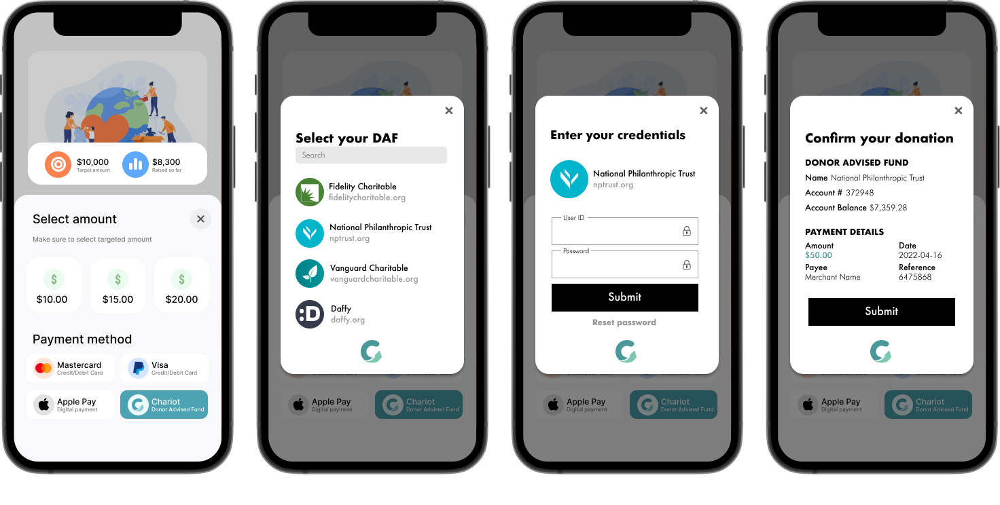
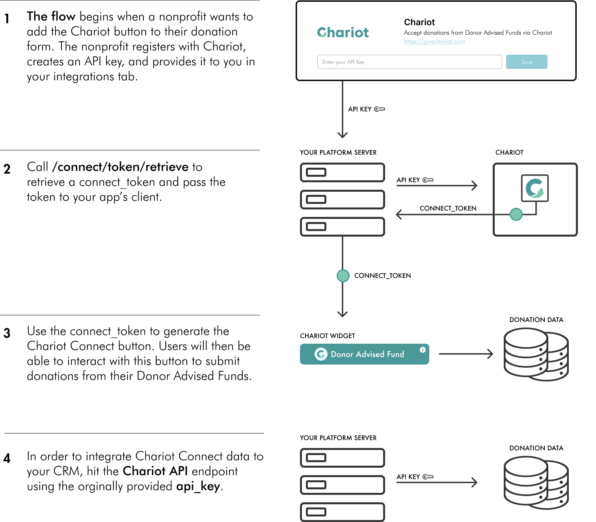

# Chariot Connect

## Introduction

Chariot Connect is the client-side component that your users will interact with in order to initiate grant recommendations from their Donor Advised Funds. 

Chariot Connect will handle credential validation, multi-factor authentication, and error handling for each Donor Advised Fund that we support. Connect works across all modern browsers and platforms. 

## Initialization

Chariot Connect is initialized by passing a **connect_token** to Connect's configuration. This token is generated by calling the [/connect/token/retreive](ref:get-connect_token) endpoint. Additionally, onSuccess and onExit callback functions can be set to handle successful and unsuccessful donation attempts. For more information, see [Integrating Connect](doc:connect-for-web).

## Connect flow overview

The diagram below shows a model of how Chariot Connect is initialized using a connect_token.  It then shows how to retrieve the data the button generated by calling the Connect API.  
  

