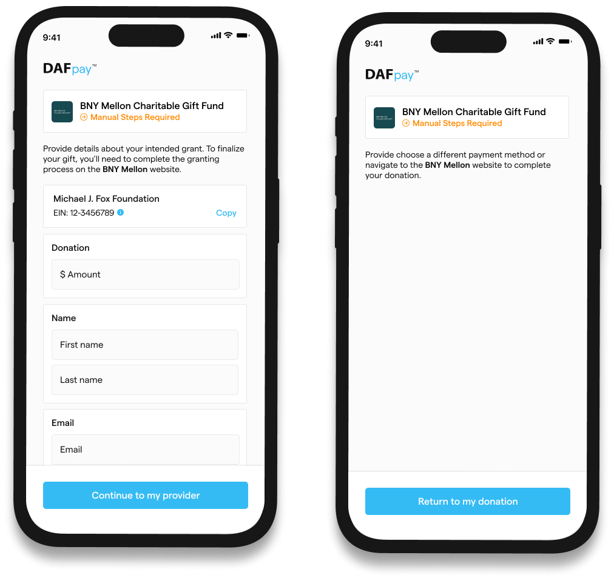
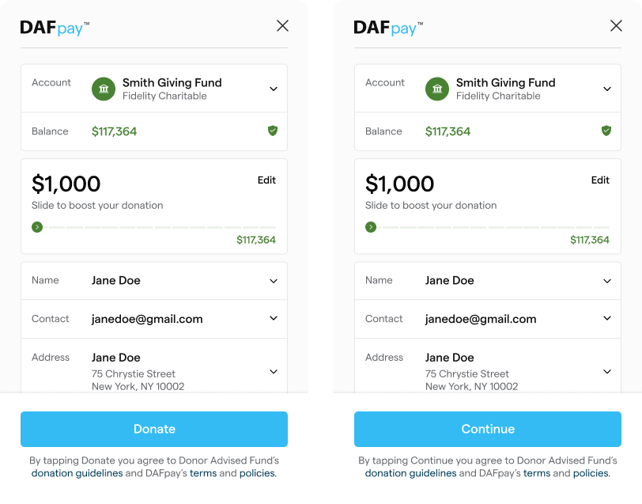

Chariot allows for a couple of workflow configurations. To change any of the default configurations, please email [contact@givechariot.com](mailto:contact@givechariot.com)

### Disable unintegrated grant submissions

If a user selects an unintegrated DAF, the workflow can be configured to prompt closing the modal and selecting another payment option (see image above). This option is typically chosen if users prefer to avoid redirection away from the page to complete the gift elsewhere.

### Donate versus Continue

In the final pane of the workflow, the call-to-action button can be configured to show "Continue" instead of "Donate" (refer to the image above). Those preferring their users to input additional information after the Connect experience choose to alter the button to "Continue".

### Autofill Donor Information

The Chariot Connect modal has the ability to pull information about the donor from their account with the DAF provider. If this feature is enabled, the donor information will be pre-populated in the last pane of the workflow as long as no donor information was passed into Connect via the `onDonationRequest` callback. The user always has the ability to review their information and make changes before submission. This allows for "one-click" checkout experiences and removes the need for a donor to fill out a lengthy form before making a DAF donation.

Chariot makes no guarantee on the completeness or consistency of the information fetched from the donor's DAF account and serves purely as a convenience feature for donors to expedite the donation experience. In general, Chariot supports fetching donor name, email, and address information. If you require certain information from donors, you will likely need to use the "Continue" flow mentioned above and you can analyze the donor data passed back from the `CHARIOT_SUCCESS` callback and determine if more information is needed before creating the Grant and finalizing the donation.

