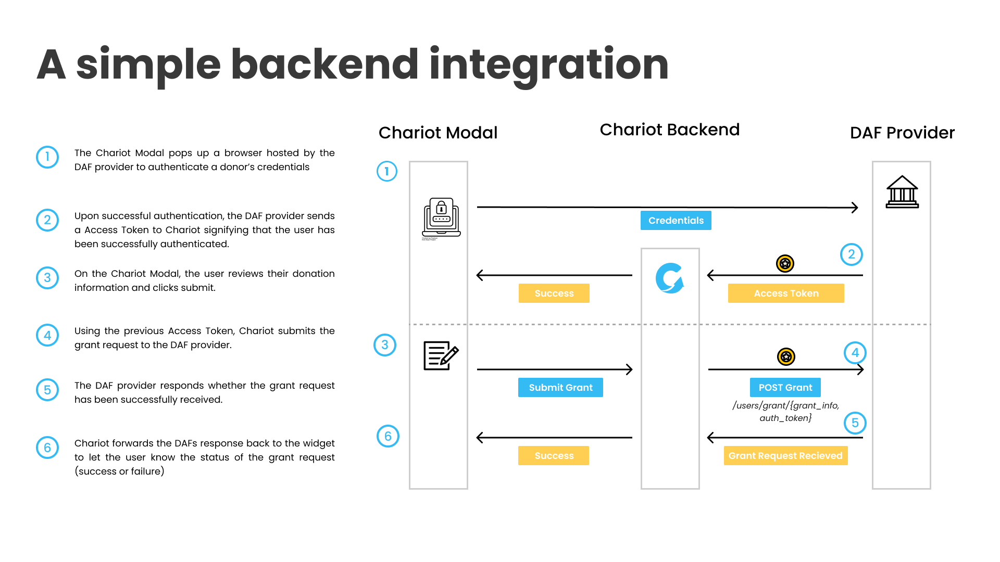

### Workflow

1. Chariot’s server returns an ***Authorize URL*** which launches in a popup window when the user continues to sign in. Chariot redirects the donor to the identity provider via the ***Authorize URL*** for authentication and sign-in.
2. If verification is successful, the identity provider generates a token which it sends in the request (either as the payload or query parameters) to the configured Chariot ***Callback URL***.
3. The donor returns to the Chariot flow where they now can see information about their DAF Provider account including name and balance on the account. The donor reviews the information and clicks submit.
4. Chariot submits a grant request using the Access Token from step 2
5. The DAF provider responds with the status of the grant request
6. The Chariot Modal displays the DAF response to the user to let them know the status of the grant (success or failure)

### Estimated Timeline

This depends highly on the current authentication and authorization schemes for your DAF. If you already uses Okta or Auth0 for Authentication and/or Authorization, integration should require one engineer for around 3 days. 

Chariot will need 2 weeks to build and test the integration.