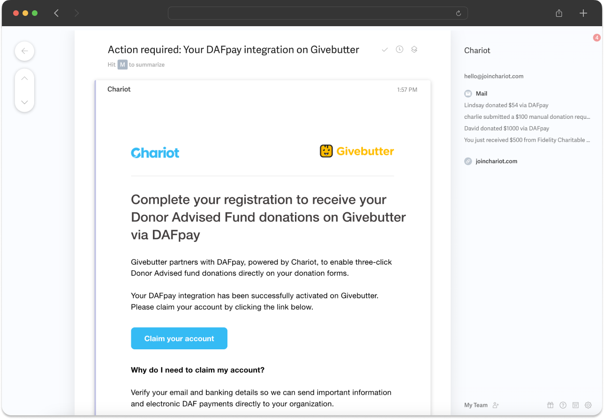

<Steps>

###  Register Nonprofit via API

- [Create Nonprofit](/api/nonprofits/create): Call this route to create a nonprofit organization in our system using the organization’s EIN and email address
    - *Ensure the email address provided is unique to the nonprofit and not a generic support email (e.g., support@platform.com). This email will be used for important messaging related to the nonprofit’s Chariot account.*
- [Create Connect](/api/connects/create): After creating the nonprofit, call this route using the `nonprofitId` to generate a Connect record, which will allow you to enable the DAFpay button on the nonprofit’s donation form.
    - You only need to call this route once, save down the CID, which will allow you to render the DAFpay button

### Claim Chariot Account
    - Upon calling the [Create Connect](/api/connects/create) route, Chariot will automatically email the nonprofit (using the email provided during nonprofit creation) with instructions on how to claim their Chariot account.
    - Article: [Claiming your account with Chariot](https://intercom.help/givechariot/en/articles/9141609-claiming-your-account-with-chariot)

<Note>
*If a nonprofit has not claimed their account with Chariot, they will still be able to receive donations via DAFpay.
However, the funds will be sent via the [DAFpay Network](https://www.dafpaynetwork.org/).
See flow of funds guide in [Manage Transactions](/manage-transactions).*
</Note>

<Frame caption="Claim account email from Chariot">
    
</Frame>

### Check Account Status

    - Use the `claimed` boolean property from the `Nonprofit` object to check whether the nonprofit has claimed their account with Chariot.
        <Tip>
            *If claimed = false, consider rendering an action-required banner on your platform’s portal to remind the nonprofit that they still need to claim their Chariot account.*
        </Tip>

</Steps>
