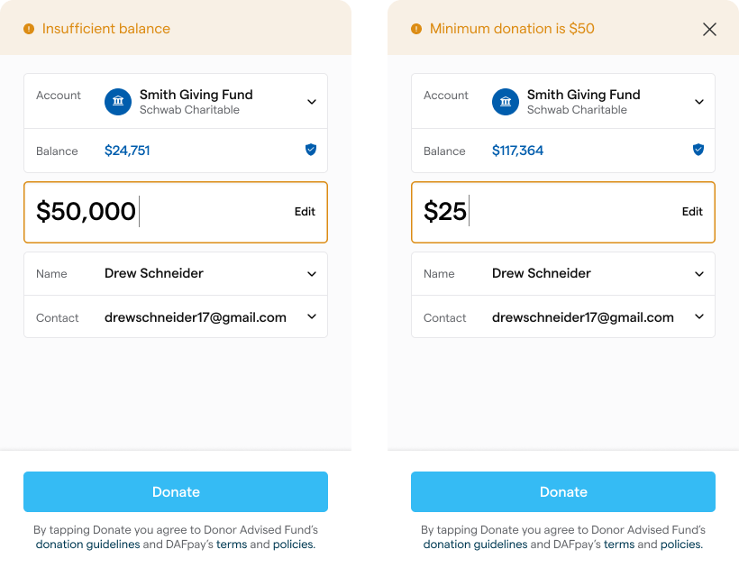
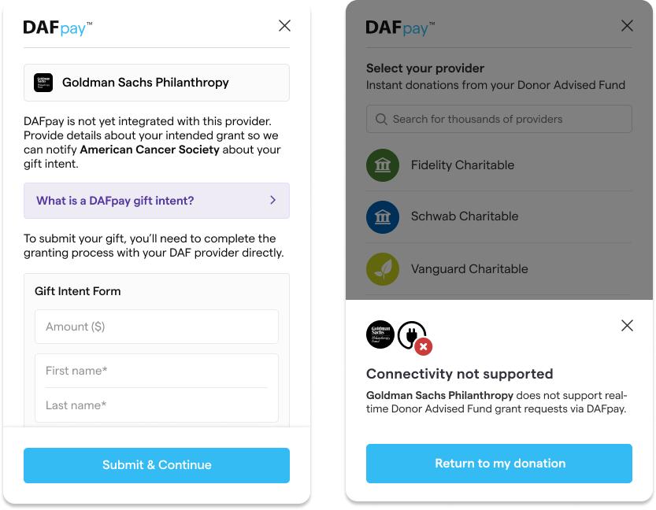

## Collecting Donor Data
Chariot offers two ways of processing donor data.

### Express Checkout
Chariot offers "express checkout" where the Chariot Connect modal pulls the donor's name, email, and address information from their account with the DAF provider. This allows for "one-click" checkout experiences and removes the need for a donor to fill out a lengthy form before making a DAF donation.

 If this feature is enabled, the donor information will be pre-populated in the last pane of the workflow as long as **NO** donor information was passed into Connect via the `onDonationRequest` callback.

The user always has the ability to review their information and make changes before submission. Chariot makes no guarantee on the completeness or consistency of the information fetched from the donor's DAF account and serves purely as a convenience feature for donors to expedite the donation experience.

### Pre-populate Data
Alternatively, you can pass donor information to Chariot before launching a Connect session.
To provide this information, leverage the `onDonationRequest` function from the Chariot element.

You can use metadata if you want to associate the payment or session with any data in your system.

<CodeBlocks>
```javascript JavaScript
// get the element from the DOM
const chariot = document.getElementById("chariot")

// provide a callback that returns the donation data
chariot.onDonationRequest(async () => {
  return {
    amount: 25000, //this is $250.00 USD
    firstName: "Michael",
    lastName: "Scott",
    email: "michaelScott@theoffice.com",
    address: {
      line1: "123 Main St",
      line2: "Suite 4",
      city: "New York",
      state: "NY",
      postalCode: "12345"
    },
    designation: "My Special Designation",
    metadata: {
      fundraiserTag: "marathon"
    },
  }
})
```
```javascript React
import React, { useState } from 'react';
import ChariotConnect from 'react-chariot-connect';

const App = () => {
    const onDonationRequest = () => {
        return {
            amount: 25000, //this is $250.00 USD
            firstName: "Michael",
            lastName: "Scott",
            email: "michaelScott@theoffice.com",
            metadata: {
                fundraiserTag: "marathon"
            },
        }
    }

    return (
        <div>
            <ChariotConnect
                cid="GENERATED_CONNECT_IDENTIFIER"
                onDonationRequest={onDonationRequest}
            />
        </div>
    );
};
```
</CodeBlocks>

The given donation data must match the following schema to be accepted by Chariot:

| Parameter   | Description                                                                                                                                                                                                                                           | Type              |
|-------------|-------------------------------------------------------------------------------------------------------------------------------------------------------------------------------------------------------------------------------------------------------|-------------------|
| amount      | The donation amount in cents. e.g., for a $20 donation, enter 2000.  <br /><br />If this value is not passed in, Chariot will use the user's account balance to recommend a donation amount. This can lead to significantly larger donation amounts.  | number (optional) |
| firstName   | The donor's first name                                                                                                                                                                                                                                | string (optional) |
| lastName    | The donor's last name                                                                                                                                                                                                                                 | string (optional) |
| email       | The donor's email address. Must be in email format                                                                                                                                                                                                    | string (optional) |
| phone       | The donor's phone number. Please provide the phone number with the country code and without special characters                                                                                                                                        | string (optional) |
| note        | A note the donor wants to send to the nonprofit                                                                                                                                                                                                       | string (optional) |
| anonymous   | Indicates if this donation should be sent anonymously (default: false)                                                                                                                                                                                | boolean (optional)|
| designation | The designation to include on the grant. If this is left blank, "Where needed most" will be used. Note that including a custom designation may cause the grant approval process to take longer. Designations over 100 characters will be truncated.   | string (optional) |
| address     | The donor's address: line1, line2, city, state, postalCode                                                                                                                                                                                            | object (optional) |
| metadata    | An object with a set of name-value pairs. You can use this object to include any miscellaneous information you want to tie to the workflow session.                                                                                                   | object (optional) |
| fundId      | The ID of the preselected DAF provider. <br /><br /> If this value is provided, the donor will not be shown the default DAF dropdown and will instead be taken straight to that DAF's login.                                                          | string (optional) |
| frequency   | The recurring frequency of the DAF grant (if it's a recurring gift). This parameter allows the following possible enum values: `ONE_TIME`, `MONTHLY`. If not provided, the grant will default to a `ONE_TIME` grant. For more information on recurring donations, please see the [section below](#recurring-donations-beta) | string (optional) |

To prevent Connect from initiating until form validation is performed, passing `false` to the onDonationRequest will stop the button from launching.


## Capturing Grant Intents
When a user completes a Chariot Connect session you will receive a grant intent.
After you submit your own donation form, don't forget to call the [Create Grant](/api-reference/grants/create) API to complete the transaction.

Most workflows proceed as follows:

1. Listen for the `CHARIOT_SUCCESS` event to receive the grant intent after a Chariot Connect session.
   1. If you would like to collect any additional information from the user such as additional contact information you can do so at this step. If the Chariot Connect session is the last step in your donation form this is not necessary.
2. Submit your own donation form before converting the grant intent into a completed grant.
3. Have your backend call Chariot's [Create Grant](/api-reference/grants/create) API to complete the grant (and capture the grant intent).

<Note>
  Submitting your own donation form before capturing the grant ensures consistency between your systems and Chariot.
</Note>

<CodeBlocks>
```javascript JavaScript
// get the element from the DOM
const chariot = document.getElementById('chariot');

chariot.addEventListener('CHARIOT_SUCCESS', ({ detail }) => {
    // Record the grant intent information so that you can
    // capture the transaction once your form is submitted.
});
```
```javascript React
import React, { useState } from 'react';
import ChariotConnect from 'react-chariot-connect';

const App = () => {
  const onSuccess = (r) => {
		// Record the grant intent information so that you can
    // complete the transaction once your form is submitted.
  };
  const onExit = (e) => console.log('exit', e);
  const onDonationRequest = () => {
    // your logic
  }

  return (
    <div>
        <ChariotConnect
          cid="GENERATED_CONNECT_IDENTIFIER"
          onDonationRequest={onDonationRequest}
          onSuccess={onSuccess}
          onExit={onExit}
        />
    </div>
  );
};
```
</CodeBlocks>

### Response Objects

<CodeBlocks>
```json onSuccessMetadata
  {
    "workflowSessionId":"79e772be-547d-4c9c-8b76-4ac4ed4c441a", //Id of the Connect session
    "grantIntent": {
      "userFriendlyId": "100020", //The user-friendly identifier for the grant intent
      "fundId": "bbf485dd-a056-4a9d-89a8-06e201cdbf7f", //Id of the donor advised fund
      "amount": 2000, //The grant amount expressed in units of cents; USD only
      "metadata": {} // The same metadata object that was passed in the onDonationRequest callback referenced above
    }
  }
```

```json onExitMetadata
  {
    "workflowSessionId": "79e772be-547d-4c9c-8b76-4ac4ed4c441a", // Id of the Connect workflow session.
    "nodeId": "consent-node-id", // The id representing the pane where the user exited the Connect flow.
    "fundId": "bbf485dd-a056-4a9d-89a8-06e201cdbf7f", // The id of the donor advised fund that the user selected.
    "reason": "USER_EXIT", // An enum giving a reason to why the modal exited.
    "description": "User exited the flow" // A human readable string containing a brief sentence explaining the exit reason.
  }
```
</CodeBlocks>

| Event Name         | Description                                                                                                                                                                                                                                                                               | Metadata Type         |
|--------------------|-------------------------------------------------------------------------------------------------------------------------------------------------------------------------------------------------------------------------------------------------------------------------------------------|-----------------------|
| `CHARIOT_INIT`     | The init event is called when the Chariot Connect script is initialized and ready to be run. This is useful to be able to know when Chariot Connect is initialized and ready to be used.                                                                                                   | No metadata is provided for this event. |
| `CHARIOT_SUCCESS`  | The success event contains a final summary of the Connect workflow session. It contains the workflow session id and relevant donation information.  <br /><br />Once you receive the success event don't forget to complete the transaction by calling the [Create Grant](/api-reference/grants/create) or [Create Recurring Grant](/api-reference/grants/create-recurring-grant) route based on the grant intent data. | `OnSuccessMetadata`   |
| `CHARIOT_EXIT`     | The exit event is called when a user exits without successfully completing the flow, when an error occurs during the flow, or when a user confirms an unintegrated grant.                                                                                                                  | `OnExitMetadata`      |

#### Exit Reasons

| Exit Reason                | Description                                                                                                                                                                                                                   |
|----------------------------|-------------------------------------------------------------------------------------------------------------------------------------------------------------------------------------------------------------------------------|
| `USER_EXIT`                | User exited the flow.                                                                                                                                                                                                         |
| `UNINTEGRATED_DAF`         | DAF is not integrated with Chariot.                                                                                                                                                                                           |
| `UNINTEGRATED_GRANT_CONFIRMED` | Unintegrated grant confirmed with Chariot.                                                                                                                                                                                  |
| `CID_NOT_FOUND`            | Connect Identifier is not found.                                                                                                                                                                                              |
| `INELIGIBLE_ORGANIZATION`   | This Organization is not eligible to receive DAF donations.                                                                                                                                                                   |
| `CREDENTIALS_ERROR`        | Invalid credentials.                                                                                                                                                                                                          |
| `INVALID_CARD`             | Invalid card number.                                                                                                                                                                                                          |
| `TFA_ERROR`                | Two-factor authentication error.                                                                                                                                                                                              |
| `ZERO_AMOUNT`              | Grant amount is zero.                                                                                                                                                                                                         |
| `SERVICE_DEACTIVATED`      | Nonprofit's Connect is deactivated (active = false).                                                                                                                                                                          |
| `ACCESS_RESTRICTED`        | User's DAF sponsor account electronic access is restricted.                                                                                                                                                                    |
| `EIN_NOT_FOUND`            | DAF sponsor does not support grants to the Nonprofit.                                                                                                                                                                          |
| `CONNECTION_FAILED`        | Connection to the DAF sponsor failed.                                                                                                                                                                                          |
| `SESSION_NOT_FOUND`        | User session is not found and may have expired.                                                                                                                                                                                |
| `CUSTOM_ERROR`             | Custom error.                                                                                                                                                                                                                 |
| `INTERNAL_ERROR`           | Internal error.                                                                                                                                                                                                               |
| `INSTITUTION_DOWN_ERROR`   | DAF sponsor institution is down; user should try again later.                                                                                                                                                                  |
| `NO_CHARITABLE_ACCOUNTS`   | Donor has no charitable accounts in the logged in account.                                                                                                                                                                      |
| `INVALID_PRESELECTED_DAF`  | Preselected DAF is invalid.                                                                                                                                                                                                   |
| `INACTIVE_CARD`            | Inactive card.                                                                                                                                                                                                                |
| `RECURRING_NOT_SUPPORTED`  | Recurring grants are not supported by this DAF
| `UNINTEGRATED_DAF_NOT_SUPPORTED` | Unintegrated DAF is not supported by DAFpay

### Donation Amount Changes

If a donor tries to submit a grant request for an amount that exceeds their current account balance, Connect will alert the donor and suggest the donor to adjust the donation amount to the available account balance.

Additionally, if a Donor Advised Fund platform has a minimum donation requirement, Connect will alert donors of this requirement and suggest the donor to alter the donation size to match the minimum threshold for submission.



## Recurring Donations
Recurring donations are a powerful way to generate consistent revenue streams for nonprofits and they make up a large majority of the DAF grants that are distributed to charity each year. Chariot enables a donor to not only initiate a one-time grant, but also allows donors to initiate `MONTHLY` recurring grants through their Donor Advised Fund. 

A recurring donation via DAFpay indicates that the donation was initiated on a monthly recurring basis. The actual recurrence is managed through the DAF provider so if the donor wants to cancel the recurrence they log into their DAF provider portal and cancel it there. As a result, we are not aware when a recurrence is canceled so we do not create a new grant each month in our system. 

When a user completes a Chariot Connect session for a recurring donation, instead of receiving a `grantIntent` as part of the `CHARIOT_SUCCESS` event, you will receive a `recurringGrantIntent`.

<CodeBlocks>
```json onSuccessMetadata
  {
    "workflowSessionId":"79e772be-547d-4c9c-8b76-4ac4ed4c441a", //Id of the Connect session
    "recurringGrantIntent": {
      "userFriendlyId": "100020", //The user-friendly identifier for the grant intent
      "fundId": "bbf485dd-a056-4a9d-89a8-06e201cdbf7f", //Id of the donor advised fund
      "amount": 2000, //The grant amount expressed in units of cents; USD only
      "frequency": "MONTHLY", // The frequency of the recurring schedule for the donation
      "metadata": {} // The same metadata object that was passed in the onDonationRequest callback referenced above
    }
  }
```

```json onExitMetadata
  {
    "workflowSessionId": "79e772be-547d-4c9c-8b76-4ac4ed4c441a", // Id of the Connect workflow session.
    "nodeId": "consent-node-id", // The id representing the pane where the user exited the Connect flow.
    "fundId": "bbf485dd-a056-4a9d-89a8-06e201cdbf7f", // The id of the donor advised fund that the user selected.
    "reason": "USER_EXIT", // An enum giving a reason to why the modal exited.
    "description": "User exited the flow" // A human readable string containing a brief sentence explaining the exit reason.
  }
```

</CodeBlocks>

After you submit your own donation form, don't forget to call the [Create Recurring Grant](/api-reference/grants/create-recurring-grant) API to complete the transaction.

<Note>
Note that if your platform enables recurring donations through Chariot, you will need to differentiate which of Chariot's APIs you use to capture the donation based on the information of the `CHARIOT_SUCCESS` event.
</Note>

## Unintegrated DAF Providers
Chariot offers two workflows for unintegrated DAF Providers
1. User is prompted to enter dontation data and redirected to DAF provider site (left)
2. User is prompted to close modal and select another payment option (right).

Please let the Chariot team know which option you would like implement in your DAfpay integration.

