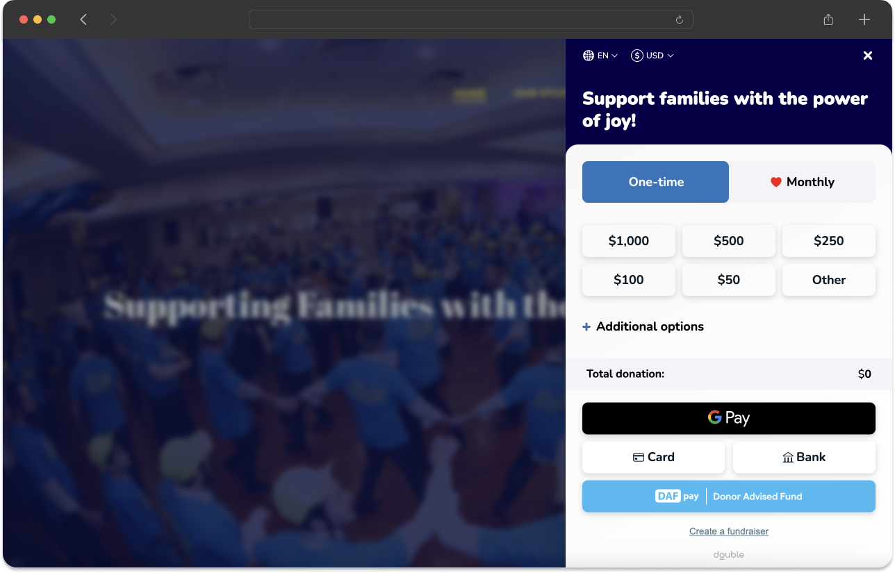

## Installation

Chariot Connect (DAFpay button) comes as a small JavaScript package.
It can be loaded directly from the Chariot CDN or installed via [NPM](https://www.npmjs.com/package/react-chariot-connect) or Yarn.
When loading from the CDN, it must always be loaded directly from [https://cdn.givechariot.com](https://cdn.givechariot.com), rather than included in a bundle or hosted yourself.

<CodeBlocks>
```html CDN
<script src="https://cdn.givechariot.com/chariot-connect.umd.js"></script>
```
```shell NPM
npm install --save react-chariot-connect
```
```shell Yarn
yarn add react-chariot-connect
```
</CodeBlocks>

## Add Chariot Connect

Chariot provides a simple-to-use web component that allows you to implement the Chariot Connect (DAFpay) button with a single line.
Add Chariot-Connect component where you want the DAFpay button to appear.

<CodeBlocks>
```html HTML
<chariot-connect id="chariot" cid="GENERATED_CONNECT_IDENTIFIER"></chariot-connect>
```
```javascript React
import React, { useState } from 'react';
import ChariotConnect from 'react-chariot-connect';

const App = () => {
    return (
        <div>
            <ChariotConnect
                cid="GENERATED_CONNECT_IDENTIFIER"
            />
        </div>
    );
};
```
</CodeBlocks>

<Info> 
You only need to call the Create Connect route one time per nonprofit.
</Info>


A nonprofit's `cid` (Connect ID) should be retrieved from your database after the nonprofit has been registered with Chariot.


<Tip>
  _Note: For testing purposes in the sandbox environment the following credentials will log in to any DAF provider._

  ```
  username: good-user
  password: password123
  ```
</Tip>

## Button Placement

Ensure that _DAFpay_ is listed directly alongside primary payment methods (i.e., credit card, bank transfer, and Apple Pay)

<Frame caption="Placement is key!">
    
</Frame>

## Button Themes

<Check>
    We require brand consistency for the DAFpay button and logo.
</Check>

Choose your theme by adding the theme name as a parameter to the `chariot-connect` component, as below.

<CodeBlocks>
```html HTML
<chariot-connect 
	id="chariot" 
	cid="GENERATED_CONNECT_IDENTIFIER" 
	theme="THEME_NAME" <!-- Add this parameter ->
>
</chariot-connect>
```
```javascript React
<ChariotConnect 
  cid="GENERATED_CONNECT_IDENTIFIER" 
  theme="THEME_NAME" <!-- Add this parameter -> 
  ...
/>
```
</CodeBlocks>

We provide the options below as default themes. If `theme` is not defined, `DefaultTheme` will be used.

**DefaultTheme**


**LightModeTheme**


**LightBlueTheme**


**GradientTheme**


**Custom Theme**

To create a custom theme for the DAFpay button, create an object with the desired properties that you wish to change.
Utilize [Tailwind CSS](https://tailwindcss.com/) styling in the definition of these properties.

<Info title="Important Note for Style Customizations">  
 Style customizations for DAFpay require that all available CSS be packaged within the `chariot-connect.umd.js` bundle.
 The problem is that for Chariot to allow any customizations, we would need to include the entire [tailwindcss](https://v1.tailwindcss.com/docs/controlling-file-size) package (~2.4Mb uncompressed) which would degrade performance and load times to an unacceptable level.
 While performance is a concern, we also realize the need for a consistent and seamless user experience and are also committed to providing configurations for size, padding, border radius, etc. on top of the pre-built themes that we offer.
</Info>

<CodeBlocks>
```javascript JavaScript
// get the element from the DOM
const chariot = document.getElementById("chariot")

// define your alterations using valid properties from the table below
const alterations = {
	width: "w-12",
	height: "h-8",
};

// register your new theme with a custom name
chariot.registerTheme("myTheme", alterations);
```
```javascript React
<ChariotConnect 
  cid="GENERATED_CONNECT_IDENTIFIER" 
  theme={
        width: "w-12",
        height: "h-8",
    }
  ...
/>
```
</CodeBlocks>

**Theme Properties**

| Parameter Name     | Use                                                                                      | Allowed value                                                                             |
| :----------------- | :--------------------------------------------------------------------------------------- | :---------------------------------------------------------------------------------------- |
| `width`            | The width of the button                                                                  | [width](https://tailwindcss.com/docs/width) up to `16` or `64px`                          |
| `height`           | The height of the button                                                                 | [height](https://tailwindcss.com/docs/height) at least `9` or `36px` up to `12` or `48px` |
| `showExtendedText` | Show an extended text (`Give with Donor Advised Fund`) version of the DAFpay button text | `true` or `false` (this value is `false` by default)                                      |

