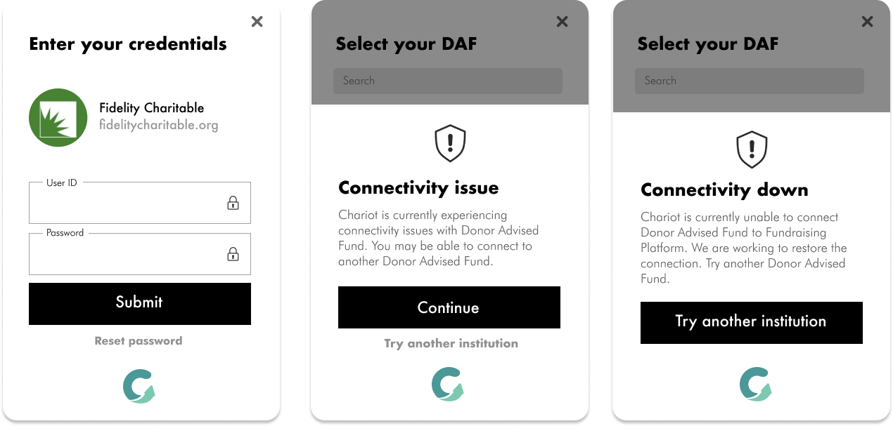

### Missing institution or "Connectivity not supported" error

If your user has a Donor-Advised Fund that Chariot does not currently integrate with, then Connect will allow the user to select that DaF and give detailed instructions on how to complete their DaF donation. Connect will hyperlink the user to their DaF login portal and allow the donor to notify Chariot that the donation was placed.  

[Insert image showing modules]

### Institution status in Connect

Connect proactively lets users know if an institution's connection isn't performing well. Below are the three views a user will see depending on the status of the institution they select.

When the status of an institution is DEGRADED, Connect will warn users that they may experience issues and allow them to continue. Once the status becomes DOWN, Connect will block users from attempting to log in and suggest the "Missing Institution" flow described above

