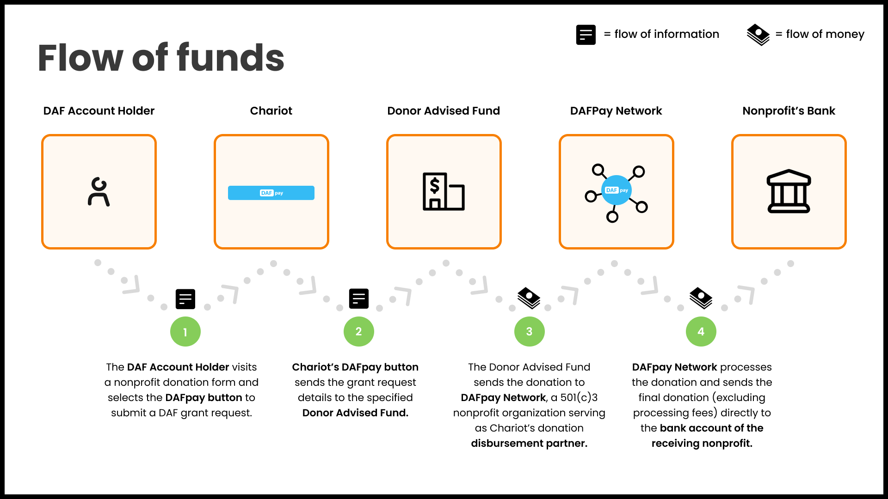
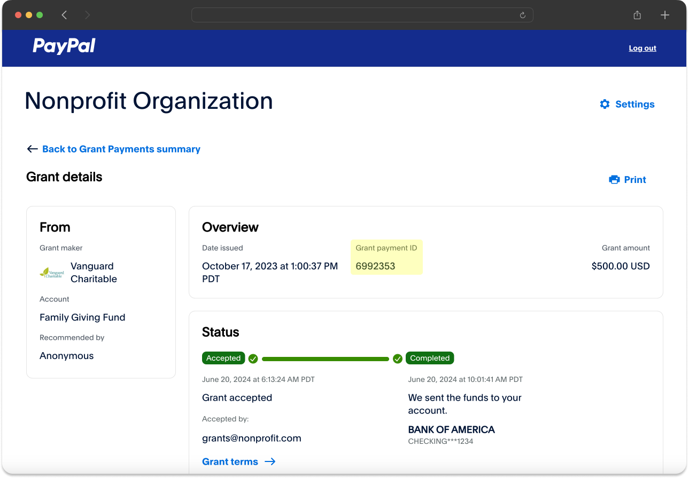

### Nonprofit Onboarding
<AccordionGroup>
    <Accordion title="What information is needed to register a nonprofit?">
    To register a nonprofit using the [Create nonprofit](/api/nonprofits/create) endpoint you need:
     1. The nonprofit's EIN
     2. Contact Information (only used to reach out to the nonprofit to claim their account)

    Ensure the email address provided is unique to the nonprofit and not a generic support email (e.g., support@platform.com). This email will be used for important messaging related to the nonprofit’s Chariot account and can be updated later.

    </Accordion>
    <Accordion title="How do nonprofits claim their accounts?">
        - Upon calling the [Create Connect](/api/connects/create) route, Chariot will automatically email the nonprofit (using the email provided during nonprofit creation) with instructions on how to claim their Chariot account.
        - Article: [Claiming your account with Chariot](https://intercom.help/givechariot/en/articles/9141609-claiming-your-account-with-chariot)

        <Frame caption="Claim account email from Chariot">
            
        </Frame>
    </Accordion>
    <Accordion title="Why did Create Nonprofit return an error?">
    `This organization is ineligible to receive DAF gifts because they are not in good standing with the IRS. If you have a concern or disagree with this statement, then please reach out to contact@givechariot.com`

    If you received the above error when calling the Create Nonprofit route, it means that this organization is not eligible for Donor Advised Fund gifts and cannot add DAFpay to their form.

    Typically, this error means that the organization is no longer in good standing with the IRS or that they are a religious organization that is not registered with the IRS directly.
    </Accordion>
</AccordionGroup>

### Sandbox Development
<AccordionGroup>
    <Accordion title="What is the sandbox API url">
       Access token: `https://chariot-sandbox.us.auth0.com/oauth/token`

       API calls: `https://sandboxapi.givechariot.com/v1`
    </Accordion>
    <Accordion title="What EIN should I use for testing?">
        You can use any valid EIN for testing in sandbox (i.e., American Red Cross 53-0196605).
    </Accordion>
    <Accordion title="What are the test credentials?">
        Yuc can use the following credentials for testing in Sandbox:

        Username: `good-user`

        Password: `password123`
    </Accordion>
</AccordionGroup>

### Platform Fees and Tips
<AccordionGroup>
    <Accordion title="How can my platform collect our processing fees?">

        In the [Create Grant](/api/grants/create) endpoint, there is a parameter named `applicationFeeAmount`.
        This will allow the caller to pass in a processing fee for the grant.
        Chariot will then either deduct that amount before paying out the nonprofit or invoice the fees from the Nonprofit and send the fees in a cadence according to an agreed-upon contract.

    </Accordion>
    <Accordion title="Can we add an optional tip?">

        DAF giving can not be used to give to a for-profit entity which means tipping to the fundraising platform is not allowed.

        If a donor has selected to enable DAFPay, you must suppress the option to add a tip.

        See [GoFundMe](https://www.gofundme.com/f/help-leo-aid-hurricane-milton-and-helene-victims/donate?source=btn_donate) for an example of how to remove the tip functionality when DAFpay is selected.
    </Accordion>

    <Accordion title="How can donors cover fees?">

        If a donor wishes to cover the fees, increase the final amount sent to the [Create Grant](/api/grants/create) route to compensate for the processing fees.
        Take into consideration that increasing the final amount also raises the processing fee
        and **don't forget to round the final amount to a whole dollar (nearest 100) as DAFs only allow grants in dollar increments**.

        To calculate the final amount you can use the following formula:

        <Frame caption="Covered fee calculation">
            
        </Frame>
    </Accordion>
</AccordionGroup>

### Payment Reconciliation
<AccordionGroup>
    <Accordion title="What is the DAFpay Network?">

        For nonprofits that haven't completed onboarding and verification with Chariot,
        DAFpay routes payments through a 501(c)(3) nonprofit entity named [DAFpay Network](https://www.dafpaynetwork.org/).
        The DAFpay Network then sends the funds to the nonprofit minus processing fees.
        This enables DAFpay to accommodate payments to all eligible 501(c)(3) nonprofits for receiving DAF (Donor-Advised Fund) donations.

        <Frame caption="DAFpay Network Flow of Funds">
            
        </Frame>

    </Accordion>
    <Accordion title="How do nonprofits reconcile received payments to specific DAF grants?">

        Reconciliation is crucial for DAF grants due to the lack of visibility into DAF donors and their grant requests.
        Nonprofits often face challenges tracking the source and intended purpose of a DAF grant payment received weeks or months after the donor's decision to donate.
        This can negatively impact donor relationships. Chariot and DAFpay aim to streamline this process.

        DAFpay records unique reconciliation identifiers to help nonprofits easily identify specific donations:
        - **Tracking ID**: A 10-digit alphanumeric identifier generated by DAFpay, included in the initial grant request, and usually passed to the nonprofit from the DAF. This appears in the DAF provider’s data as a “Tracking ID:” string within the grant note or purpose.
        - **External Grant ID**: A string identifier generated by the DAF provider following a successful grant initiation request. The format depends on the DAF provider and typically appears in the provider’s data as a “Grant ID.”

        Nonprofits can use these identifiers to match payments from a DAF provider to DAFpay information.
        If the DAFpay Tracking ID is not available, the External Grant ID should be used.
        Both of these properties are available on the [Grants](/api/grants/get) API.

        Nonprofits can view this information in their Chariot dashboard:

        <Frame caption="Chariot Dashboard">
            
        </Frame>

        Below are two common examples of how nonprofits may receive the DAF grant payment and use the information provided to reconcile the payment to the DAFpay grant from their dashboard:

        <Frame caption="Schwab Grant Letter & Check with Tracking ID in letter and External Grant ID in Check memo">
            
        </Frame>

        <Frame caption="PayPal Grant Payments Dashboard with External Grant ID">
            
        </Frame>
    </Accordion>
    <Accordion title="What are unintegrated grants?">

    Unintegrated grants is an optional feature where DAFpay can facilitate donations from unintegrated DAF providers.

    If configured, if a user selects a DAF provider that is not integrated with DAFpay, the modal can collect the donation amount and donor information so the nonprofit can be notified in real time. The donor is then given the trackingID and asked to included in the the note when they make their donation through their DAf portal that way  it can be used for reconciliation.

    Since the donor has to leave the nonprofit site to actually submit the donation we do not have visibility into whether or not the donation was actually made.

    </Accordion>
    <Accordion title="How do recurring donations work?">

    A recurring donation via DAFpay  indicates that the donation was initiated on a monthly recurring basis. We indicate that the initial grant was set up with frequency of monthly but do not create a new grant each month in our system.

    The actual recurrence is managed through the DAF provider so if the donor wants to cancel the recurrence they log into their DAF provider portal and cancel it there. As a result, we are not aware when a recurrence is canceled.

    </Accordion>

</AccordionGroup>

### DAFpay Configuration
<AccordionGroup>
    <Accordion title="What are some best practices and recommendations?">

        **Enable by Default**: DAFpay supports transactions for all eligible 501(c)(3) organizations, allowing DAFpay to function on a donation form prior to the completion of the nonprofit's onboarding with Chariot. Thus, we advise setting DAFpay as a default payment option across your donation pages. This will improve  fundraising outcomes and help develop relationships with key donors!

        **Express Checkout Option**: DAFpay offers the capability to automatically gather crucial donor information, such as names, email addresses, physical addresses, and more. Additionally, DAFpay provides Intelligent Donation Recommendations, taking into account factors like the donor's account balance. For this reason, we recommend featuring DAFpay as an Express Checkout option, making it visible early in the donation process, before donors are prompted to input their information or decide on a donation amount. This enhances conversion rates and encourages larger donations.

    </Accordion>
    <Accordion title="How can I run form validations before the DAFpay button launches?">

        To perform form validation before DAFpay launches, simply return `false` in the onDonationRequest.
        Please see [Disabling Connect](https://docs.givechariot.com/guides/dafpay/integrating-dafpay/integration#disabling-connect) to learn more.
    </Accordion>
    <Accordion title="Can a donor change their donation amount in the modal?">
        Yes, we allow the user to change their donation amount in the DAFpay modal for a few reasons:
        1. Once users see their account balance they often choose to make a larger donation
        2. Some DAFs have a minimum donations amounts
        3. The donation amount can't exceed the account balance
    </Accordion>
</AccordionGroup>