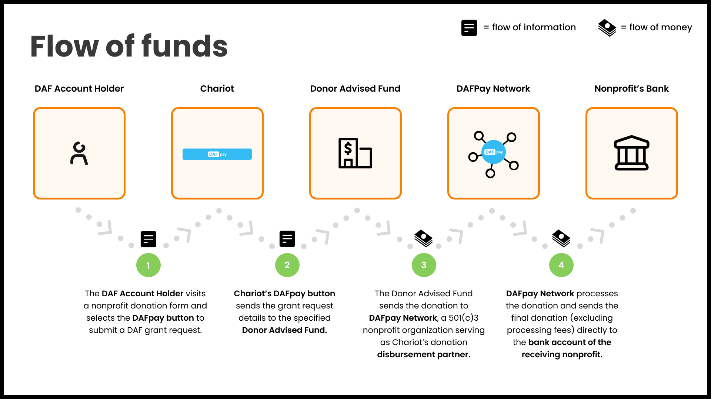

<AccordionGroup>
    <Accordion title="How can my platform collect our processing fees?">

        In the [Create Grant](/v2024-10-30/api/grants/create) endpoint, there is a parameter named `applicationFeeAmount`.
        This will allow the caller to pass in a processing fee for the grant.
        Chariot will then either deduct that amount before paying out the nonprofit or invoice the fees from the Nonprofit and send the fees in a cadence according to an agreed-upon contract.

    </Accordion>
    <Accordion title="How can I run form validations before the DAFpay button launches?">

        To perform form validation before DAFpay launches, simply return `false` in the onDonationRequest.
        Please see [Integrating DAFpay](/guides/dafpay/overview) to learn more.

    </Accordion>
    <Accordion title="How can donors cover fees?">

        If a donor wishes to cover the fees, increase the final amount sent to the [Create Grant](/v2024-10-30/api/grants/create) route to compensate for the processing fees.
        Take into consideration that increasing the final amount also raises the processing fee 
        and **don't forget to round the final amount to a whole dollar (nearest 100) as DAFs only allow grants in dollar increments**.

        To calculate the final amount you can use the following formula: 

        <Frame caption="Covered fee calculation">
            
        </Frame>
    </Accordion>
    <Accordion title="What is the DAFpay Network?">

        For nonprofits that haven't completed onboarding and verification with Chariot, 
        DAFpay routes payments through a 501(c)(3) nonprofit entity named [DAFpay Network](https://www.dafpaynetwork.org/).
        The DAFpay Network then sends the funds to the nonprofit minus processing fees.
        This enables DAFpay to accommodate payments to all eligible 501(c)(3) nonprofits for receiving DAF (Donor-Advised Fund) donations.

        <Frame caption="DAFpay Network Flow of Funds">
            
        </Frame>

    </Accordion>
    <Accordion title="How do nonprofits reconcile received payments to specific DAF grants?">

        Reconciliation is crucial for DAF grants due to the lack of visibility into DAF donors and their grant requests.
        Nonprofits often face challenges tracking the source and intended purpose of a DAF grant payment received weeks or months after the donor's decision to donate.
        This can negatively impact donor relationships. Chariot and DAFpay aim to streamline this process.

        DAFpay records unique reconciliation identifiers to help nonprofits easily identify specific donations:
        - **Tracking ID**: A 10-digit alphanumeric identifier generated by DAFpay, included in the initial grant request, and usually passed to the nonprofit from the DAF. This appears in the DAF provider’s data as a “Tracking ID:” string within the grant note or purpose.
        - **External Grant ID**: A string identifier generated by the DAF provider following a successful grant initiation request. The format depends on the DAF provider and typically appears in the provider’s data as a “Grant ID.”

        Nonprofits can use these identifiers to match payments from a DAF provider to DAFpay information.
        If the DAFpay Tracking ID is not available, the External Grant ID should be used.
        Both of these properties are available on the [Grants](/v2024-10-30/api/grants/get) API.

        Nonprofits can view this information in their Chariot dashboard:

        <Frame caption="Chariot Dashboard">
            
        </Frame>

        Below are two common examples of how nonprofits may receive the DAF grant payment and use the information provided to reconcile the payment to the DAFpay grant from their dashboard:

        <Frame caption="Schwab Grant Letter & Check with Tracking ID in letter and External Grant ID in Check memo">
            
        </Frame>
        
        <Frame caption="PayPal Grant Payments Dashboard with External Grant ID">
            
        </Frame>

    </Accordion>
</AccordionGroup>

