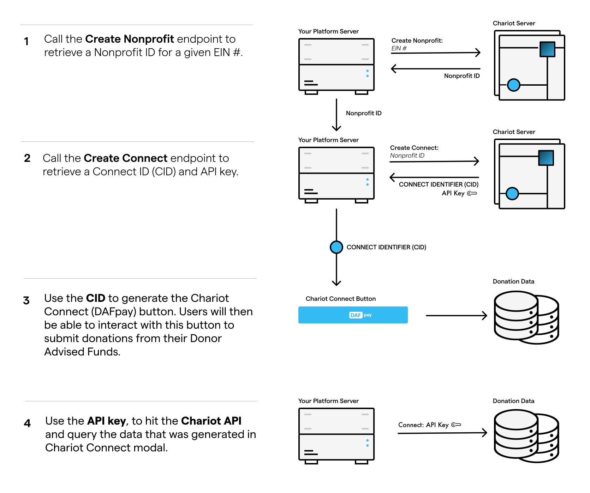

DAFpay is a payment option that enables donors to complete transactions using their Donor-Advised Fund (DAF).

## Features and Advantages of DAFpay:

1. **Universal Support for Nonprofits**: DAFpay enables donors to support any nonprofit organization eligible to receive DAF gifts, thus facilitating grants to a wide range of eligible nonprofits.
2. **Express Checkout**: By retrieving donor information automatically, DAFpay eliminates the need for donors to enter their contact details on donation forms, thereby simplifying the donation process and enhancing conversion rates. For most scenarios, DAFpay can auto-fill details such as the donor's name, email, address, and phone number.
3. **Intelligent Donation Recommendations**: DAFpay suggests donation amounts calculated from the donor's account balance and other key factors, encouraging larger donations. On average, donations made through DAFpay exceed $1,000.

DAFpay manages the entire grant submission process, including credential verification, multi-factor authentication, error management, and fee collection, for each Donor Advised Fund supported.

## How it works

The initial step involves **registering** each nonprofit organization. Once registered, you will receive a Connect ID (CID) that can be used to **initialize** Connect, the web component that renders the DAFpay button.  Lastly, **query** Chariot's APIs to gather all the data generated through Connect. 

<Frame>
    
</Frame>

## Try it out!

Try out the [DAFpay Demo](https://secure.dafpay.com/demo) for yourself and see what it might look like on your website after you've completed the integration.

<iframe src="https://secure.dafpay.com/tryitnow" width="100%" height="680" frameborder="0"></iframe>
