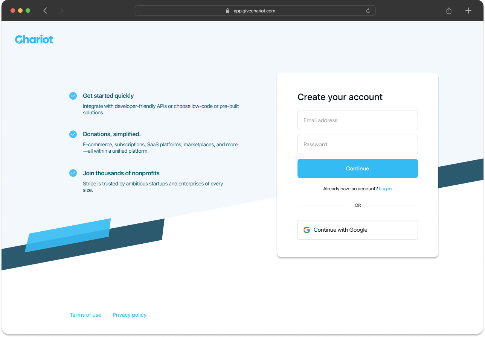
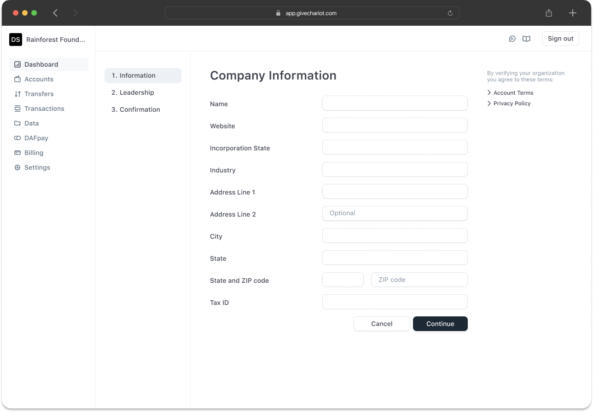
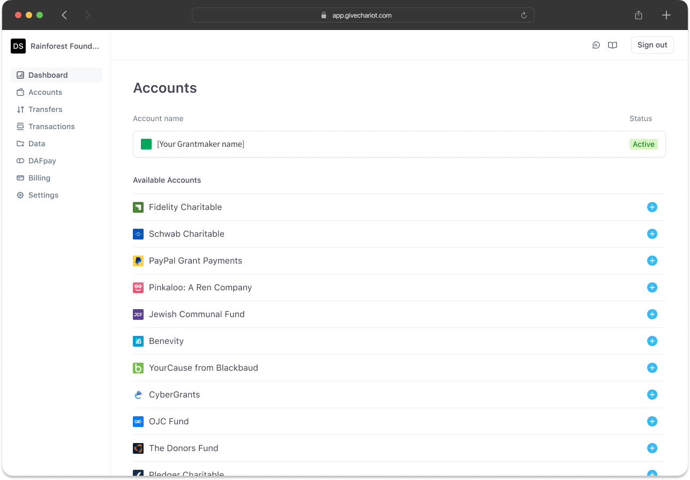

<AccordionGroup>
    <Accordion title="What if a nonprofit isn't listed on Chariot?">

        In the rare case that a nonprofit is not listed on Chariot, Chariot supports the ability to add new nonprofit organizations to the system.
        Please reach out to [Support](mailto:support@givechariot.com) to submit a request for an organization to be reviewed for addition.

        The request should include the following information at a minimum:
        - Name
        - EIN
        - Mailing Address
        - Website
        - Fiscal sponsor information
        - Contact information for an officer or director including name, title, email, and phone number
        - IRS determination letter
        
    </Accordion>
    <Accordion title="What are nonprofits charged for using Chariot Payments?">

        Nonprofits are not charged for using Chariot Payments. Chariot charges a transaction fee to the grantmaker.
        For nonprofits that want additional services to support their gift processing needs, Chariot has subscriptions plans available.

    </Accordion>
    <Accordion title="What does the onboarding process look like for nonprofits?">

        The onboarding process for nonprofits is as follows:
        
        
        
        1. Nonprofit creates an account on Chariot
        2. Nonprofit provides verifying information to Chariot
        3. Chariot reviews the information and once verified, allows the nonprofit to receive electronic payments from over 50+ Grantmakers
    </Accordion>
</AccordionGroup>