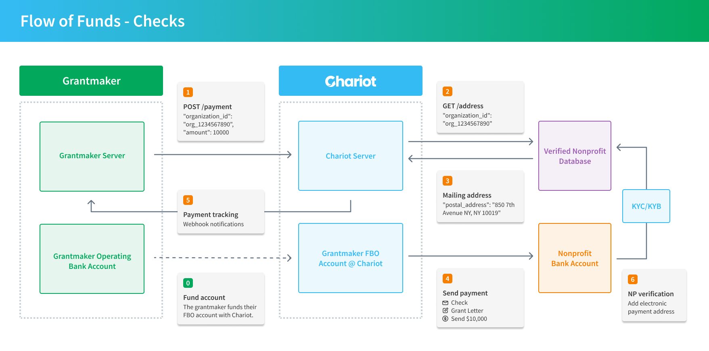

The flow of funds for check payments follows the following steps:

0. **Fund Account**: The grantmaker funds their FBO account with Chariot.
1. **Create Payment**: The grantmaker calls the *Create Payment* endpoint to initiate a payment to a nonprofit.
2. **Get Address**: Chariot searches its nonprofit database for a verified payment address.
3. **Mailing Address**: Chariot retrieves the nonprofit’s verified mailing address.
4. **Send Payment**: Chariot sends a check to the nonprofit’s verified address.
5. **Payment Tracking**: Chariot provides payment status updates via webhooks, so the grantmaker can track the payment lifecycle.
6. **Nonprofit Verification**: Chariot encourages nonprofits to get verified for electronic payments, enabling easy reconciliation and access to over 50+ grantmakers.

The flow of funds for electronic payments follows the following steps:

0. **Fund Account**: The grantmaker funds their FBO account with Chariot.
1. **Initiate Payment**: The grantmaker uses the *Create Payment* endpoint to send a payment to a nonprofit.
2. **Address Search**: Chariot searches its database for a verified payment address for the nonprofit.
3. **Bank Account Verification**: Chariot retrieves the nonprofit’s verified bank account details.
4. **Send Payment**: Chariot sends an electronic payment to the nonprofit, including transaction details.
5. **Payment Tracking**: Chariot provides real-time updates via webhooks, allowing the grantmaker to track the payment’s progress.

Note, that nonprofits are incentivized to get verified for electronic payments, enabling easy reconciliation and access for electronic payments from over 50+ grantmakers. All DAFpay nonprofits will also be requiredd to get verified.