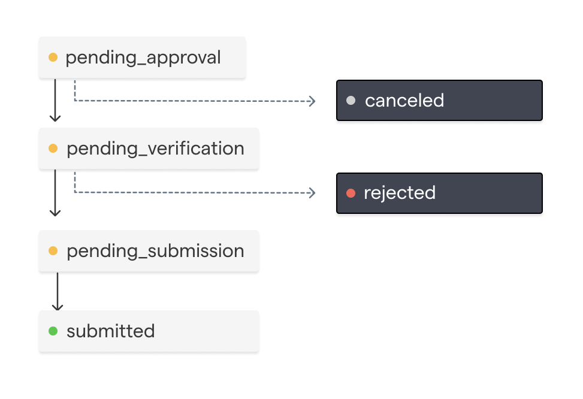
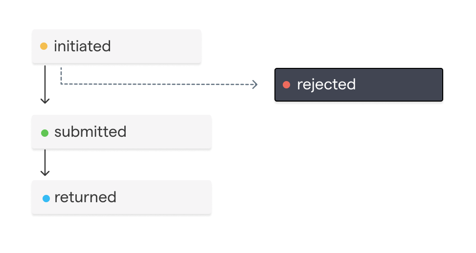
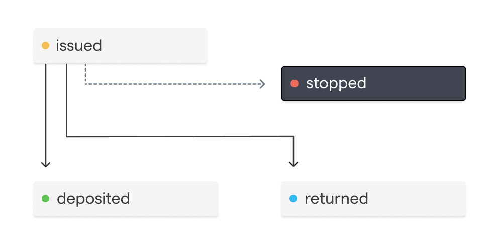

## Disbursement `status` lifecycle
A Disbursement's `status` represents a workflow lifecycle.

It tracks whether a Disbursement has been approved or canceled by your organization based on your organization's configured approval rules.
Additionally, it tracks if the Disbursement has been verified by the Chariot team.

Once a Disbursement's status is `submitted`, a request will be made to the preferred payment rail to initiate the payment.
A Disbursement with a `submitted` status will have a `submission` object.

Once a Disbursement is `submitted`, it can no longer be canceled. Instead, depending on the payment rail the submission may be able to be stopped or reversed.
<Frame>
    
</Frame>

 Status | Description |
|--------|-------------|
| `pending_approval` | The disbursement is awaiting approval from the grantmaker |
| `canceled` | The disbursement was canceled by the grantmaker |
| `pending_verification` | The disbursement is awaiting verification from Chariot |
| `rejected` | The disbursement was rejected by Chariot before being submitted|
| `pending_submission` | The disbursement is awaiting submission to the payment rail|
| `submitted` | The disbursement has been submitted to the payment rail |

## Payment Rail Lifecycle
Once a Disbursement contains a `submission`, a payment has been initiated through a specific payment rail. Each payment rail follows its own distinct payment lifecycle.

<AccordionGroup>
    <Accordion title="Account Transfer">
        An Account Transfer happens instantly and can be sent 24 hours a day, 7 days a week.
        If a nonprofit has a DDA Account[*](a "Chariot is a financial technology company, not a bank. Chariot Accounts come with a Demand Deposit Account through our banking services partner, Column N.A., Member FDIC. Deposits in Chariot Accounts are eligible for FDIC insurance up to $250,000 per depositor, for each insurable capacity in which the account is held") with Chariot, Chariot will typically send funds using this payment rail.

        Since Account Transfers are instant, they don't have a payment lifecycle and funds are available to the nonprofit immediately.
    </Accordion>
    <Accordion title="ACH">
        ACH submission represents an credit (push) payment using the Automated Clearing House (ACH) network.
        This transfer method is used if the receiving organization is not avaiable for Account Transfers.
        Funds availability is typically 1-2 days.

        <Frame>
            
        </Frame>
        | Status | Description |
        |--------|-------------|
        | `initiated` | The ACH transfer has been initiated and is pending submission to the Federal Reserve |
        | `rejected` | The ACH transfer was rejected |
        | `submitted` | The ACH transfer has been submitted to the Federal Reserve |
        | `returned` | The ACH transfer was returned by the receiving organization |
    </Accordion>
    <Accordion title="Mailed Check">
        A check submission represents a physical check that is mailed to the receiving organization.
        This is the transfer method used when the receiving organization does not have a Chariot account.
        <Frame>
            
        </Frame>

        | Status | Description |
        |--------|-------------|
        | `issued` | The check has been mailed and is pending delivery |
        | `stopped` | A stop payment was requested on the check |
        | `deposited` | The check has been deposited by the receiving organization |
        | `returned` | The check has been returned by the receiving organization |
    </Accordion>

</AccordionGroup>