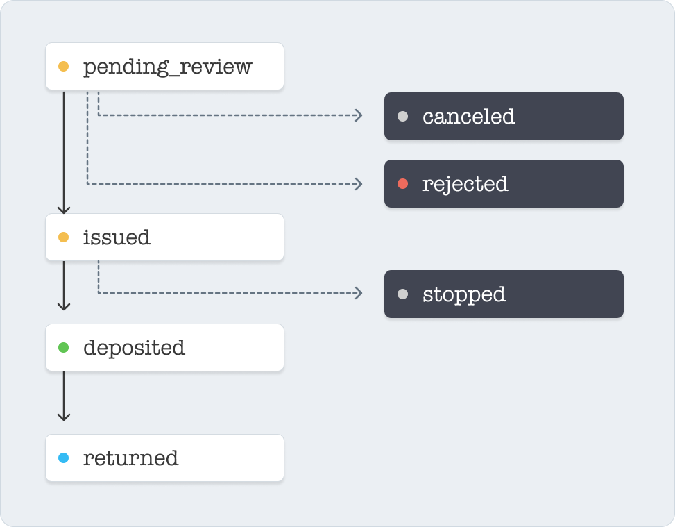

A Disbursment can be submitted through different payment rails. Each payment rail has a different payment lifecycle. To view which  payment rail a Disbursment is using, check the `submission` in a Disbursement object.

## Book Transfer :zap:

A Book Transfer happen instantly and can be sent 24 hours a day, 7 days a week. If a nonprofit has an account with Chariot, Chariot will send funds using this payment rail.

Since Book Transfers are instant, they don't have a payment lifecycle and funds are available to the nonprofit immediately.

## Check
A check submission represents a paper check that is sent to the receiving organization. This is the submission method used when the receiving organization does not have a Chariot account.
<Frame>
    
</Frame>

| Status | Description |
|--------|-------------|
| `pending_review` | The check is pending review by Chariot |
| `canceled` | The check has been canceled by the grantmaker before being issued|
| `rejected` | The check was rejected by Chariot before being issued|
| `issued` | The check has been mailed and is pending delivery |
| `stopped` | A stop payment was requested on the check |
| `deposited` | The check has been deposited by the receiving organization |
| `returned` | The check has been returned by the receiving organization |

