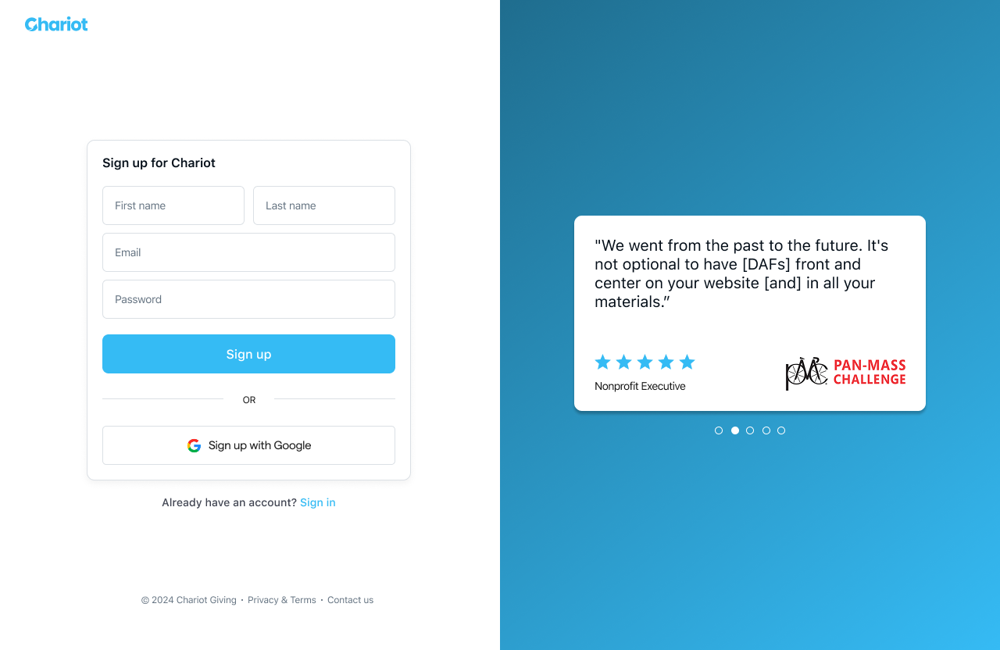
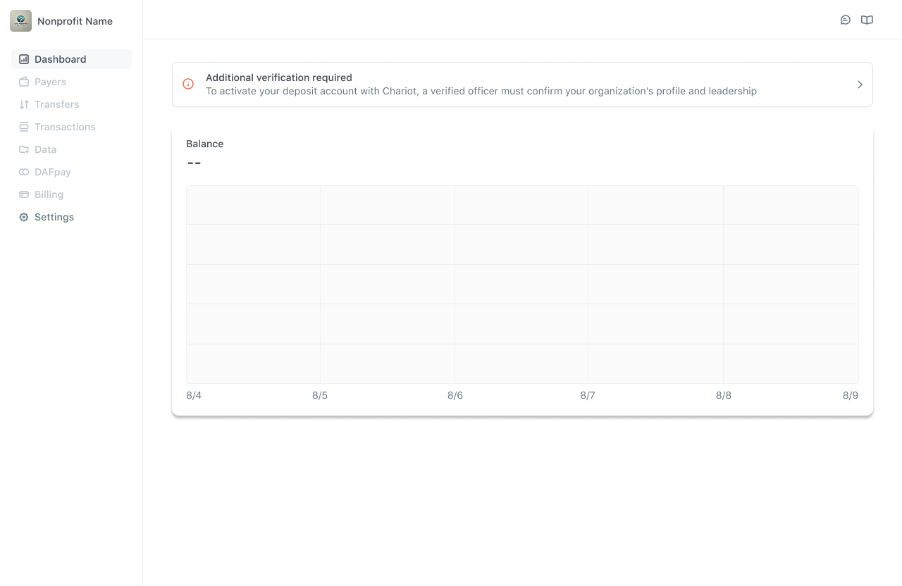
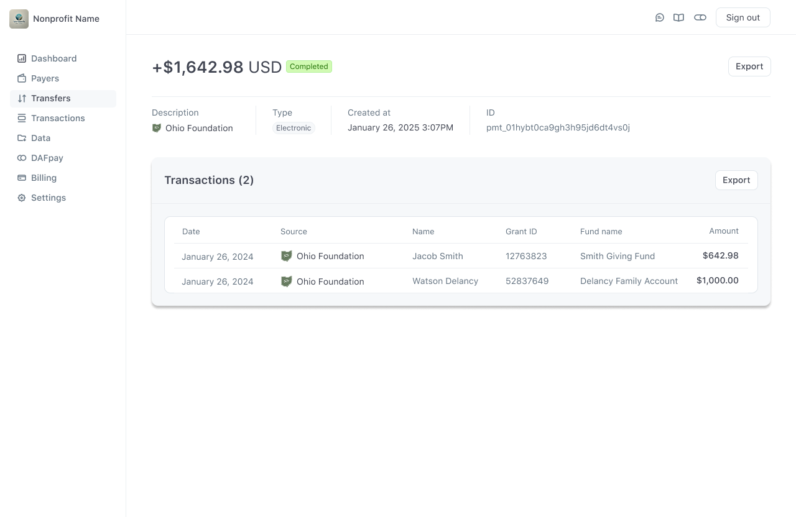

### Nonprofit
<AccordionGroup>
    <Accordion title="What if a nonprofit isn't listed on Chariot?">

        In the rare case that a nonprofit organization is not listed on Chariot, Chariot supports the ability to add new nonprofit organizations to the system.
        Please reach out to [Support](mailto:support@givechariot.com) to submit a request for an organization to be reviewed for addition.

        The request should include the following information:
        - Name
        - EIN
        - Mailing Address
        - Website
        - Fiscal sponsor information
        - Contact information for an officer or director including name, title, email, and phone number
        - IRS determination letter (if applicable)
    </Accordion>
    <Accordion title="What if a nonprofit is ineligible for disbursements?">

        If a nonprofit is ineligible for disbursements, the organization's `organization.compliance.daf_eligible` field will be `false`.
        The organization will not be able to receive disbursements from grantmakers.

        If you believe that the organization should be eligible for disbursements, please reach out to [Compliance](mailto:compliance@givechariot.com).

    </Accordion>
    <Accordion title="What are nonprofits charged for using Chariot Disbursements?">

        Nonprofits are not charged for using Chariot Disbursements. Chariot charges a transaction fee to the grantmaker.
        For nonprofits that want additional services to support their gift processing needs, Chariot has subscriptions plans available.

    </Accordion>
    <Accordion title="What does the onboarding process look like for nonprofits?">

        The onboarding process for nonprofits is as follows:

        <Steps>
            Nonprofit creates an account on Chariot
            <Frame caption="Nonprofit account registration">
                
            </Frame>

            Nonprofit provides verifying information to Chariot

            <Frame caption="Nonprofit KYC and verification">
                
            </Frame>

            Chariot approves Nonprofit to receive electronic payments from grantmakers

            <Frame caption="Nonprofits can manage payments from all their grantmaking platforms">
                
            </Frame>
        </Steps>
    </Accordion>
</AccordionGroup>

### Disbursements

<AccordionGroup>
    <Accordion title="How does Chariot route payments?">

    ## Payment Rails

    ### Checks
    If a Nonprofit does not have an account with Chariot, Chariot will mail a paper check to the nonprofit's verified payment address. We strongly recommend that nonprofits sign up for a free account with Chariot to receive future disbursements electronically.

    <Frame>
      
    </Frame>

    ### Electronic (ACH, RTP, etc.)
    If a Nonprofit has an account with Chariot, they can receive payments electronically to their verified bank account. Chariot is able to present a consolidated view of all payments received by the nonprofit in their dashboard across all grantmakers. In this case, a payment may settle almost instantly.

    <Frame>
      
    </Frame>

    </Accordion>

     <Accordion title="How to handle returned checks?">
       If a check is returned, the Disbursement's check submission status will be `returned`. If the check was returned because the mailing address was outdated,
       the grantmaker can let Chairot's compliance team know in order to update the most recent mailing address. Afterwards, a disbursement can be resubmitted.
    </Accordion>
</AccordionGroup>
