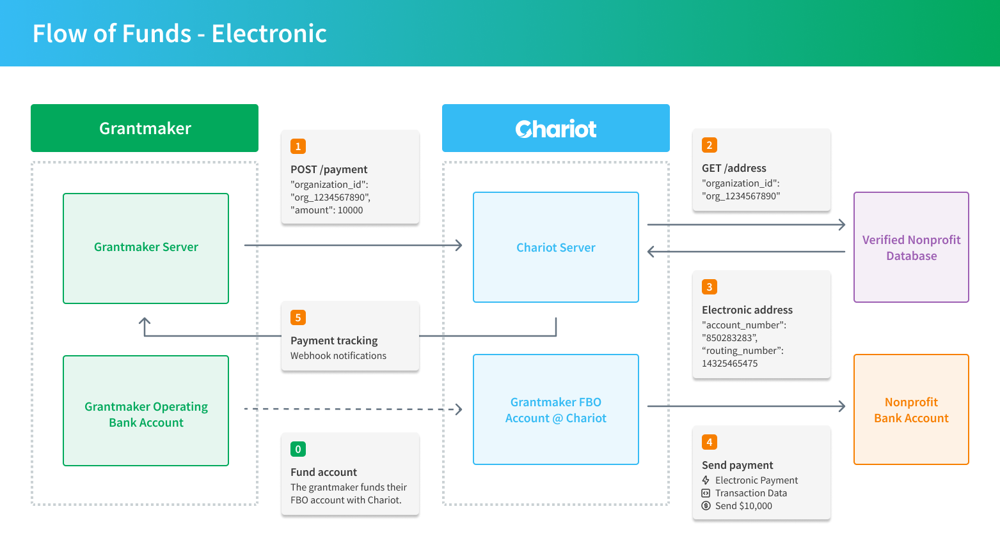

## Funding Your Chariot Account

Before disbursements can be sent, your Chariot Deposit Account must have sufficient available balance. Funds enter your account through **inbound transfers** from your external bank account.

| Funding Method | Settlement Time | Description |
|----------------|-----------------|-------------|
| ACH debit | 3-4 business days | Chariot pulls funds from your linked bank account |
| ACH credit | 1-2 business days | Your bank pushes funds to your Chariot account |
| JIT (auto-fund) | 3-4 business days | Chariot automatically initiates an ACH debit when a disbursement is approved |

<Note>
Funds from inbound transfers are added to your account's **shared balance pool**. They are not earmarked for any specific disbursement. For details on how balance is applied to disbursements, see [How Balance and Funding Works](/guides/disbursements/disbursement-lifecycle#how-balance-and-funding-works).
</Note>

<Tip>
We recommend maintaining a rolling balance of **1-4 weeks** of expected disbursement volume so that disbursements execute immediately without waiting for inbound transfers to settle.
</Tip>

## Checks

The flow of funds for check disbursements follows these steps:

<Frame>
    
</Frame>

0. **Fund Account**: The grantmaker funds their Chariot Deposit Account via an [inbound transfer](/api/inbound-transfers/create).
1. **Create Disbursement**: The grantmaker calls the [Create Disbursement](/api/disbursements/create) endpoint to initiate a disbursement to a nonprofit.
2. **Get Address**: Chariot searches its nonprofit database for a verified payment address.
3. **Mailing Address**: Chariot retrieves the nonprofit's verified mailing address.
4. **Send Check**: Chariot mails a check to the nonprofit's verified address.
5. **Disbursement Tracking**: Chariot provides status updates via [webhooks](/api/webhooks), so the grantmaker can track the [disbursement lifecycle](/guides/disbursements/disbursement-lifecycle).
6. **Nonprofit Outreach**: Chariot encourages nonprofits to claim their account for electronic payments, enabling easy reconciliation and access to disbursements from 50+ grantmakers.

<Info>
The payment rail (check vs electronic) is decided **at the moment of submission**. If a nonprofit claims their Chariot account before the disbursement is submitted, they will receive the payment electronically -- even if the disbursement was originally expected to go by check. See [Payment Rail Selection](/guides/disbursements/disbursement-lifecycle#payment-rail-selection) for details.
</Info>

## Electronic

The flow of funds for electronic disbursements follows these steps:

<Frame>
    
</Frame>

0. **Fund Account**: The grantmaker funds their Chariot Deposit Account via an [inbound transfer](/api/inbound-transfers/create).
1. **Create Disbursement**: The grantmaker calls the [Create Disbursement](/api/disbursements/create) endpoint to initiate a disbursement to a nonprofit.
2. **Nonprofit Lookup**: Chariot searches its database for a verified payment address for the nonprofit.
3. **Bank Account Verification**: Chariot retrieves the nonprofit's verified bank account details.
4. **Send Payment**: Chariot sends an electronic payment (ACH credit or in-network transfer) to the nonprofit, including transaction details.
5. **Disbursement Tracking**: Chariot provides real-time updates via [webhooks](/api/webhooks), allowing the grantmaker to track the disbursement's progress.

Nonprofits are incentivized to get verified for electronic payments, enabling easy reconciliation and access to electronic disbursements from 50+ grantmakers. All DAFpay nonprofits are also required to get verified.
