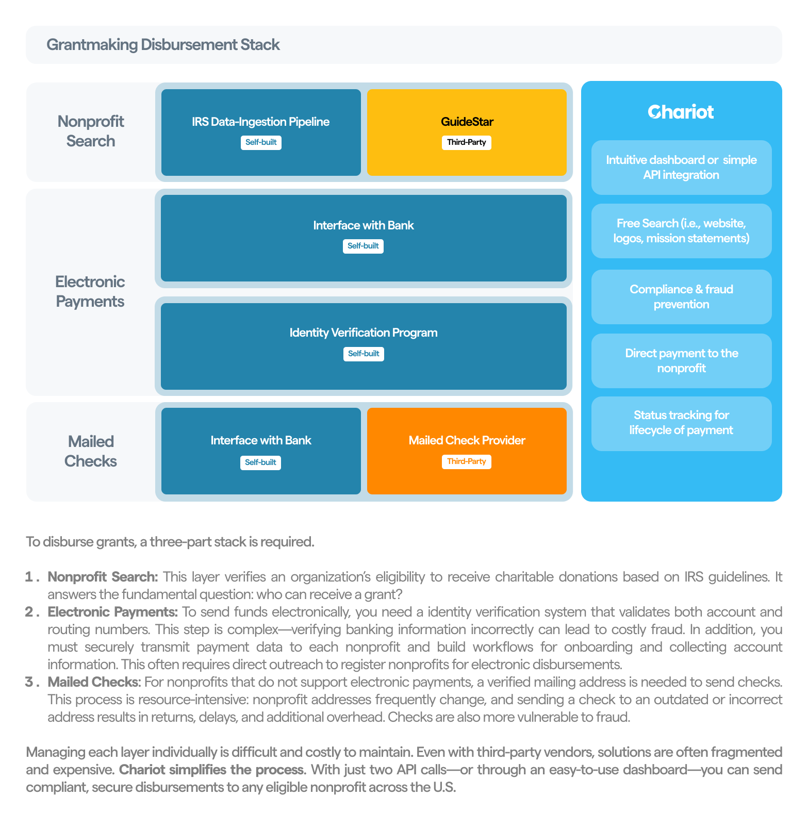

<Frame>
    
</Frame>

<Info>*Chariot is a financial technology company, not a bank. Chariot Accounts come with a Demand Deposit Account through our banking services partner, Column N.A., Member FDIC. Deposits in Chariot Accounts are eligible for FDIC insurance up to $250,000 per depositor, for each insurable capacity in which the account is held.*</Info>