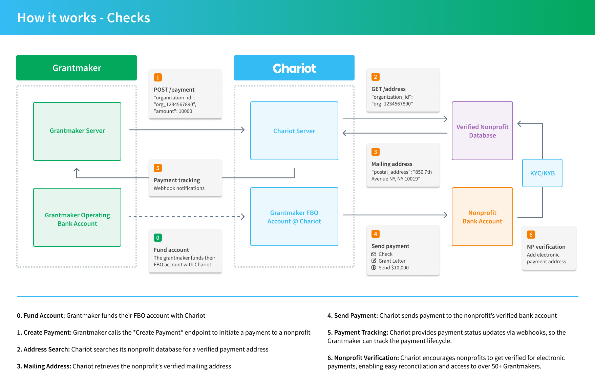
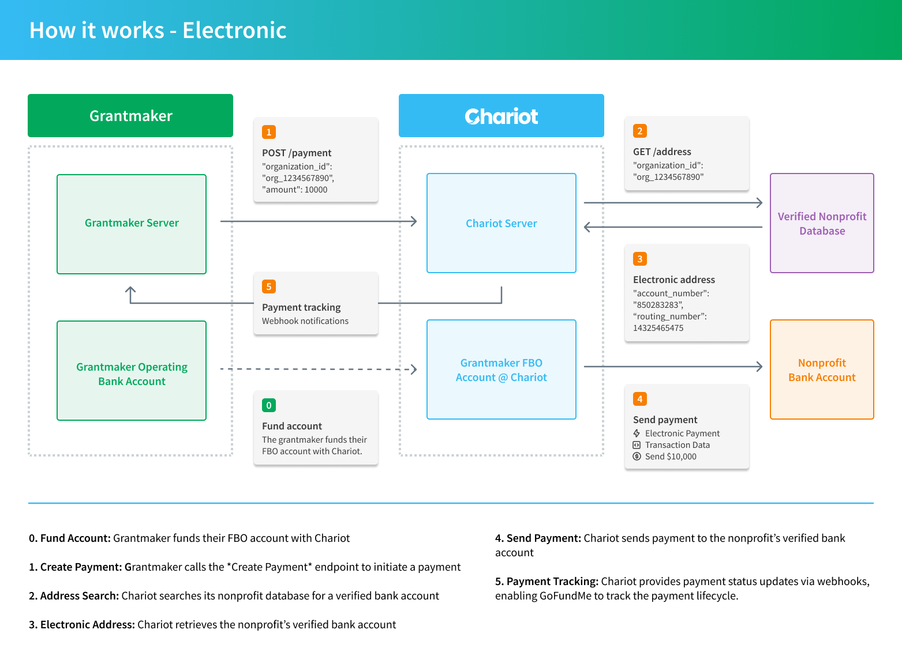

## Platform Onboarding
<CardGroup cols={3}>
    <Card
        title='1. Set up account'
        icon='user-plus'
    >
    Create a Chariot Disbursements Account
    </Card>

    <Card
        title='2. Add your bank'
        icon='bank'
    >
    Add and verify your bank account to fund payments
    </Card>
        <Card
        title='3. Send a payment'
        icon='money-check-dollar-pen'
    >
    Send your first disbursement to a verified nonprofit
    </Card>
</CardGroup>

To get started with Chariot Disbursements, you'll need to register for an account with Chariot and go through an onboarding process.
After you are approved and verified, you'll be given access to a dashboard where you will be able to manage and create `API Keys`.

The onboarding process involves verifying your identity and setting up your account.
The specific requirements of account setup and onboarding depend on how your organization wants to manage payments and use Chariot's API.
In most cases, you will need to provide Chariot with sufficient information to open and fund a bank account.

## Making a Disbursement

This section provides the steps required to send a disbursement.

<Steps>

### Find an Organization

First, you need to find the nonprofit `Organization` that you want to send a disbursement to.

<EndpointRequestSnippet endpoint="GET /v1/organizations" />

You can use the response to verify the details of the `Organization` to ensure it is the correct one and eligible for DAF grants.

<EndpointResponseSnippet endpoint='GET /v1/organizations' />

### Create a Disbursement

Next, you'll create a `Disbursement` to the Organization with the amount that you want to send.

You can create multiple `Transactions` for a single `Payment` to attribute multiple individual donations to the same `Payment`.

{/* <Note>
You can attach a document or file to the payment by [first uploading a file to Chariot's servers](/v2024-10-30/api/files/upload-file)
and then creating a `Transaction` with the `attachment_file_id` field populated.
</Note> */}

<EndpointRequestSnippet endpoint="POST /v1/disbursements"  example="ExampleWithTransactions"/>

Once, you receive a successful response, you can be sure that the payment will be processed.
Chariot will use the funds in your FBO to push a payment to the organization.
After Chariot processes and submits the payment, you will be able to track the lifecycle of the payment using webhook events.

<EndpointResponseSnippet endpoint='POST /v1/disbursements' example="WithPaymentId" />

</Steps>

## How Chariot Disbursements Work for Nonprofits

Chariot provides a service to nonprofits to facilitate receiving disbursements from payers and other platforms.

If a Nonprofit has an account with Chariot, they can receive payments electronically to their verified bank account.
Chariot is able to present a consolidated view of all payments received by the nonprofit in their dashboard across all payers.
In this case, a payment may settle almost instantly.

If a Nonprofit does not have an account with Chariot, they can still receive payments via Chariot's Disbursements.
In this case, Chariot will mail a paper check to the nonprofit's verified postal address.
We strongly recommend that nonprofits sign up for a free account with Chariot to receive future disbursements electronically.

## Payment Rails

### Checks

<Frame>
    
</Frame>

### Electronic (ACH, RTP, etc.)

<Frame>
    
</Frame>

{/* TODO: Add back this section if/when we want to expose different ways to manage disbursements */}
{/* ## Managing Disbursements

Chariot offers several ways to manage disbursements.

### Use Chariot's Hosted Payment Solution

<Tip>
Recommended: Lowest friction, zero compliance overhead.
</Tip>

In this flow, the payers use Chariot's hosted payment solution to send payments to the Organizations.
This option is ideal for payers that do not want to manage their own Accounts Payable systems and/or want to offload the responsibility of
sending payments and managing compliance altogether.

### Manage Your Own

<Warning>
Caution: Requires compliance overhead and being able to send payments via Check or electronically.
</Warning>

In this flow, the payers call the API to read the public-facing `Address`
and create a payment intent for a payment that will be sent via the appropriate payment rail.
This option is great for payers that manage their own Accounts Payable systems or already have capabilities to send payments.

### Delegate to Accounts Payable Systems

<Info>
If this is something that you are interested in, please reach out to us at contact@givechariot.com.
</Info>

In this flow, the payers delegate `Chariot` API access to their Accounts Payable systems via an OAuth application.
The Accounts Payable systems can then read the Organization's `Address` via API and send a payment via the appropriate payment network.
Note that this method requires Chariot to offer OAuth and for charitable AP systems to have built an integration with the `Chariot` API. */}