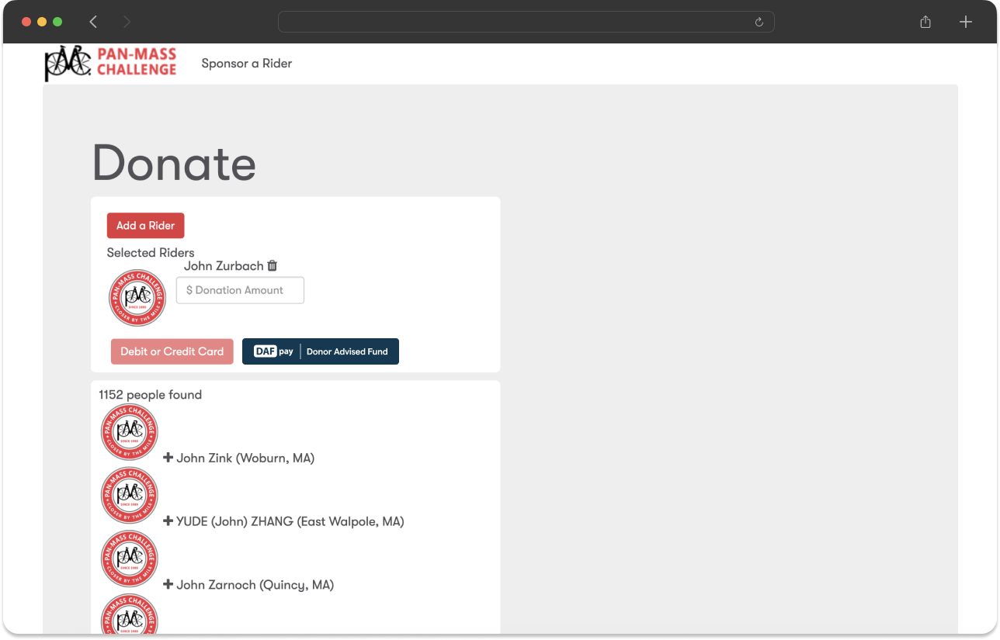
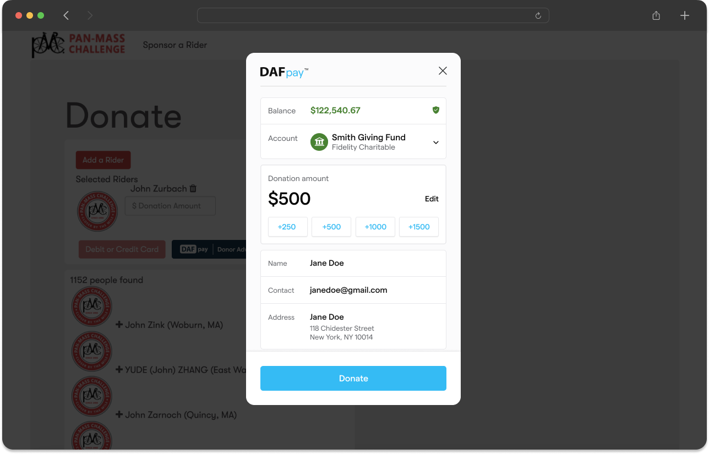
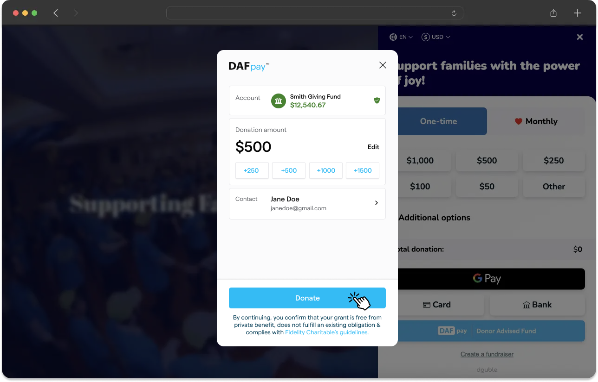
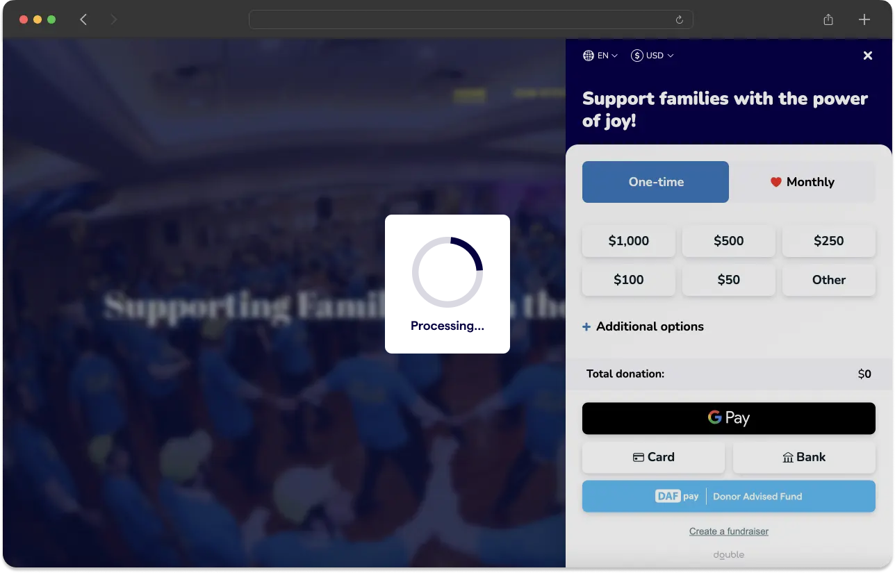
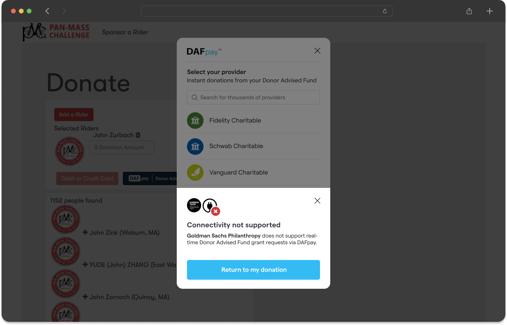
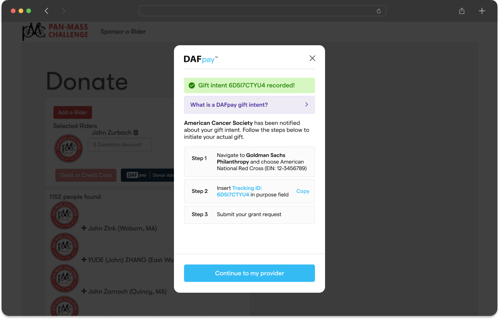
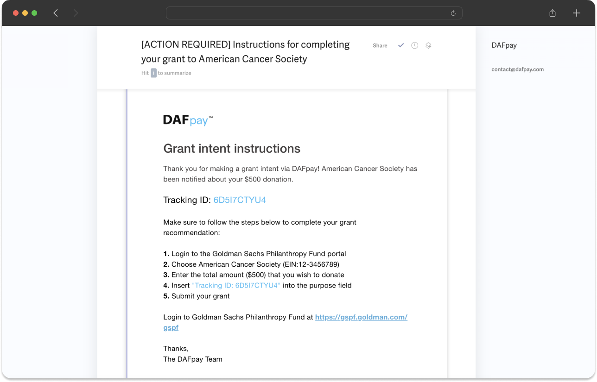

## Button Placement

Ensure that _DAFpay_ is listed directly alongside primary payment methods (i.e., credit card, bank transfer, and Apple Pay)

<Frame caption="Placement is key!">
    
</Frame>

<Check>
    We require brand consistency for the DAFpay button and logo. Please see [Button Styles](/guides/dafpay/button-styles) for more information.
</Check>

## Express Checkout

To increase conversion, add _DAFpay_ at the beginning of your donation form as an express checkout feature (similar to Apple Pay or Google Pay).
When DAFpay is launched at the beginning of a donation form, the DAFpay modal will automatically capture the donor’s name, email, and address directly from the DAF provider.

- **Autocomplete Donor Information** - No development changes are required for this feature; the donor’s contact fields will auto-populate when the onDonationRequest is left blank.
- **Auto-Recommended Donation Amount** - If no amount is passed in, DAFpay utilizes the donor’s account balance to auto-recommend a donation amount, which can lead to larger gifts.

<Frame caption="Express Checkout with donor information and suggested amounts">
    
    
</Frame>

## Pre-fill Donation Information at the End of a Form

When integrating DAFpay at the end of the donation form, make sure to use the `onDonationRequest` callback to pre-fill relevant information in the Connect session before it launches:

- **amount** - the amount in cents (rounded to the nearest whole dollar) that was selected on the donation form
- **firstName, lastName, email, address** - pass in the donor contact fields that were filled out on the donation form
- **anonymous** - set to true if the donor indicated that they want their gift to be anonymous
- **metadata** - use for miscellaneous information (e.g., form title, designation, rider name)

Use the `CHARIOT_SUCCESS` and `CHARIOT_EXIT` events to capture any donation details about the grantIntent, which should be used to call the [Create Grant](/api/grants/create) API

## Loading Screen

Occasionally, there may be a delay between clicking "Donate" on DAFpay and being redirected to the organization’s confirmation page.
To provide an intuitive user experience, make sure to implement an intermediary loading screen to notify the donor that their gift is being processed and that they should avoid navigating away from the page during this time.

This loading screen should be displayed between the time you receive the `CHARIOT_SUCCESS` event and the time your systems have successfully processed the grant.

<Frame caption="Loading screen example">
    
    
</Frame>

## Handling Grants

### Whole Dollars

DAFpay only processes whole dollar amounts. Ensure that you round to the nearest whole dollar when passing the gift amount into the `onDonationRequest` or when calling the [Create Grant](/api/grants/create) route (e.g., $505.95 → $506.00)
    - If you pass in $505.95 to the onDonationRequest, the DAFpay front-end will automatically round the amount to the nearest whole dollar; however, your platform must make sure to record the rounded amount when calling the [Create Grant](/api/grants/create) API.

### Amount Changes

DAFpay allows donors to change the donation amount within the modal for two primary reasons:

    1. **Minimum Donation Requirements:** Some DAF providers have a minimum donation amount (e.g., $50). If a donor tries to donate less than the minimum, DAFpay will ask the donor to increase their gift amount.
    2. **Donation Boosting:** Donors may choose to increase their donation after seeing their available account balance in the DAFpay modal.

If the donation amount is changed within the modal, make sure that your platform submits the updated amount when calling the [Create Grant](/api/grants/create) API.

### Split Designations

If your platform allows donors to assign multiple designations to a single donation (e.g., $100 split between Domestic Relief and Foreign Aid), you can include this information in the `onDonationRequest` metadata for your platform (and nonprofits) to reference later on.

If the donation amount for a split gift is increased within the modal, we suggest adjusting the split allocation proportionally (e.g., a \$100 gift with a 60/40 split that increases to \$150 should maintain the 60/40 split).

### Form Submission

After a donor clicks "Donate" in the DAFpay modal, no further action should be required from the user.
Your platform should call the [Create Grant](/api/grants/create) API, submit the organization’s donation form, render the thank you page, and send the donation confirmation email.

## Handling Fees

### Application Fee Amount

The `applicationFeeAmount` parameter can be used to set the additional fee your platform will take from the grant in cents, alongside Chariot’s processing fee.
The applicationFeeAmount will be collected and paid out to your platform at the end of the month

<Note>
Please note that Platform fees are only charged when an integrated grant is successfully received by the nonprofit.
Processing fees are not charged for unintegrated grants.
</Note>

<Warning>
The total combined fee cannot exceed 5% of the grant amount; exceeding this limit results in a `400 Bad Request` error.
</Warning>

### Donor Fee Coverage

If a donor chooses to cover fees, increase the final amount sent to the [Create Grant](/api/grants/create) route to account for processing fees (e.g., \$100 gift + 3% fee = \$103).
Round the final amount as required.
Please see the [FAQ](/guides/getting-started/faq) for the detailed covered fee calculation.

<Tip>
    *If the donor opted to cover fees, and the donation amount is boosted within the modal, we suggest treating the gift as a standard donation without fee coverage. Your platform does not need to recalculate a new fee amount*
</Tip>

## Handling Unsupported Providers

Unintegrated Grants represent a *donation intent* from a DAF provider that DAFpay is not yet integrated with.
Unintegrated grants will be marked with an `unknown` status.
    - Use the [List Unintegrated Grants](/api/unintegrated-grants/list) API to access details such as gift amount, DAF provider name, and donor information.
    - You can simulate the Unintegrated Grants flow on our [demo page](https://secure.dafpay.com/demo) by selecting Goldman Sachs Philanthropy Fund.

<Info>
    If your platform does not want to support unintegrated grants, DAFpay can redirect donors back to your donation form to select a different payment method (if the donor chooses an unsupported provider).
    
    Please let the Chariot team know if you would like to disable Unintegrated Grants for your platform.
</Info>

<Frame caption="Handling unsupported DAF providers differently within DAFpay. Left: Allow donors to record a Grant Intent; Right: Return donors to your donation form.">
    
    
</Frame>

After submitting a gift intent, donors will receive instructions both within the DAFpay modal and via email, guiding them on how to complete their donation.
Unintegrated grants should arrive with a Tracking ID in the grant message or purpose field that can be used for reconciliation.

<Frame caption="The grant intent donor experience">
    
    
</Frame>
