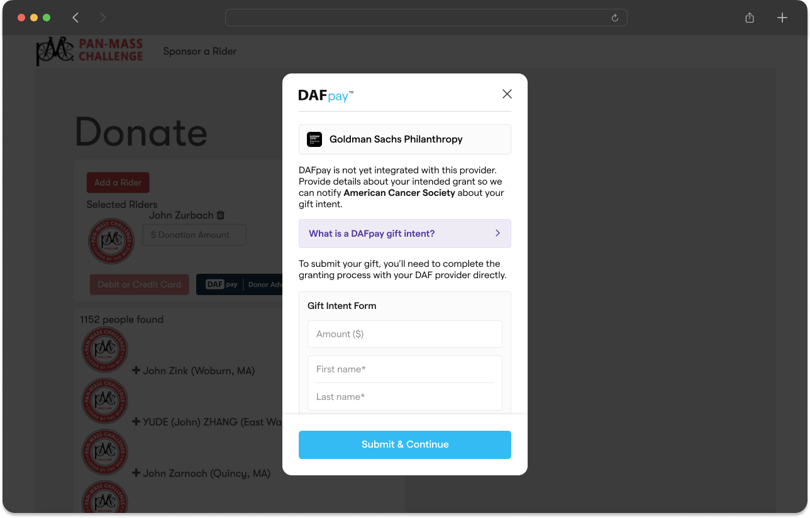

## Collecting Form Data
DAFpay can auto-populate the donor contact fields or your platform can pass donor information directly into the onDonationRequest.

### Option 1: Express Checkout
Chariot offers "Express Checkout" where the Chariot Connect modal pulls the donor's name, email, phone and address information from their account with the DAF provider. This allows for "one-click" checkout experiences and removes the need for a donor to fill out a lengthy form before making a DAF donation. The user always has the ability to review their information and make changes before submission.


<Warning title="Placement Requirement">
DAFpay's Express Checkout feature only works when the button is placed at the top of a donation form (before the donor’s contact details are collected).
</Warning>

<Tip title="Automatically Active">
No action is required to enable Express Checkout. If no donor information is provided in the onDonationRequest, the contact fields will be automatically populated from the DAF provider.

To test the Express Checkout functionality, visit https://secure.dafpay.com/demo and ensure the "Express" toggle is enabled, which will place DAFpay at the top of the form, ahead of the contact fields.
</Tip>

<Note title="Donation Amount">
If your platform opts for Express Checkout, you will still need to utilize the onDonationRequest to pass in the amount from your donation form to the DAFpay modal. See below for a list of potential onDonationRequest parameters that can be utilized (even when Express Checkout is active).
</Note>

### Option 2: Pre-Populated Data
You can pass form information to Chariot before launching a Connect session.
To provide this information, leverage the `onDonationRequest` function from the Chariot element.

<Info title="Leveraging The onDonationRequest">
If DAFpay (or other payment options) appear after the amount and contact fields on your donation form, ensure that the collected information is passed into the onDonationRequest. This will allow the fields to be properly recorded by Chariot's system and displayed correctly on the DAFpay modal.
</Info>

<CodeBlocks>
```javascript JavaScript
// get the element from the DOM
const chariot = document.getElementById("chariot")

// provide a callback that returns the donation data
chariot.onDonationRequest(async () => {
  return {
    amount: 25000, //this is $250.00 USD
    firstName: "Michael",
    lastName: "Scott",
    email: "michaelScott@theoffice.com",
    address: {
      line1: "123 Main St",
      line2: "Suite 4",
      city: "New York",
      state: "NY",
      postalCode: "12345"
    },
    designation: "My Special Designation",
    metadata: {
      fundraiserTag: "marathon"
    },
  }
})
```
```javascript React
import React, { useState } from 'react';
import ChariotConnect from 'react-chariot-connect';

const App = () => {
    const onDonationRequest = () => {
        return {
            amount: 25000, //this is $250.00 USD
            firstName: "Michael",
            lastName: "Scott",
            email: "michaelScott@theoffice.com",
            metadata: {
                fundraiserTag: "marathon"
            },
        }
    }

    return (
        <div>
            <ChariotConnect
                cid="GENERATED_CONNECT_IDENTIFIER"
                onDonationRequest={onDonationRequest}
            />
        </div>
    );
};
```
</CodeBlocks>

The given donation data must match the following schema to be accepted by Chariot:

| Parameter   | Description                                                                                                                                                                                                                                           | Type              |
|-------------|-------------------------------------------------------------------------------------------------------------------------------------------------------------------------------------------------------------------------------------------------------|-------------------|
| amount      | The donation amount in cents. e.g., for a $20 donation, enter 2000.  <br /><br />If this value is not passed in, Chariot will use the user's account balance to recommend a donation amount. This can lead to significantly larger donation amounts.  | number (optional) |
| firstName   | The donor's first name. Maximum length: 255 characters.                                                                                                                                                                                               | string (optional) |
| lastName    | The donor's last name. Maximum length: 255 characters.                                                                                                                                                                                                | string (optional) |
| email       | The donor's email address. Must be in email format. Maximum length: 255 characters.                                                                                                                                                                   | string (optional) |
| phone       | The donor's phone number. Please provide the phone number with the country code and without special characters. Maximum length: 255 characters.                                                                                                       | string (optional) |
| note        | A note the donor wants to send to the nonprofit. Maximum length: 400 characters.                                                                                                                                                                      | string (optional) |
| anonymous   | Indicates if this donation should be sent anonymously (default: false)                                                                                                                                                                                | boolean (optional)|
| designation | The designation to include on the grant. If this is left blank, "Where needed most" will be used. Note that including a custom designation may cause the grant approval process to take longer. Designations over 100 characters will be truncated. Maximum length: 255 characters. | string (optional) |
| address     | The donor's address: line1, line2, city, state, postalCode. Maximum length: 255 characters.                                                                                                                                                           | object (optional) |
| metadata    | An object with a set of name-value pairs. You can use this object to include any miscellaneous information you want to tie to the workflow session.                                                                                                   | object (optional) |
| fundId      | The ID of the preselected DAF provider. <br /><br /> If this value is provided, the donor will not be shown the default DAF dropdown and will instead be taken straight to that DAF's login.                                                          | string (optional) |
| frequency   | The recurring frequency of the DAF grant (if it's a recurring gift). This parameter allows the following possible enum values: `ONE_TIME`, `MONTHLY`. If not provided, the grant will default to a `ONE_TIME` grant. For more information on recurring donations, please see the [section below](/guides/dafpay/integrating-dafpay/integration#recurring-donations) | string (optional) |
| lockedAmount| Indicates if the donation amount should be locked in the modal (not recommend)                                                                                                                                                                        | boolean (optional)|

<Warning title="Data Validation">
To prevent request failures, any inputs exceeding the maximum allowed length will be automatically truncated.
</Warning>

<Note title="Popular Parameters">
- Metadata: Allows you to associate the payment or session with any data in your system (i.e., Form ID, Campaign Name).
- Anonymous: Indicate if a donor has chosen to give anonymously on your donation form so the donation can be properly anonymized by the DAF provider.
</Note>

### Preventing Blocked Popups
Certain mobile browsers impose restrictions on popups if they are considered “decoupled” from the original user action. This often occurs when long-running asynchronous operations are introduced between the user’s action (e.g., a button click) and the popup launch.

To ensure a seamless integration with DAFpay, platforms must be mindful of potential pitfalls when handling donation requests.

<Tip title="General Best Practices">
- Keep the interval between user action and popup launch under 1000ms.
- Minimize blocking API calls before launching the popup.
- Avoid long-running async operations in the donation request flow.
- Where possible, prefetch necessary data before the user clicks the donation button.
</Tip>

**Common scenarios where popup blocking occurs**
<Accordion title="Custom button with Shadow DOM and delayed API calls">
  If your platform has implemented a custom donation button using a Shadow DOM and manually triggers the DAFpay popup, be cautious about adding intermediate API or network requests before invoking the popup.

  When a user clicks the platform’s custom button and the platform makes an API call to its own servers before triggering the DAFpay popup, if the delay exceeds 1000ms, the browser may block the popup.

  To prevent the popup from being blocked, ensure that all network requests complete before the Shadow DOM event is triggered and minimize intermediate operations to prevent unnecessary delays.
</Accordion>
<Accordion title="Async operations in onDonationRequest callback">
  Some platforms rely on the built-in Chariot Connect (DAFpay) button to open the popup.

  However, they introduce additional asynchronous operations in the onDonationRequest callback, such as:
  - fetching user donation history
  - verifying donor eligibility via API calls
  - retrieving pre-filled form data

  Since onDonationRequest allows for async operations, any delay beyond 1000ms increases the risk of the popup being blocked.

  To prevent the popup from being blocked, minimize async logic inside onDonationRequest.	If additional data fetching is required, perform it before triggering the donation request or use background loading strategies.
</Accordion>

Following these guidelines will ensure a smooth user experience and prevent popup-blocking issues on mobile devices. If you encounter integration challenges, reach out to Chariot support for further assistance.

### Disabling Connect

To prevent the DAFpay button from launching until form validation is performed, pass `false` to the onDonationRequest.


## Capturing Grant Intents
When a user completes a Chariot Connect session you will receive a grant intent.

<Warning title="Create Grant Route">
After you submit your own donation form, do not forget to call the [Create Grant](/api/grants/create) API to initiate the grant.
</Warning>

Most workflows proceed as follows:

1. Listen for the `CHARIOT_SUCCESS` event to receive the grant intent after a Chariot Connect session.
   - If you would like to collect any additional information from the user (i.e., Fee Coverage Prefences) you can do so at this step. However, if the Chariot Connect session is the last step in your donation form this is not necessary.
2. Submit your own donation form before converting the grant intent into a grant.
3. Have your backend call Chariot's [Create Grant](/api/grants/create) to create the grant (i.e., capture the grant intent).

<Error>
  Submitting your own donation form before calling Chariot’s [Create Grant](/api/grants/create) ensures consistency between your system and Chariot. See **Loading Screen** section below.
</Error>

<CodeBlocks>
```javascript JavaScript
// get the element from the DOM
const chariot = document.getElementById('chariot');

chariot.addEventListener('CHARIOT_SUCCESS', ({ detail }) => {
    // Record the grant intent information so that you can
    // capture the transaction once your form is submitted.
});
```
```javascript React
import React, { useState } from 'react';
import ChariotConnect from 'react-chariot-connect';

const App = () => {
  const onSuccess = (r) => {
		// Record the grant intent information so that you can
    // complete the transaction once your form is submitted.
  };
  const onExit = (e) => console.log('exit', e);
  const onDonationRequest = () => {
    // your logic
  }

  return (
    <div>
        <ChariotConnect
          cid="GENERATED_CONNECT_IDENTIFIER"
          onDonationRequest={onDonationRequest}
          onSuccess={onSuccess}
          onExit={onExit}
        />
    </div>
  );
};
```
</CodeBlocks>

### Response Objects

<CodeBlocks>
```json onSuccessMetadata
  {
    "workflowSessionId":"79e772be-547d-4c9c-8b76-4ac4ed4c441a", //Id of the Connect session
    "grantIntent": {
      "userFriendlyId": "100020", //The user-friendly identifier for the grant intent
      "fundId": "bbf485dd-a056-4a9d-89a8-06e201cdbf7f", //Id of the donor advised fund
      "amount": 2000, //The grant amount expressed in units of cents; USD only
      "metadata": {} // The same metadata object that was passed in the onDonationRequest callback referenced above
    }
  }
```

```json onExitMetadata
  {
    "workflowSessionId": "79e772be-547d-4c9c-8b76-4ac4ed4c441a", // Id of the Connect workflow session.
    "nodeId": "consent-node-id", // The id representing the pane where the user exited the Connect flow.
    "fundId": "bbf485dd-a056-4a9d-89a8-06e201cdbf7f", // The id of the donor advised fund that the user selected.
    "reason": "USER_EXIT", // An enum giving a reason to why the modal exited.
    "description": "User exited the flow" // A human readable string containing a brief sentence explaining the exit reason.
  }
```
</CodeBlocks>

| Event Name         | Description                                                                                                                                                                                                                                                                               | Metadata Type         |
|--------------------|-------------------------------------------------------------------------------------------------------------------------------------------------------------------------------------------------------------------------------------------------------------------------------------------|-----------------------|
| `CHARIOT_INIT`     | The init event is called when the Chariot Connect script is initialized and ready to be run. This is useful to be able to know when Chariot Connect is initialized and ready to be used.                                                                                                   | No metadata is provided for this event. |
| `CHARIOT_SUCCESS`  | The success event contains a final summary of the Connect workflow session. It contains the workflow session id and relevant donation information.  <br /><br />Once you receive the success event don't forget to complete the transaction by calling the [Create Grant](/api/grants/create) or [Create Recurring Grant](/api/recurring-grants/create) route based on the grant intent data. | `OnSuccessMetadata`   |
| `CHARIOT_EXIT`     | The exit event is called when a user exits without successfully completing the flow, when an error occurs during the flow, or when a user confirms an unintegrated grant.                                                                                                                  | `OnExitMetadata`      |

**Exit Reasons**

| Exit Reason                | Description                                                                                                                                                                                                                   |
|----------------------------|-------------------------------------------------------------------------------------------------------------------------------------------------------------------------------------------------------------------------------|
| `USER_EXIT`                | User exited the flow.                                                                                                                                                                                                         |
| `UNINTEGRATED_DAF`         | DAF is not integrated with Chariot.                                                                                                                                                                                           |
| `UNINTEGRATED_GRANT_CONFIRMED` | Unintegrated grant confirmed with Chariot.                                                                                                                                                                                  |
| `CID_NOT_FOUND`            | Connect Identifier is not found.                                                                                                                                                                                              |
| `INELIGIBLE_ORGANIZATION`   | This Organization is not eligible to receive DAF donations.                                                                                                                                                                   |
| `CREDENTIALS_ERROR`        | Invalid credentials.                                                                                                                                                                                                          |
| `INVALID_CARD`             | Invalid card number.                                                                                                                                                                                                          |
| `TFA_ERROR`                | Two-factor authentication error.                                                                                                                                                                                              |
| `ZERO_AMOUNT`              | Grant amount is zero.                                                                                                                                                                                                         |
| `SERVICE_DEACTIVATED`      | Nonprofit's Connect is deactivated (active = false).                                                                                                                                                                          |
| `ACCESS_RESTRICTED`        | User's DAF sponsor account electronic access is restricted.                                                                                                                                                                    |
| `EIN_NOT_FOUND`            | DAF sponsor does not support grants to the nonprofit.                                                                                                                                                                          |
| `CONNECTION_FAILED`        | Connection to the DAF sponsor failed.                                                                                                                                                                                          |
| `SESSION_NOT_FOUND`        | User session is not found and may have expired.                                                                                                                                                                                |
| `CUSTOM_ERROR`             | Custom error.                                                                                                                                                                                                                 |
| `INTERNAL_ERROR`           | Internal error.                                                                                                                                                                                                               |
| `INSTITUTION_DOWN_ERROR`   | DAF sponsor institution is down; user should try again later.                                                                                                                                                                  |
| `NO_CHARITABLE_ACCOUNTS`   | Donor has no charitable accounts in the logged in account.                                                                                                                                                                      |
| `INVALID_PRESELECTED_DAF`  | Preselected DAF is invalid.                                                                                                                                                                                                   |
| `INACTIVE_CARD`            | Inactive card.                                                                                                                                                                                                                |
| `RECURRING_NOT_SUPPORTED`  | Recurring grants are not supported by this DAF
| `UNINTEGRATED_DAF_NOT_SUPPORTED` | Unintegrated DAF is not supported by DAFpay

### Donation Amount Changes

<Warning title="Accounting For Changes Within a Session">
Please note that the donation amount passed into DAFpay from your platform may change within the DAFpay modal for various reasons.
To ensure accuracy, always use the information provided in the onSuccessMetadata from Chariot when calling the Create Grant route.
</Warning>

If a donor tries to submit a grant request for an amount that exceeds their current account balance, Connect will alert the donor and suggest the donor to adjust the donation amount to the available account balance.

Additionally, if a Donor Advised Fund platform has a minimum donation requirement, Connect will alert donors of this requirement and suggest the donor to alter the donation size to match the minimum threshold for submission.


### Loading Screen

Occasionally, there may be a delay between clicking "Donate" on DAFpay and being redirected to the organization’s confirmation page.
To provide an intuitive user experience, make sure to implement an intermediary loading screen to notify the donor that their gift is being processed and that they should avoid navigating away from the page during this time.

This loading screen should be displayed between the time you receive the `CHARIOT_SUCCESS` event and the time your systems have successfully processed the grant by calling the Create Grant route.

<Frame caption="Loading screen example">
    
    
</Frame>

## Unintegrated DAF Providers
Unintegrated Grants represent a donors intention to donate from a DAF provider that DAFpay is not yet integrated with.

Unintegrated grants will be marked with an `unknown` status.
    - Use the [List Unintegrated Grants](/api/unintegrated-grants/list) API to access details such as gift amount, DAF provider name, and donor information.
    - You can simulate the Unintegrated Grants flow on our [demo page](https://secure.dafpay.com/demo) by selecting The Boston Foundation.

<Note title="Opting Out of Unintegrated Grants">
    If your platform does not want to support unintegrated grants, DAFpay can redirect donors back to your donation form to select a different payment method (if the donor chooses an unsupported provider). Please let the Chariot team know if you would like to disable Unintegrated Grants for your platform.
</Note>

<Frame caption="Handling unsupported DAF providers differently within DAFpay. Left: Allow donors to record a Grant Intent; Right: Return donors to your donation form.">
    
    
</Frame>

If unintegrated grants are enabled, the modal automatically closes after the user enters their donation information allowing you to record the gift intent in your system. When the modal closes, the `CHARIOT_EXIT` event will fire with the exit reason `UNINTEGRATED_GRANT_CONFIRMED`.

<Note title="Unintegrated Grants Confirmation Page">
  In the thank you page for unintegrated grants you should render the data provided from `CHARIOT_EXIT` (tracking ID, nonprofit EIN, nonprofit name, and link to the DAF provider) so the donor is aware of the remaining steps to complete their donation. Make sure to offer the ability for a donor to copy the tracking ID (including the "Tracking ID" prefix) directly on your confirmation page.
</Note>

<Frame caption="Unintegrated Grant Confirmation Page">
    
</Frame>

DAFpay will also send an email directly to the donor reiterating the instructions.

<Frame caption="Unintegrated Grant Donor Instructions Email">
    
</Frame>

## Recurring Donations

Recurring donations are a powerful way to generate consistent revenue streams for nonprofits and they make up a large majority of the DAF grants that are distributed to charity each year. Chariot enables a donor to not only initiate a one-time grant, but also allows donors to initiate `MONTHLY` recurring grants through their Donor Advised Fund.

<Tip title="Managing Recurrence Schedule">
When a recurring donation is made via DAFpay, it indicates that the donation was set up as a monthly recurring donation. However, the actual recurrence is managed by the DAF provider. If the donor wishes to cancel or modify the recurrence, they must do so through their DAF provider portal. As a result, Chariot is not notified when a recurrence is canceled or updated. Therefore, we only record the initial grant with a monthly frequency and do not create a new grant each month in our system.
</Tip>

When a user completes a Chariot Connect session for a recurring donation, instead of receiving a `grantIntent` as part of the `CHARIOT_SUCCESS` event, you will receive a `recurringGrantIntent`.

<CodeBlocks>
```json onSuccessMetadata
  {
    "workflowSessionId":"79e772be-547d-4c9c-8b76-4ac4ed4c441a", //Id of the Connect session
    "recurringGrantIntent": {
      "userFriendlyId": "100020", //The user-friendly identifier for the grant intent
      "fundId": "bbf485dd-a056-4a9d-89a8-06e201cdbf7f", //Id of the donor advised fund
      "amount": 2000, //The grant amount expressed in units of cents; USD only
      "frequency": "MONTHLY", // The frequency of the recurring schedule for the donation
      "metadata": {} // The same metadata object that was passed in the onDonationRequest callback referenced above
    }
  }
```

```json onExitMetadata
  {
    "workflowSessionId": "79e772be-547d-4c9c-8b76-4ac4ed4c441a", // Id of the Connect workflow session.
    "nodeId": "consent-node-id", // The id representing the pane where the user exited the Connect flow.
    "fundId": "bbf485dd-a056-4a9d-89a8-06e201cdbf7f", // The id of the donor advised fund that the user selected.
    "reason": "USER_EXIT", // An enum giving a reason to why the modal exited.
    "description": "User exited the flow" // A human readable string containing a brief sentence explaining the exit reason.
  }
```

</CodeBlocks>

After you submit your own donation form, don't forget to call the [Create Recurring Grant](/api/recurring-grants/create) API to complete the transaction.

<Note title="Create Recurring Grant API">
If your platform enables recurring donations through Chariot, you will need to differentiate which of Chariot's APIs you use to capture the donation based on the information of the `CHARIOT_SUCCESS` event.
</Note>