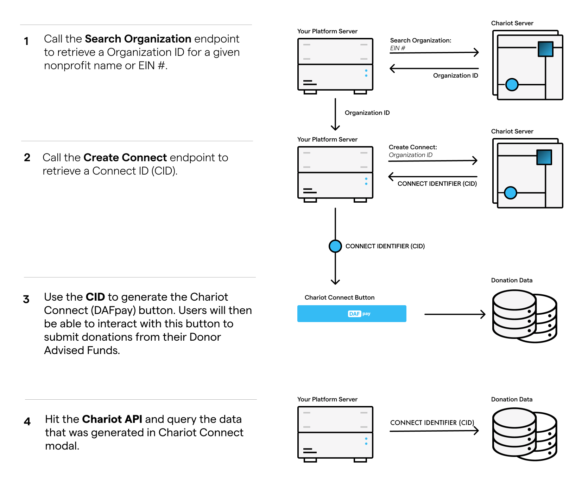

## How it works

DAFpay manages the entire grant submission process, including credential verification, multi-factor authentication, error management, and fee collection, for each Donor Advised Fund supported.

The initial step involves **searching** Chariot's database for an organization and **creating** a Connect.
Once created, you will receive a Connect ID (CID) that can be used to **initialize** Chariot Connect, the web component that renders the DAFpay button.
Lastly, **query** Chariot's APIs to gather all the data generated through Connect. 

<Frame>
    
</Frame>

## Try it out

Try out the [DAFpay Demo](https://secure.dafpay.com/demo) for yourself and see what it might look like on your website after you've completed the integration.