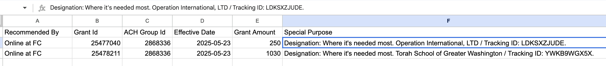

## Reconciliation & Grant Identifiers
Organizations will receive DAFpay gifts directly from each DAF provider — either via electronic transfer or mailed check.

Because **DAFpay does not handle the funds directly**, when grants are sent from the DAF provider to the nonprofit, they will include a tracking ID and external ID as well as a "Gift via DAFpay" callout in the memo section, which can be used to easily identify and match the grant to the corresponding record in your platform's transactions table.

<Warning title="Grant Identifiers">
Make sure that your platform displays the trackingId and externalId fields as searchable fields on your transactions dashboard.
</Warning>

DAFpay provides unique identifiers to help nonprofits reconcile donations once they arrive:

    1. **Tracking ID**: A 10-digit alphanumeric identifier generated by DAFpay, included in the initial grant request, and usually passed to the nonprofit from the DAF. This appears in the DAF provider’s data as a “Tracking ID:” string within the grant note or purpose.
    2. **External Grant ID**: A string identifier generated by the DAF provider following a successful grant initiation request. The format depends on the DAF provider and typically appears in the provider’s data as a “Grant ID.”

<Frame caption="Example of how nonprofits will receive grants initiated via DAFpay. Note that the funds are sent directly to the nonprofit from the DAF provider, not DAFpay.">
    
    
</Frame>

If you would like to include the name of the DAF provider on each grant in your dashboard (i.e., Fidelity Charitable),
you can use the `fundId` from the Grant object to call the [Get DAF](/api/donor-advised-funds/get) API.

## Grant Statuses

All DAFpay grants from integrated providers will be marked with the `Initiated` status,
indicating that a grant was successfully submitted (but the DAF provider is still processing the gift).

Once a nonprofit receives the funds from the DAF provider and identifies the specific grant line item using the trackingId/externalId, they should be able to manually update the status from `Initiated` to `Received` directly in your platform’s dashboard or on the Chariot dashboard.

If a grant status is updated directly on the Chariot dashboard, subscribe to the `grant.updated` [Webhook Event](https://docs.givechariot.com/api/webhooks) to receive notifications.

If a grant status is updated in your fundraising platform’s dashboard, make sure to use the [Update Grant](/api/grants/update) API so we can reflect those changes on our end.

## Cancellations & Refunds

Donors may have the option to cancel their grants from their Donor Advised Fund portal before disbursement, subject to the specific policies of their DAF provider.
As funds in DAFs are no longer under the donor's direct ownership, the concept of refunds after the money leaves the DAF, does not apply.

Donations made via DAFpay are typically **final and irrevocable** gifts (depending on the specific policies of the DAF provider).

<Info title="Cancellation Procedures">
    Cancelled grants will be marked as `Cancelled` in your platform’s dashboard and will not incur any processing fees.
    If you believe a grant should be cancelled, please contact the donor first to confirm the cancellation and then send a request to the Chariot support team.
</Info>