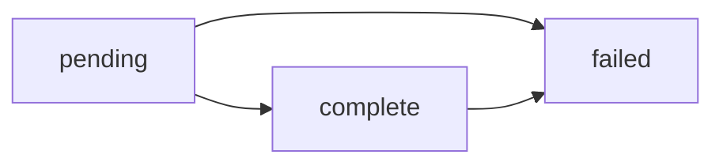

## Deposit Lifecycle

A Deposit represents a transfer of money to your Virtual Account. Understanding the deposit lifecycle helps you know when funds are available and how to handle edge cases.

### Deposit Status Flow



| Status | Description |
|--------|-------------|
| `pending` | The deposit has been received but funds have not yet settled |
| `complete` | The deposit has successfully settled to your Chariot Deposit Account |
| `failed` | The deposit was returned or rejected (funds will be debited if previously settled) |

### Status Details

<AccordionGroup>
    <Accordion title="Pending">
        When a deposit is first created, it enters the `pending` state.

        **What this means:**
        - Chariot has received notification of the incoming transfer
        - Individual donation records have been created
        - Funds have not yet settled to your account
        - You should not yet disburse these funds

        **How long it lasts:**
        - **In-Network transfers**: < 1 second (almost instant)
        - **ACH transfers**: 1-2 business days
        - **Check deposits**: 3-5 business days

        **What you should do:**
        - Donation data is available for CRM sync
        - Wait for `deposit.completed` webhook before considering funds available
        - Do not create acknowledgment letters yet (in case deposit fails)
    </Accordion>

    <Accordion title="Complete">
        When a deposit reaches `complete` status, funds have successfully settled to your account.

        **What this means:**
        - Funds are available in your Chariot Deposit Account balance
        - You can transfer funds to your external bank account
        - Donations are finalized and ready for acknowledgment
        - The deposit won't be reversed (except in rare fraud cases)

        **What you should do:**
        - Send donor acknowledgment letters
        - Finalize CRM records
        - Reconcile with your accounting system
        - Consider transferring funds to your external account

        **Webhook event:** `deposit.completed`
    </Accordion>

    <Accordion title="Failed">
        A deposit can fail for several reasons, even after initially settling.

        **Common failure reasons:**
        - ACH transfer rejected by bank
        - Insufficient funds at source
        - Incorrect account information
        - Check bounced or returned

        **What this means:**
        - If funds had settled, they will be debited from your account
        - Donations remain in your system but should be marked as uncollected
        - You should not send acknowledgment letters
        - You may need to contact the payment source

        **What you should do:**
        - Review the failure reason in the deposit details
        - Contact the payment source to resolve the issue
        - If you sent an acknowledgment, follow up with donor
        - Mark donations in your CRM as pending resolution

        **Webhook event:** `deposit.returned`
    </Accordion>
</AccordionGroup>

## Donation Lifecycle

Donations represent individual gifts from donors. Unlike deposits, donations don't have a status field but their availability follows the deposit lifecycle.

### Donation Creation

Donations are created when:
1. A deposit is received at a Virtual Account
2. The payment source provides donation-level details
3. Chariot parses and attributes individual gifts

**Timing:**
- Donations are created at the same time as the deposit
- You can retrieve donation data immediately via API
- Donation data is available even while the deposit is still pending

### Donation Data Structure

Each donation includes:

<Tabs>
    <Tab title="Core Fields">
        **Always present:**
        - `id` - Unique donation identifier
        - `virtual_account_id` - Which Virtual Account received it
        - `amount_gross` - Original donation amount
        - `amount_net` - Amount after fees
        - `amount_fee` - Fees deducted
        - `currency` - Currency code (usually USD)
        - `effective_date` - When the donation occurred
        - `created_at` - When Chariot recorded it
    </Tab>

    <Tab title="Attribution">
        **Donor information (when available):**
        - Donor name
        - Donor email
        - Donor address
        - Donor phone number
        - Anonymous flag

        Attribution quality varies by source:
        - **DAF grants**: Usually complete attribution
        - **Platform donations**: Depends on platform
        - **Checks**: Limited to check payer info
    </Tab>

    <Tab title="Source Details">
        **DAF Grant (`donor_advised_fund_grant`):**
        - DAF sponsor name
        - DAF account ID
        - Grant reference ID
        - Grant letter URL

        **Platform (`platform`):**
        - Platform name
        - Platform transaction ID
        - Platform fees
        - Platform campaign ID

        **Corporate Match (`corporate_match`):**
        - Employer name
        - Match ratio
        - Match amount
        - Employee reference
    </Tab>

    <Tab title="Settlement">
        **Settlement details:**
        - Settlement method (account/ACH/check)
        - Settlement date
        - Settlement status
        - Related deposit ID

        **Initiation details:**
        - How the donation was initiated
        - External reference IDs
        - Source system information
    </Tab>
</Tabs>

## Payment Rail Lifecycles

Different deposit types follow different settlement timelines:

<AccordionGroup>
    <Accordion title="In-Network Transfers">
        Deposits from Chariot-enabled grantmakers using Chariot Disbursements:

        **Timeline:**
        - **T+0 seconds**: Deposit created
        - **T+0 seconds**: Donations created
        - **T+0 seconds**: Deposit status → `complete`
        - **T+0 seconds**: Funds available

        **Benefits:**
        - Instant settlement
        - Real-time donation data
        - No fees for receiving
        - Best donor experience

        **Webhook events:**
        - `donation.created` (immediate)
        - `deposit.completed` (immediate)
    </Accordion>

    <Accordion title="ACH Transfers">
        Deposits via ACH from external sources:

        **Timeline:**
        - **Day 0**: Source initiates ACH transfer
        - **Day 1**: Deposit created in Chariot (status: `pending`)
        - **Day 1**: Donations created and available via API
        - **Day 1-2**: Deposit status → `complete`
        - **Day 1-2**: Funds available in account

        **Edge cases:**
        - ACH can be returned up to 2 business days after settlement
        - If returned, deposit status → `failed`
        - Weekend/holiday transfers settle next business day

        **Webhook events:**
        - `donation.created` (Day 1)
        - `deposit.completed` (Day 1-2)
        - `deposit.returned` (if failed)
    </Accordion>

    <Accordion title="Check Deposits">
        Deposits via physical checks to lockboxes:

        **Timeline:**
        - **Day 0**: Check arrives at lockbox
        - **Day 1**: Check scanned and processed
        - **Day 1**: Deposit created (status: `pending`)
        - **Day 1**: Donations created with check images
        - **Day 3-5**: Funds settle to account
        - **Day 3-5**: Deposit status → `complete`

        **Edge cases:**
        - Checks can bounce up to 5 business days after deposit
        - If bounced, deposit status → `failed`
        - Large checks may have holds per banking regulations

        **Webhook events:**
        - `donation.created` (Day 1)
        - `deposit.completed` (Day 3-5)
        - `deposit.returned` (if bounced)
    </Accordion>
</AccordionGroup>

## Best Practices

### When to Process Donations

<CardGroup cols={2}>
    <Card title='Immediate CRM Sync' icon='rotate'>
    Sync donation data to your CRM immediately when created, even if deposit is pending
    </Card>

    <Card title='Wait for Settlement' icon='clock'>
    Wait for deposit to complete before sending acknowledgment letters
    </Card>

    <Card title='Handle Failures' icon='triangle-exclamation'>
    Subscribe to `deposit.returned` to update records if deposit fails
    </Card>

    <Card title='Daily Reconciliation' icon='calendar-check'>
    Reconcile completed deposits with your bank statements daily
    </Card>
</CardGroup>

### Recommended Webhook Flow

```javascript
// Handle donation.created event
webhook.on('donation.created', async (event) => {
  const donation = event.data;
  
  // Sync to CRM immediately
  await crm.createOrUpdateDonor(donation.attribution.donor);
  await crm.createDonation({
    ...donation,
    status: 'pending' // Mark as pending settlement
  });
  
  // Do NOT send thank you letter yet
});

// Handle deposit.completed event
webhook.on('deposit.completed', async (event) => {
  const deposit = event.data;
  
  // Get all donations in this deposit
  const donations = await chariot.donations.list({
    deposit_id: deposit.id
  });
  
  // Update CRM records to finalized
  for (const donation of donations.data) {
    await crm.updateDonation(donation.id, {
      status: 'completed'
    });
    
    // Now send thank you letter
    await mail.sendThankYou(donation);
  }
});

// Handle deposit.returned event
webhook.on('deposit.returned', async (event) => {
  const deposit = event.data;
  
  // Get all donations in this deposit
  const donations = await chariot.donations.list({
    deposit_id: deposit.id
  });
  
  // Mark donations as failed in CRM
  for (const donation of donations.data) {
    await crm.updateDonation(donation.id, {
      status: 'failed'
    });
  }
  
  // Alert your finance team
  await slack.notify(`Deposit ${deposit.id} failed`);
});
```

## Handling Edge Cases

<AccordionGroup>
    <Accordion title="What if a deposit is returned after I sent an acknowledgment?">
        If you send acknowledgment letters before a deposit completes and it later fails:

        1. Contact the donor to let them know the payment didn't go through
        2. Offer to help them resubmit the donation
        3. Update your CRM to mark the donation as uncollected
        4. Don't include in tax reporting for that year

        **Prevention:** Always wait for `deposit.completed` before sending acknowledgments.
    </Accordion>

    <Accordion title="Can I update donation information?">
        Yes. Use the [Update Donation](/api/donations/update) endpoint:

        <EndpointRequestSnippet endpoint="PATCH /v1/donations/{id}" />

        You can update:
        - `purpose` - How the gift should be used
        - `note` - Additional information
        - `attribution` - Donor details

        You cannot update amounts or fees as they reflect the actual transaction.
    </Accordion>

    <Accordion title="How do I handle partial deposits?">
        Some platforms send partial payments (e.g., weekly payouts from ongoing campaigns).

        Each payout creates a separate deposit with its own set of donations. Use the `virtual_account_id` and effective date to reconcile across deposits.

        Consider using custom properties to link related donations across deposits:

        ```javascript
        await chariot.properties.assign('donation', donation.id, {
          campaign_id: 'spring-2024',
          payout_batch: 'week-12'
        });
        ```
    </Accordion>
</AccordionGroup>

## Monitoring and Alerts

Set up monitoring for:

<CardGroup cols={2}>
    <Card title='Failed Deposits' icon='circle-exclamation'>
    Alert when deposits fail so you can quickly investigate
    </Card>

    <Card title='Large Donations' icon='sack-dollar'>
    Flag unusually large donations for special handling
    </Card>

    <Card title='Delayed Settlements' icon='hourglass'>
    Monitor for deposits taking longer than expected to settle
    </Card>

    <Card title='Missing Data' icon='magnifying-glass'>
    Alert if donations are missing key attribution fields
    </Card>
</CardGroup>

## Next Steps

<CardGroup cols={2}>
    <Card title='Flow of Funds' icon='money-bill-transfer' href='/guides/processing/flow-of-funds'>
    Learn how money flows from sources to your account
    </Card>

    <Card title='Webhooks Guide' icon='webhook' href='/api/webhooks'>
    Set up webhooks to respond to lifecycle events
    </Card>

    <Card title='API Reference' icon='code' href='/api/donations/list'>
    Explore the full Donations API
    </Card>

    <Card title='FAQ' icon='circle-question' href='/guides/processing/faq'>
    Common questions about processing
    </Card>
</CardGroup>

<Info>
Chariot is a financial technology company, not a bank. Chariot Accounts come with a Demand Deposit Account through our banking services partner, Column N.A., Member FDIC. Deposits in Chariot Accounts are eligible for FDIC insurance up to $250,000 per depositor, for each insurable capacity in which the account is held.
</Info>
