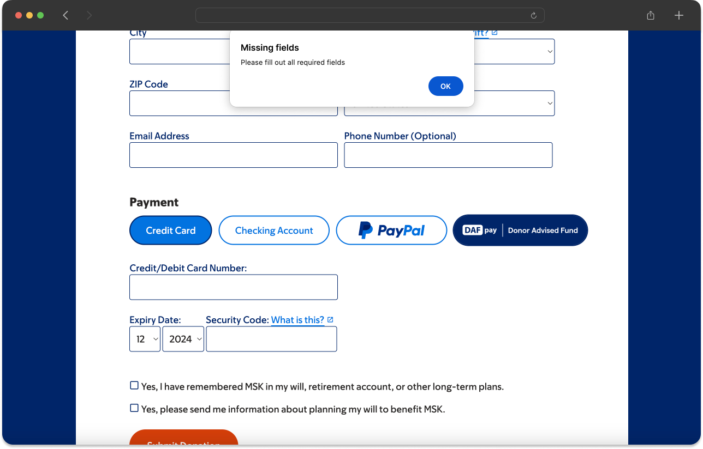

Return what your form collected from `onDonationRequest`. Anything you leave out, DAFpay fills from the donor's DAF account.

That fill is Express Checkout. It needs no setup, but it only works when the button sits above your contact fields. Test it on the [demo page](https://secure.dafpay.com/demo) with the Express toggle on.

Pass the amount either way — Express Checkout doesn't supply it.

<Error title="Empty strings count as provided">
Chariot treats any value you pass as provided, including an empty string. Sending `email: ""` tells us the donor's email is blank, and they type it by hand instead of having it prefilled.

Omit `firstName`, `lastName`, `email`, `phone` and `address` entirely to get prefill. Don't send them set to `""`.
</Error>

<CodeBlocks>
```javascript JavaScript
// get the element from the DOM
const chariot = document.getElementById("chariot")

// provide a callback that returns the donation data
chariot.onDonationRequest(async () => {
  return {
    amount: 25000, //this is $250.00 USD
    firstName: "Michael",
    lastName: "Scott",
    email: "michaelScott@theoffice.com",
    address: {
      line1: "123 Main St",
      line2: "Suite 4",
      city: "New York",
      state: "NY",
      postalCode: "12345"
    },
    designation: "My Special Designation",
    metadata: {
      fundraiserTag: "marathon"
    },
  }
})
```
```javascript React
import React, { useState } from 'react';
import ChariotConnect from 'react-chariot-connect';

const App = () => {
    const onDonationRequest = () => {
        return {
            amount: 25000, //this is $250.00 USD
            firstName: "Michael",
            lastName: "Scott",
            email: "michaelScott@theoffice.com",
            metadata: {
                fundraiserTag: "marathon"
            },
        }
    }

    return (
        <div>
            <ChariotConnect
                cid="GENERATED_CONNECT_IDENTIFIER"
                onDonationRequest={onDonationRequest}
            />
        </div>
    );
};
```
</CodeBlocks>

The given donation data must match the following schema to be accepted by Chariot:

| Parameter   | Description                                                                                                                                                                                                                                           | Type              |
|-------------|-------------------------------------------------------------------------------------------------------------------------------------------------------------------------------------------------------------------------------------------------------|-------------------|
| amount      | The donation amount in cents. e.g., for a $20 donation, enter 2000.  <br /><br />If this value is not passed in, Chariot will use the user's account balance to recommend a donation amount. This can lead to significantly larger donation amounts.  | number (optional) |
| firstName   | The donor's first name. Maximum length: 255 characters.                                                                                                                                                                                               | string (optional) |
| lastName    | The donor's last name. Maximum length: 255 characters.                                                                                                                                                                                                | string (optional) |
| email       | The donor's email address. Must be in email format. Maximum length: 255 characters.                                                                                                                                                                   | string (optional) |
| phone       | The donor's phone number. Please provide the phone number with the country code and without special characters. Maximum length: 255 characters.                                                                                                       | string (optional) |
| note        | A note the donor wants to send to the nonprofit. Maximum length: 400 characters.                                                                                                                                                                      | string (optional) |
| anonymous   | Indicates if this donation should be sent anonymously (default: false)                                                                                                                                                                                | boolean (optional)|
| designation | The designation to include on the grant. If this is left blank, "Where needed most" will be used. Note that including a custom designation may cause the grant approval process to take longer. Designations over 100 characters will be truncated. Maximum length: 255 characters. | string (optional) |
| address     | The donor's address: line1, line2, city, state, postalCode. Maximum length: 255 characters.                                                                                                                                                           | object (optional) |
| metadata    | An object with a set of name-value pairs. You can use this object to include any miscellaneous information you want to tie to the workflow session.                                                                                                   | object (optional) |
| fundId      | The ID of the preselected DAF provider. <br /><br /> If this value is provided, the donor will not be shown the default DAF dropdown and will instead be taken straight to that DAF's login.                                                          | string (optional) |
| frequency   | The recurring frequency of the DAF grant (if it's a recurring gift). This parameter allows the following possible enum values: `ONE_TIME`, `MONTHLY`. If not provided, the grant will default to a `ONE_TIME` grant. For more information on recurring donations, please see the [Recurring Grants](/guides/dafpay/integrating-dafpay/recurring) | string (optional) |

Anything longer than its maximum is truncated rather than rejected.

Send `anonymous` when a donor chooses to give anonymously, so the DAF provider anonymizes the grant properly.

<Note title="Pass your hidden fields too">
Whatever identifiers your form already carries — form or campaign ID, source, appeal code, designation code — belong in `metadata`. They come back on the grant's `metadata`, and on the donation as `initiation.dafpay_metadata`, which is how the nonprofit codes the gift in their CRM. Anything you leave out is gone by then.
</Note>

## Popup timing

Mobile browsers block popups they consider decoupled from the click that asked for one, which happens when something slow runs in between.

<Tip title="Keep it under a second">
- Keep the gap between the donor's click and the popup under 1000ms.
- Don't make blocking API calls before launching the popup.
- Prefetch what you need before the donor clicks.
</Tip>

Two ways platforms break this: a custom button that calls your own server before triggering the popup, and async work inside `onDonationRequest` such as fetching giving history or eligibility. Move that work earlier.

## Holding the button back

To keep the window from opening until your validation passes, return `false` from `onDonationRequest`.



Next: [Handle the Result](/guides/dafpay/integrating-dafpay/events).
