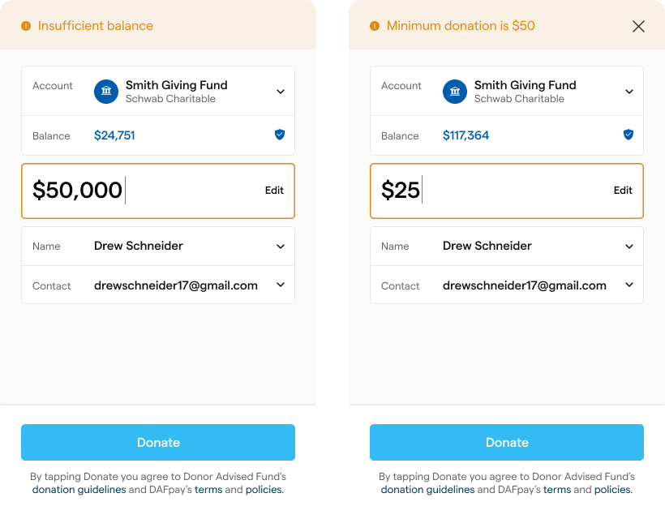
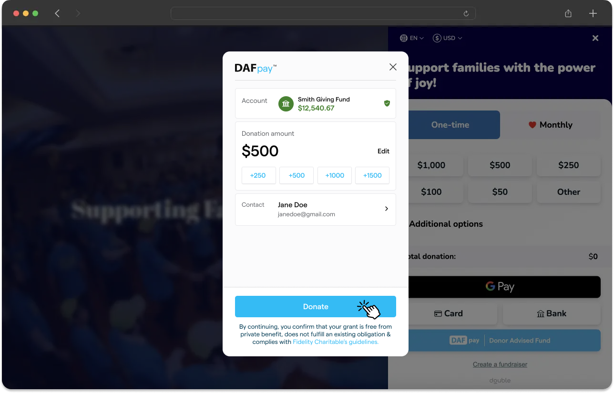
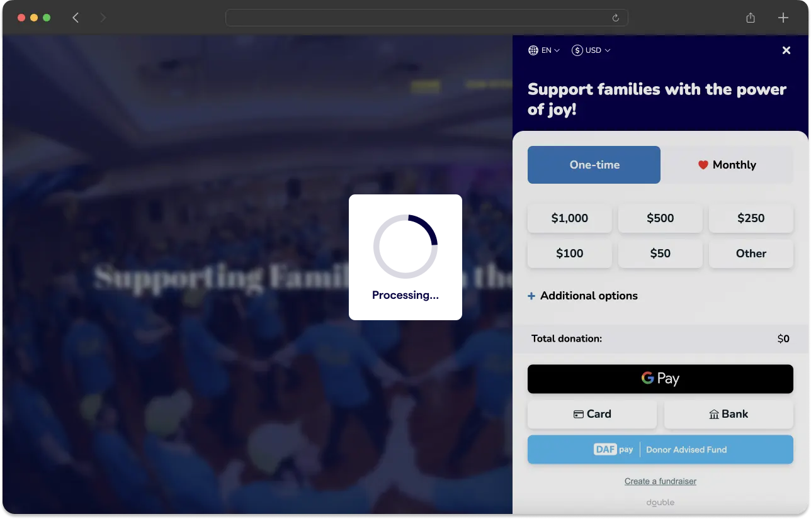

Connect fires three events. Everything your integration does after a donor opens the window hangs off them.

| Event Name         | Description                                                                                                                                                                                                                                                                               | Metadata Type         |
|--------------------|-------------------------------------------------------------------------------------------------------------------------------------------------------------------------------------------------------------------------------------------------------------------------------------------|-----------------------|
| `CHARIOT_INIT`     | The init event is called when the Chariot Connect script is initialized and ready to be run. This is useful to be able to know when Chariot Connect is initialized and ready to be used.                                                                                                   | No metadata is provided for this event. |
| `CHARIOT_SUCCESS`  | The success event contains a final summary of the Connect workflow session. It contains the workflow session id and relevant donation information.  <br /><br />Once you receive the success event don't forget to complete the transaction by calling the [Create Grant](/api/grants/create) or [Create Recurring Grant](/api/recurring-grants/create) route based on the grant intent data. | `OnSuccessMetadata`   |
| `CHARIOT_EXIT`     | The exit event is called when a user exits without successfully completing the flow, when an error occurs during the flow, or when a user confirms an unintegrated grant.                                                                                                                  | `OnExitMetadata`      |

## Payloads

<CodeBlocks>
```json onSuccessMetadata
  {
    "workflowSessionId":"79e772be-547d-4c9c-8b76-4ac4ed4c441a", //Id of the Connect session
    "grantIntent": {
      "userFriendlyId": "100020", //The user-friendly identifier for the grant intent
      "fundId": "bbf485dd-a056-4a9d-89a8-06e201cdbf7f", //Id of the donor advised fund
      "amount": 2000, //The grant amount expressed in units of cents; USD only
      "metadata": {} // The same metadata object that was passed in the onDonationRequest callback referenced above
    }
  }
```

```json onExitMetadata
  {
    "workflowSessionId": "79e772be-547d-4c9c-8b76-4ac4ed4c441a", // Id of the Connect workflow session.
    "nodeId": "consent-node-id", // The id representing the pane where the user exited the Connect flow.
    "fundId": "bbf485dd-a056-4a9d-89a8-06e201cdbf7f", // The id of the donor advised fund that the user selected.
    "reason": "USER_EXIT", // An enum giving a reason to why the modal exited.
    "description": "User exited the flow" // A human readable string containing a brief sentence explaining the exit reason.
  }
```
</CodeBlocks>

## Exit Reasons

| Exit Reason                | Description                                                                                                                                                                                                                   |
|----------------------------|-------------------------------------------------------------------------------------------------------------------------------------------------------------------------------------------------------------------------------|
| `USER_EXIT`                | User exited the flow.                                                                                                                                                                                                         |
| `UNINTEGRATED_DAF`         | DAF is not integrated with Chariot.                                                                                                                                                                                           |
| `UNINTEGRATED_GRANT_CONFIRMED` | Unintegrated grant confirmed with Chariot.                                                                                                                                                                                  |
| `CID_NOT_FOUND`            | Connect Identifier is not found.                                                                                                                                                                                              |
| `INELIGIBLE_ORGANIZATION`   | This Organization is not eligible to receive DAF donations.                                                                                                                                                                   |
| `CREDENTIALS_ERROR`        | Invalid credentials.                                                                                                                                                                                                          |
| `INVALID_CARD`             | Invalid card number.                                                                                                                                                                                                          |
| `TFA_ERROR`                | Two-factor authentication error.                                                                                                                                                                                              |
| `ZERO_AMOUNT`              | Grant amount is zero.                                                                                                                                                                                                         |
| `SERVICE_DEACTIVATED`      | Nonprofit's Connect is deactivated (active = false).                                                                                                                                                                          |
| `ACCESS_RESTRICTED`        | User's DAF sponsor account electronic access is restricted.                                                                                                                                                                    |
| `EIN_NOT_FOUND`            | DAF sponsor does not support grants to the nonprofit.                                                                                                                                                                          |
| `CONNECTION_FAILED`        | Connection to the DAF sponsor failed.                                                                                                                                                                                          |
| `SESSION_NOT_FOUND`        | User session is not found and may have expired.                                                                                                                                                                                |
| `CUSTOM_ERROR`             | Custom error.                                                                                                                                                                                                                 |
| `INTERNAL_ERROR`           | Internal error.                                                                                                                                                                                                               |
| `INSTITUTION_DOWN_ERROR`   | DAF sponsor institution is down; user should try again later.                                                                                                                                                                  |
| `NO_CHARITABLE_ACCOUNTS`   | Donor has no charitable accounts in the logged in account.                                                                                                                                                                      |
| `INVALID_PRESELECTED_DAF`  | Preselected DAF is invalid.                                                                                                                                                                                                   |
| `INACTIVE_CARD`            | Inactive card.                                                                                                                                                                                                                |
| `RECURRING_NOT_SUPPORTED`  | Recurring grants are not supported by this DAF
| `UNINTEGRATED_DAF_NOT_SUPPORTED` | Unintegrated DAF is not supported by DAFpay

## Donation Amount Changes

<Warning title="Accounting For Changes Within a Session">
Please note that the donation amount passed into DAFpay from your platform may change within the DAFpay modal for various reasons.
To ensure accuracy, always use the information provided in the onSuccessMetadata from Chariot when calling the Create Grant route.
</Warning>

If a donor tries to submit a grant request for an amount that exceeds their current account balance, Connect will alert the donor and suggest the donor to adjust the donation amount to the available account balance.

Additionally, if a Donor Advised Fund platform has a minimum donation requirement, Connect will alert donors of this requirement and suggest the donor to alter the donation size to match the minimum threshold for submission.



## Loading Screen

Occasionally, there may be a delay between clicking "Donate" on DAFpay and being redirected to the organization’s confirmation page.
To provide an intuitive user experience, make sure to implement an intermediary loading screen to notify the donor that their gift is being processed and that they should avoid navigating away from the page during this time.

This loading screen should be displayed between the time you receive the `CHARIOT_SUCCESS` event and the time your systems have successfully processed the grant by calling the Create Grant route.

<Frame caption="Loading screen example">
    
    
</Frame>

Next: [Create the Grant](/guides/dafpay/integrating-dafpay/create-grant).
