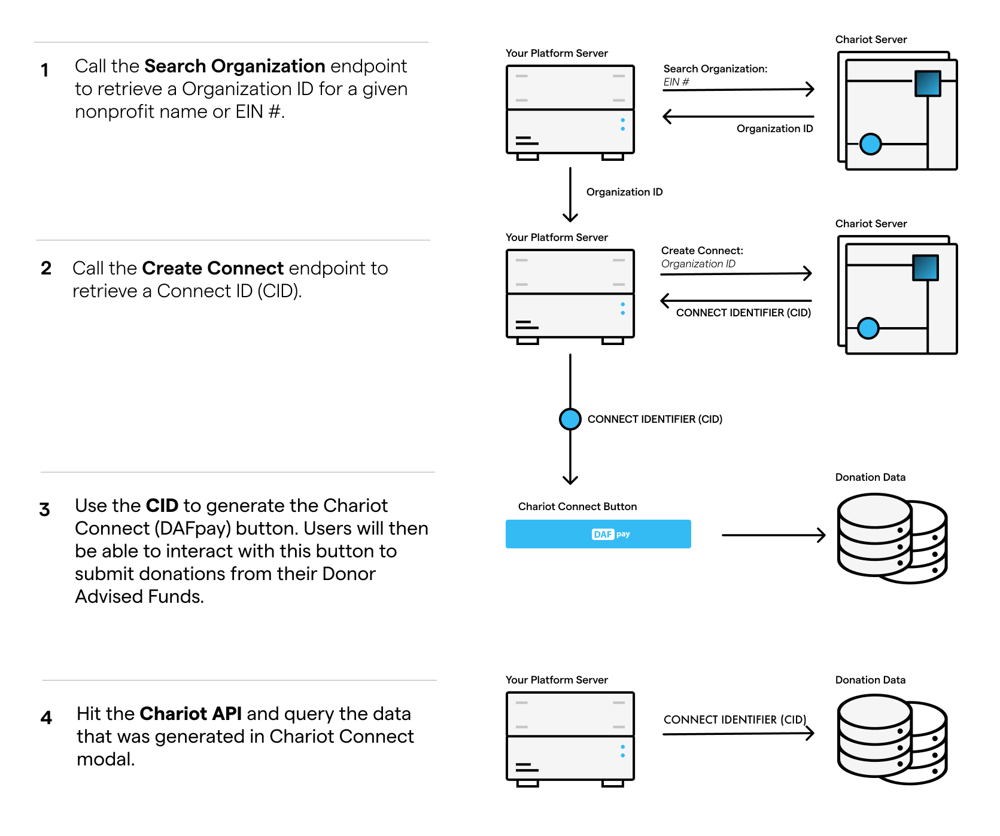

This guide is for fundraising platforms adding DAFpay on behalf of the nonprofits they serve. If you are a nonprofit putting DAFpay on your own form, start with [For Nonprofits](/guides/nonprofits).

You integrate once and enable DAFpay for many nonprofits. Each one gets its own connect and its own Connect ID, and your platform is what decides which connect a given donation form initializes.

```
        your platform
              │
    ┌─────────┼─────────┐
    ▼         ▼         ▼
Nonprofit A  B         C
 connect   connect   connect
    └─────────┼─────────┘
              ▼
           DAFpay
              ▼
        Grant → Donation
```

Getting that mapping wrong is the one mistake that misroutes money, so store the Connect ID against the nonprofit it belongs to and never fall back to a single platform-wide CID.

## How it works

DAFpay handles the whole grant submission: credential verification, multi-factor authentication, error management and fee collection, for every DAF provider we support.

<Steps>

### Create a connect

Search Chariot's database for the nonprofit and create a connect. You get a Connect ID (CID) back, one per nonprofit.

### Initialize Chariot Connect

Use the CID to render the DAFpay button on the donation form.

### Capture the grant

Your backend turns the donor's authorized intent into a grant, and you query Chariot's APIs for everything Connect produced.

</Steps>

<Frame>
    
</Frame>

## What each stage means

```
DAFpay session → grant intent → Grant → Donation → Deposit
```

The donor authorizes an intent in the browser. Capturing that intent creates a **Grant**, the donor's instruction to their DAF provider. A **Donation** is the gift record Chariot keeps once the provider acts on it, and a **Deposit** is the transfer the money actually arrives in.

A successful DAFpay session is not a gift, and a donation that exists is not money in the bank. Nothing here can be collapsed into "the donation succeeded".

## Where to start

Work through the [Integration Checklist](/guides/dafpay/integrating-dafpay/checklist). Everything is built in [sandbox](/guides/dafpay/sandbox) first, and [production keys](/guides/dafpay/integrating-dafpay/prod-keys) come at the end.

## Try it out

Try the [DAFpay Demo](https://secure.dafpay.com/demo) and see what it looks like on a live form before you build anything.
