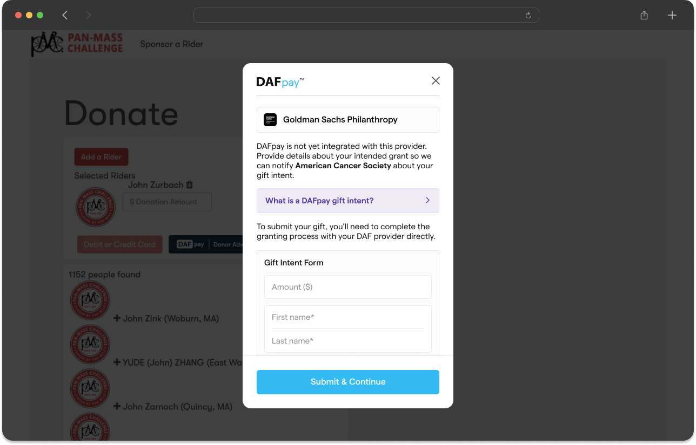
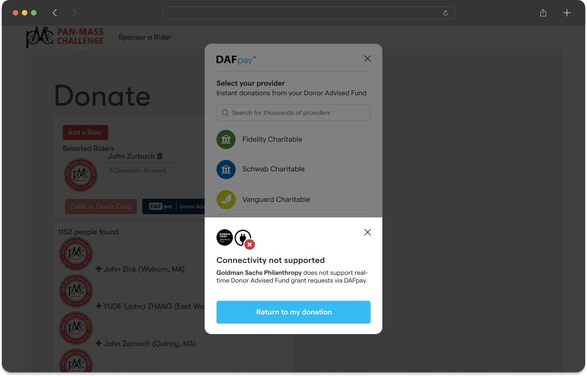
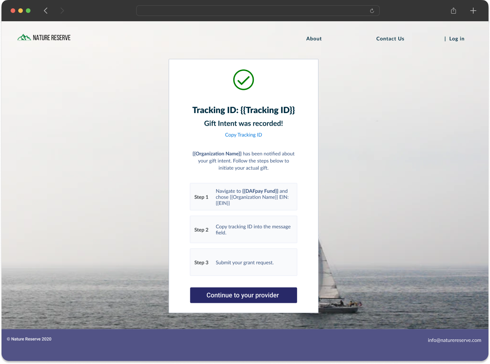
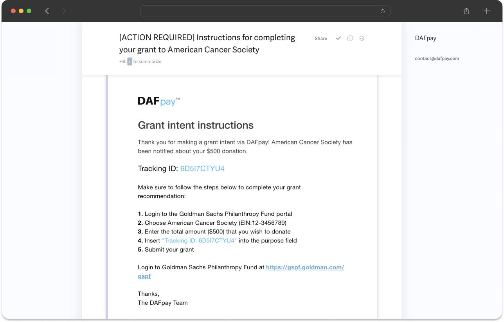

Unintegrated Grants represent a donors intention to donate from a DAF provider that DAFpay is not yet integrated with.

An unintegrated grant carries its own status: `Unknown`, `Completed` or `Canceled`. New ones come back as `Unknown`, since nobody can tell yet whether the donor finished the gift in their provider's portal.
    - Use the [List Unintegrated Grants](/api/unintegrated-grants/list) API to access details such as gift amount, DAF provider name, and donor information.
    - You can simulate the Unintegrated Grants flow on our [demo page](https://secure.dafpay.com/demo) by selecting The Boston Foundation.

<Note title="Opting Out of Unintegrated Grants">
    If your platform does not want to support unintegrated grants, DAFpay can redirect donors back to your donation form to select a different payment method (if the donor chooses an unsupported provider). Please let the Chariot team know if you would like to disable Unintegrated Grants for your platform.
</Note>

<Frame caption="Handling unsupported DAF providers differently within DAFpay. Left: Allow donors to record a Grant Intent; Right: Return donors to your donation form.">
    
    
</Frame>

If unintegrated grants are enabled, the modal automatically closes after the user enters their donation information allowing you to record the gift intent in your system. When the modal closes, the `CHARIOT_EXIT` event will fire with the exit reason `UNINTEGRATED_GRANT_CONFIRMED`.

<Note title="Unintegrated Grants Confirmation Page">
  In the thank you page for unintegrated grants you should render the data provided from `CHARIOT_EXIT` (tracking ID, nonprofit EIN, nonprofit name, and link to the DAF provider) so the donor is aware of the remaining steps to complete their donation. Make sure to offer the ability for a donor to copy the tracking ID (including the "Tracking ID" prefix) directly on your confirmation page.
</Note>

<Frame caption="Unintegrated Grant Confirmation Page">
    
</Frame>

DAFpay will also send an email directly to the donor reiterating the instructions.

<Frame caption="Unintegrated Grant Donor Instructions Email">
    
</Frame>

Next: [Production API Keys](/guides/dafpay/integrating-dafpay/prod-keys).
