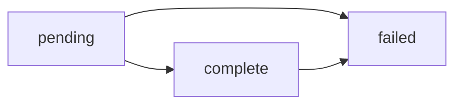

## Deposit Lifecycle

A Deposit represents a transfer of money to your Financial Account via a Payment Source. Understanding the deposit lifecycle helps you know when funds are available and how to handle edge cases.

### Deposit Status Flow

| Status | Description |
|--------|-------------|
| `pending` | The deposit has been received but funds have not yet settled |
| `complete` | The deposit has successfully settled to your Chariot Deposit Account |
| `failed` | The deposit was returned or rejected (funds will be debited if previously settled) |

### Status Details

<AccordionGroup>
    <Accordion title="Pending">
        When a deposit is first created, it enters the `pending` state.

        **What this means:**
        - Chariot has received notification of the incoming transfer
        - Individual donation records have been created or will be created shortly
        - Funds have not yet settled to your account
        - You should not yet disburse these funds

        **How long it lasts:**
        - **In-Network transfers**: < 1 second (almost instant)
        - **ACH transfers**: 1-2 business days
        - **Check deposits**: 5-7 business days

        **What you should do:**
        - Donation data is available for CRM sync
        - Wait for `deposit.completed` webhook before considering funds available
        - Do not create acknowledgment letters yet (in case deposit fails)
    </Accordion>

    <Accordion title="Complete">
        When a deposit reaches `complete` status, funds have successfully settled to your account.

        **What this means:**
        - Funds are available in your Chariot Deposit Account balance
        - You can transfer funds to your external bank account
        - Donations are finalized and ready for acknowledgment
        - The deposit won't be reversed (except in rare fraud cases)

        **What you should do:**
        - Send donor acknowledgment letters
        - Finalize CRM records
        - Reconcile with your accounting system
        - Consider transferring funds to your external account

        **Webhook event:** `deposit.completed`
    </Accordion>

    <Accordion title="Failed">
        A deposit can fail for several reasons, even after initially settling.

        **Common failure reasons:**
        - ACH transfer rejected by bank
        - Insufficient funds at source
        - Incorrect account information
        - Check bounced or returned

        **What this means:**
        - If funds had settled, they will be debited from your account
        - Donations remain in your system but should be marked as uncollected
        - You should not send acknowledgment letters
        - You may need to contact the payment source

        **What you should do:**
        - Review the failure reason in the deposit details
        - Contact the payment source to resolve the issue
        - If you sent an acknowledgment, follow up with donor
        - Mark donations in your CRM as pending resolution

        **Webhook event:** `deposit.returned`
    </Accordion>
</AccordionGroup>

## Donation Lifecycle

Donations represent individual gifts from donors. Unlike deposits, donations don't have a status field but their availability follows the deposit lifecycle.

### Donation Creation

Donations are created when:
1. A deposit is received at a Payment Source
2. The payment source provides donation-level details
3. Chariot parses and attributes individual gifts

**Timing:**
- Donations are created at the same time as the deposit
- You can retrieve donation data immediately via API
- Donation data is available even while the deposit is still pending

### Donation Data Structure

Each donation includes:

<Tabs>
    <Tab title="Core Fields">
        **Always present:**
        - `id` - Unique donation identifier
        - `payment_source_id` - Which Payment Source received it
        - `amount_gross` - Original donation amount
        - `amount_net` - Amount after fees
        - `amount_fee` - Fees deducted
        - `currency` - Currency code (usually USD)
        - `created_at` - When the donation was created
    </Tab>

    <Tab title="Attribution">
        **Donor information (when available):**
        - Donor name
        - Donor email
        - Donor address
        - Donor phone number
        - Anonymous flag

        Attribution quality varies by source:
        - **DAF grants**: Usually complete attribution
        - **Platform donations**: Depends on platform
        - **Checks**: Limited to check payer info
    </Tab>

    <Tab title="Source Details">
        **DAF Grant (`donor_advised_fund_grant`):**
        - DAF sponsor name
        - DAF account ID
        - Grant reference ID
        - Grant letter URL

        **Platform (`platform`):**
        - Platform name
        - Platform transaction ID
        - Platform fees
        - Platform campaign ID

        **Corporate Match (`corporate_match`):**
        - Employer name
        - Match ratio
        - Match amount
        - Employee reference
    </Tab>

    <Tab title="Settlement">
        **Settlement details:**
        - Settlement method (account/ACH/check)
        - Settlement date
        - Settlement status
        - Related deposit ID

        **Initiation details:**
        - How the donation was initiated
        - External reference IDs
        - Source system information
    </Tab>
</Tabs>

## Payment Rail Lifecycles

Different deposit types follow different settlement timelines:

<AccordionGroup>
    <Accordion title="In-Network Transfers">
        Deposits from Chariot-enabled grantmakers using Chariot Disbursements:

        **Timeline:**
        - **T+0 seconds**: Deposit created
        - **T+0 seconds**: Donations created
        - **T+0 seconds**: Deposit status → `complete`
        - **T+0 seconds**: Funds available

        **Benefits:**
        - Instant settlement
        - Real-time donation data
        - No fees for receiving

        **Webhook events:**
        - `donation.created` (immediate)
        - `deposit.completed` (immediate)
    </Accordion>

    <Accordion title="ACH Transfers">
        Deposits via ACH from external sources:

        **Timeline:**
        - **Day 0**: Source initiates ACH transfer
        - **Day 1**: Deposit created in Chariot (status: `pending`)
        - **Day 1**: Donations created and available via API
        - **Day 1-2**: Deposit status → `complete`
        - **Day 1-2**: Funds available in account

        **Edge cases:**
        - ACH can be returned up to 2 business days after settlement
        - If returned, deposit status → `failed`
        - Weekend/holiday transfers settle next business day

        **Webhook events:**
        - `donation.created` (Day 1)
        - `deposit.completed` (Day 1-2)
        - `deposit.updated` (if failed)
    </Accordion>

    <Accordion title="Check Deposits">
        Deposits via physical checks to lockboxes:

        **Timeline:**
        - **Day 0**: Check arrives at lockbox
        - **Day 1**: Check scanned and processed
        - **Day 1**: Deposit created (status: `pending`)
        - **Day 1**: Donations created with check images
        - **Day 5-7**: Funds settle to account
        - **Day 5-7**: Deposit status → `complete`

        **Edge cases:**
        - Checks can bounce up to 5 business days after deposit
        - If bounced, deposit status → `failed`
        - Large checks may have holds per banking regulations

        **Webhook events:**
        - `donation.created` (Day 1)
        - `deposit.completed` (Day 3-5)
        - `deposit.updated` (if bounced)
    </Accordion>
</AccordionGroup>

<Info>
Chariot is a financial technology company, not a bank. Chariot Accounts come with a Demand Deposit Account through our banking services partner, Column N.A., Member FDIC. Deposits in Chariot Accounts are eligible for FDIC insurance up to $250,000 per depositor, for each insurable capacity in which the account is held.
</Info>
