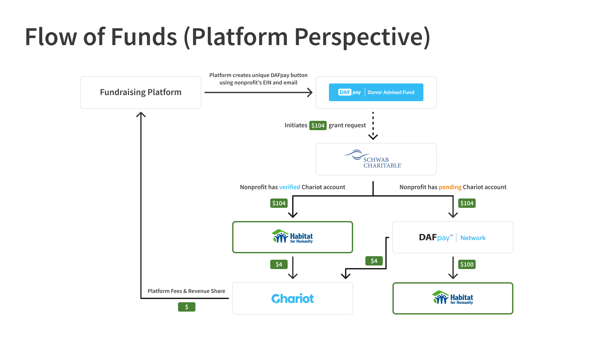

## Electronic Donations (ACH)

The flow of funds for electronic donations follows these steps:

<Frame>
    
</Frame>

1. **Payment Source**: A DAF sponsor or fundraising platform initiates an ACH transfer to your Payment Source
2. **Payment Source Receipt**: Chariot receives the transfer at your designated Payment Source's routing and account number
3. **Deposit Creation**: Chariot creates a Deposit record tracking the incoming transfer to your Financial Account
4. **Donation Processing**: Individual donations within the deposit are parsed and attributed with donor information
5. **Settlement**: Funds are settled to your Chariot Deposit Account<span title="Chariot is a financial technology company, not a bank. Chariot Accounts come with a Demand Deposit Account through our banking services partner, Column N.A., Member FDIC. Deposits in Chariot Accounts are eligible for FDIC insurance up to $250,000 per depositor, for each insurable capacity in which the account is held."><sup><Icon icon="fa-regular fa-circle-info" size="2.5"/></sup></span>
6. **Data Available**: Complete donation data is available via API for reconciliation and CRM integration
7. **Transfer Out**: You can transfer funds to your external bank account as needed

### Timeline for ACH Transfers

- **Day 0**: Payment source initiates ACH transfer
- **Day 1-2**: Transfer settles to your Chariot account
- **Day 1-2**: Donation data available via API
- **As needed**: Transfer funds to your external bank account (2-3 business days)

<Note>
ACH transfer timing depends on when the payment source initiates the transfer and standard ACH settlement windows.
</Note>

## In-Network Donations

For donations from Chariot-enabled grantmakers (using Chariot Disbursements):

<Frame>
    
</Frame>

1. **Disbursement Created**: A grantmaker creates a disbursement to your organization
2. **Instant Transfer**: Funds are transferred instantly between Chariot accounts
3. **Immediate Settlement**: The donation settles immediately to your account
4. **Real-Time Data**: Complete donation data is available immediately via API
5. **Consolidated View**: View all grants from all Chariot-enabled grantmakers in one place

### Benefits of In-Network Donations

<CardGroup cols={2}>
    <Card title='Instant Settlement' icon='bolt'>
    Funds are available immediately, 24/7/365
    </Card>

    <Card title='Complete Attribution' icon='id-card'>
    Full donor information is passed through automatically
    </Card>

    <Card title='Zero Fees' icon='circle-dollar'>
    No additional fees for receiving in-network grants
    </Card>

    <Card title='Unified Dashboard' icon='table-list'>
    See all donations from all sources in one place
    </Card>
</CardGroup>

## Check Donations

The flow of funds for physical check donations follows these steps:

1. **Mail Receipt**: Checks are mailed to your designated lockbox address
2. **Check Processing**: Chariot's processing partner receives and scans the check
3. **Image Capture**: Check images and metadata are captured
4. **Deposit Creation**: Chariot creates a deposit and initiates check deposit to your account
5. **Donation Record**: A donation record is created with check details
6. **Settlement**: Check funds are deposited to your Chariot Deposit Account (5-7 business days)
7. **Data Available**: Donation data with check images available via API

### Timeline for Check Processing

- **Day 0**: Check arrives at lockbox
- **Day 1**: Check is scanned and processed
- **Day 1**: Donation record created in Chariot
- **Day 5-7**: Check funds settle to your account
- **As needed**: Transfer funds to your external bank account

<Warning>
Check processing times may vary based on mail delivery and banking holidays. Checks deposited on Friday typically settle the following Wednesday.
</Warning>

## Fund Segregation by Source

Payment Sources enable you to segregate and track donations by source while maintaining a single Financial Account:

```
┌─────────────────────────────────────────────────────────────┐
│                 Chariot Deposit Account                      │
│                    (One unified balance)                     │
└─────────────────────────────────────────────────────────────┘
                              ▲
                              │
        ┌─────────────────────┼─────────────────────┐
        │                     │                     │
┌───────────────┐    ┌────────────────┐    ┌───────────────┐
│Payment Source │    │Payment Source  │    │Payment Source │
│   Fidelity    │    │     Schwab     │    │   Direct Mail │
│  Charitable   │    │   Charitable   │    │    Lockbox    │
└───────────────┘    └────────────────┘    └───────────────┘
```

Each Payment Source:
- Has its own unique routing + account numbers or mailing address
- Tracks deposits and donations separately for reconciliation
- Settles to the same underlying Financial Account
- Maintains complete audit trail of source and attribution

This approach provides:
- **Easy reconciliation** - Match deposits to payment sources automatically
- **Source tracking** - Know which DAF or platform each donation came from
- **Unified management** - One account balance, multiple funding sources
- **Flexible reporting** - Report by source, by date range, or in aggregate

## Reconciliation Flow

Here's how to reconcile donations with your systems:

<Steps>

### Check Your Financial Account Balance

Verify your current available balance:

<EndpointRequestSnippet endpoint="GET /v1/financial_accounts/balance" />

### List Recent Deposits

See which deposits have settled:

<EndpointRequestSnippet endpoint="GET /v1/deposits" />

### Get Donations for Each Deposit

Retrieve the individual donations within a deposit:

<EndpointRequestSnippet endpoint="GET /v1/donations" />

Filter by `deposit_id` to see all donations in a specific deposit.

### Match to Your Records

Use the donation data to:
- Update your CRM with donor information
- Generate acknowledgment letters
- Reconcile with your accounting system
- Create internal reports by source or campaign

</Steps>

## Transferring Funds Out

When you're ready to move funds to your external bank account:

<EndpointRequestSnippet endpoint="POST /v1/outbound_transfers" />

<Info>
You must configure and verify an external bank account through the Chariot Dashboard before you can create outbound transfers in production.
</Info>

### Outbound Transfer Timeline

- **Day 0**: Create outbound transfer via API or dashboard
- **Day 2-3**: Funds arrive in your external bank account

## Best Practices

<CardGroup cols={2}>
    <Card title='Create Source-Specific Virtual Accounts' icon='layer-group'>
    Use separate Virtual Accounts for each major payment source for easier reconciliation
    </Card>

    <Card title='Poll for New Donations Daily' icon='rotate'>
    Set up a daily job to retrieve new donations and sync to your CRM
    </Card>

    <Card title='Use Webhooks for Real-Time Updates' icon='webhook'>
    Subscribe to deposit and donation events for immediate notification
    </Card>

    <Card title='Reconcile Deposits Weekly' icon='calendar-check'>
    Match Chariot deposits to your bank statements regularly
    </Card>
</CardGroup>

<Info>
Chariot is a financial technology company, not a bank. Chariot Accounts come with a Demand Deposit Account through our banking services partner, Column N.A., Member FDIC. Deposits in Chariot Accounts are eligible for FDIC insurance up to $250,000 per depositor, for each insurable capacity in which the account is held.
</Info>
