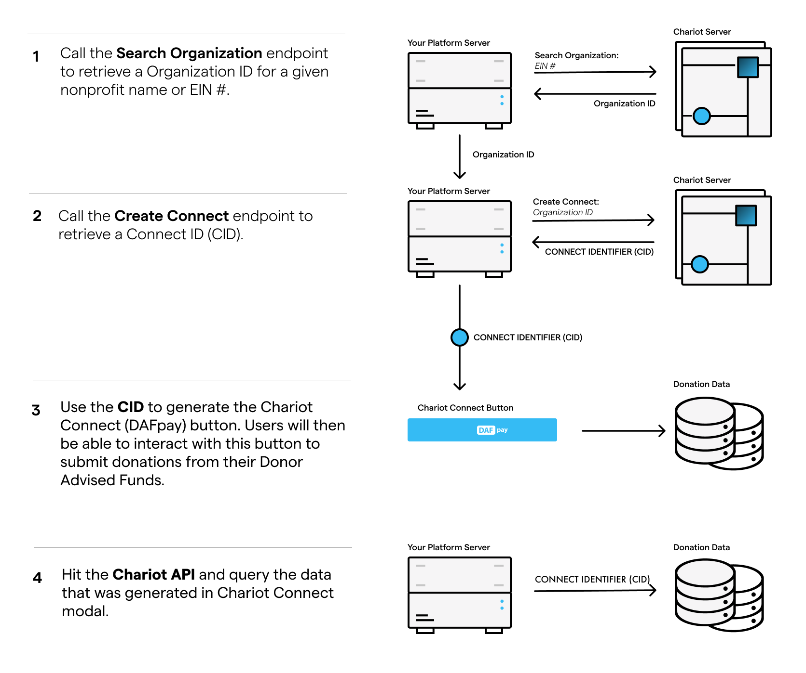

Follow this guide to build directly against the DAFpay APIs, whether you are adding DAFpay to one organization's donation form or offering it across forms for many organizations.

## How the integration works

1. Get the Connect for the organization receiving the gift. Chariot provides it for a single organization; you create one per organization if you serve many.
2. Render Chariot Connect using that organization's Connect ID.
3. Pass the current form values into DAFpay.
4. Receive `CHARIOT_SUCCESS` and create the Grant from your server within 15 minutes.
5. Store the workflow session, Grant, Donation, and reconciliation identifiers.
6. Subscribe to Grant updates.

The steps are the same either way. Where they differ is Connect handling, and that difference is set out below.

<Frame>
    
</Frame>

`CHARIOT_SUCCESS` means the donor authorized the request. It does not create the Grant or mean the nonprofit received the funds.

## Data to store

| Value | Why you need it |
| --- | --- |
| Platform nonprofit ID | Identifies the tenant in your system. |
| Chariot organization ID | Identifies the nonprofit in Chariot. |
| Connect ID | Initializes DAFpay for that nonprofit. |
| Platform transaction ID | Identifies the checkout in your system. |
| Workflow session ID | Connects the browser authorization to Create Grant. |
| Grant ID | Identifies the DAFpay Grant in Chariot. |
| Donation ID | Connects the Grant to Chariot's Donation record when available. |

Work in sandbox while you build. Sandbox has its own API keys, Connects, and data, and no real funds move. Sandbox Connect IDs begin with `test_` and production Connect IDs begin with `live_`. Create your sandbox API key in the Chariot dashboard and configure the base URL, key, and Connect ID together.

Use these credentials with any supported provider in sandbox:

```text
username: good-user
password: password123
```

Keep the [integration checklist](/guides/dafpay/accept/checklist) open as your roadmap while you build.

## Try DAFpay

Use the [DAFpay demo](https://secure.dafpay.com/demo) to see the donor experience before you begin.

## Are you a DAF provider?

If you operate a donor-advised fund and want to connect donor accounts to DAFpay, use the [Donor Accounts guide](/guides/dafpay/send/donor-accounts/overview).

## Single organization

Follow this guide if you want to integrate directly with the DAFpay APIs and embed DAFpay in a custom donation flow. If your form is hosted by a fundraising platform, [enable DAFpay through that platform](https://www.givechariot.com/dafpay-setup#integration-search) instead.

By the end of this section, your form will open DAFpay, receive the donor's authorization, and create the Grant from your server.

## Before you start

Server-side calls require an API key and the base URL for the environment you are using.

| Environment | Base URL |
| --- | --- |
| Sandbox | `https://sandboxapi.givechariot.com` |
| Production | `https://api.givechariot.com` |

Sandbox and production use separate API keys and Connect IDs. Configure the base URL, API key, and Connect ID together. See [Authentication](/api/authentication) for how to send the API key.

## How the integration works

1. [Request a Connect](/guides/dafpay/accept/connects) for your form.
2. [Install the DAFpay button](/guides/dafpay/accept/install).
3. [Send your form data](/guides/dafpay/accept/donation-data) into DAFpay.
4. [Handle the result](/guides/dafpay/accept/result) returned to your page.
5. [Create the Grant](/guides/dafpay/accept/create-grant) from your server.
6. [Test the full integration](/guides/dafpay/accept/sandbox) before requesting production access.

<Warning>
  `CHARIOT_SUCCESS` means the donor authorized the request. It does not create the Grant and does not mean your organization received the funds. Your server must call Create Grant within 15 minutes.
</Warning>

## Sandbox login

Use these credentials with any supported DAF provider in sandbox:

```text
username: good-user
password: password123
```

Next: [Integration Checklist](/guides/dafpay/accept/checklist)
