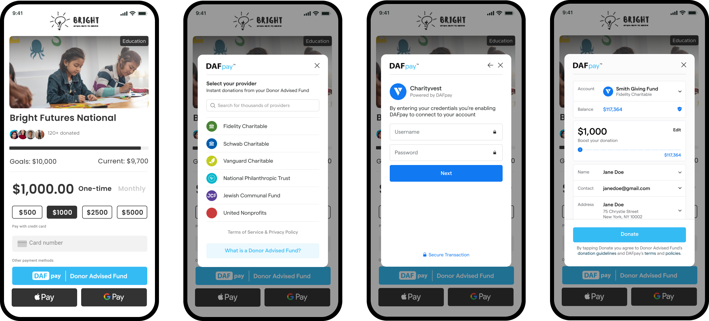

Follow this guide to build directly against the DAFpay APIs, whether you are adding DAFpay to one organization's donation form or offering it across forms for many organizations.

## How the integration works

1. Get the Connect for the organization receiving the gift. Chariot provides it if you are integrating one organization's form. If you serve many, you create one per nonprofit.
2. Render Chariot Connect using that organization's Connect ID.
3. Pass the current form values into DAFpay.
4. Receive `CHARIOT_SUCCESS` and create the Grant from your server within 15 minutes.
5. Store the workflow session, Grant, and reconciliation identifiers.
6. Subscribe to Grant updates.

`CHARIOT_SUCCESS` means the donor authorized the request. It does not create the Grant or mean the nonprofit received the funds.

## Use the SDK

Server-side calls are plain HTTP. The Node SDK wraps them with typed requests and responses, and handles paging and retries for you.

```sh
npm install --save @chariot-giving/typescript-sdk
```

See [SDKs](/api/sdks) for the full list.

## Data to store

| Value | Why you need it |
| --- | --- |
| Platform nonprofit ID | Identifies the tenant in your system. |
| Chariot organization ID | Identifies the nonprofit in Chariot. |
| Connect ID | Initializes DAFpay for that nonprofit. |
| Platform transaction ID | Identifies the checkout in your system. |
| Workflow session ID | Connects the browser authorization to Create Grant. |
| Grant ID | Identifies the DAFpay Grant in Chariot. |
| Donation ID | Connects the Grant to Chariot's Donation record. Nonprofits only; platforms cannot read Donations. |

Build against sandbox first. See [Authentication](/guides/dafpay/accept/authentication) for keys and base URLs.

Keep the [integration checklist](/guides/dafpay/accept/checklist) open as your roadmap while you build.

## Try DAFpay

Use the [DAFpay demo](https://secure.dafpay.com/demo) to see the donor experience before you begin.

## Are you a DAF provider?

If you operate a donor-advised fund and want to connect donor accounts to DAFpay, use the [Donor Accounts guide](/guides/dafpay/send/donor-accounts/overview).

Next: [Integration Checklist](/guides/dafpay/accept/checklist)
