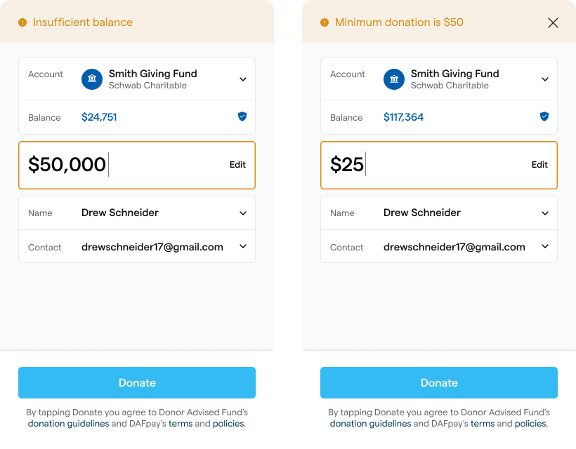

Call Create Grant from your server after `CHARIOT_SUCCESS`. A successful browser session does not create the Grant by itself.

<EndpointRequestSnippet endpoint="POST /v1/grants" />

## Server-side sequence

1. Receive the workflow session ID and amount returned by DAFpay.
2. Resolve the nonprofit and platform transaction from your stored session record.
3. Save the platform transaction, and submit your own donation form first.
4. Call Create Grant with the server-side API key.
5. Store the Grant ID and response.

Submit your own form before calling Create Grant. If your form fails after the Grant exists, the donor sees an error for a gift that was actually submitted to their DAF provider, and there is no way for them to tell.

Complete this sequence within 15 minutes of authorization.

## Retry safely

Create Grant and Create Recurring Grant are both idempotent for a workflow session. If the first request times out, call the same endpoint again with the same `workflowSessionId`.

| Response | What to do |
| --- | --- |
| `201 Created` | The Grant was created. Store it and stop retrying. |
| `200 OK` | A Grant already exists for this workflow session. Store it and stop retrying. |
| `409 Conflict` | Submission for this session is already being processed. Wait, then retry with the same workflow session. |
| `410 Gone` | The authorization expired. Ask the donor to complete DAFpay again. |
| `400 Bad Request` | A value cannot be submitted. Read the error and handle the invalid amount, provider requirement, or fee. |
| `401` or `403` | Authentication or access failed. Check the API key, the environment, and account access. |

Never create a new workflow session to retry the same donor authorization.

A timeout leaves the outcome uncertain. Keep the transaction pending while you resolve it rather than inviting the donor to start a second gift.

## Amount validation

Use the amount returned by `CHARIOT_SUCCESS`. Amounts are in cents and must be whole dollars, so the value must be divisible by 100.

Create Grant enforces this, not the modal. An amount that is not a whole dollar is accepted when the session starts and fails later, at creation, so validate it before you open DAFpay.

Do not set a universal minimum for DAFpay. Minimum Grant amounts vary by provider, and DAFpay prompts the donor to adjust an amount that is below the selected provider's minimum or above their available balance.

<Frame>
    
</Frame>

Create Grant may still return a validation error if the final amount cannot be submitted. Handle that error without marking the transaction complete.

When a `fundId` is available, use Get DAF to retrieve the provider's `minimumGrantAmount` and current availability. Treat an unavailable provider as a temporary error, not an invalid donor request.

## Platform fees

Use `applicationFeeAmount` only for the platform fee defined in your Chariot agreement. It is denominated in cents.

Create Grant validates `applicationFeeAmount` on its own against the Grant amount. The default ceiling is 210 basis points, and your Chariot agreement can raise it for your application. Chariot's own fee is charged separately and is not part of this check.

A donor-covered fee increases the Grant amount. It is not a separate tip. Do not offer a tip to a for-profit platform in a DAF transaction.

## Recurring gifts

When recurring Grants are enabled, a donor can ask their DAF provider to send a monthly Grant.

A recurring success contains `recurringGrantIntent` instead of `grantIntent`:

```json
{
  "workflowSessionId": "79e772be-547d-4c9c-8b76-4ac4ed4c441a",
  "recurringGrantIntent": {
    "fundId": "bbf485dd-a056-4a9d-89a8-06e201cdbf7f",
    "amount": 2000,
    "frequency": "MONTHLY",
    "metadata": {
      "platformTransactionId": "txn_123"
    }
  }
}
```

Call Create Recurring Grant, not Create Grant. It follows the same retry contract as Create Grant above. `workflowSessionId`, `frequency`, and `amount` are required, and `MONTHLY` is currently the only supported frequency. The endpoint also accepts the same optional donor, note, designation, and application fee fields. A recurring application fee applies to the first Grant only.


The DAF provider controls the schedule. Chariot records the initial setup but may not receive a new Grant for each later payment or learn when the donor changes or cancels the recurrence.

Model the initial record as the start of an arrangement, not proof of future payments. Treat each later gift as a separate one and reconcile it independently.

Do not promise nonprofits a complete recurring schedule unless another data source supports it.

## Authorization, Grant status, and payment

A completed DAFpay session means the donor authorized a Grant request. Creating the Grant records the request and submits it to the DAF provider. Neither event means the nonprofit has received the funds.

After Create Grant succeeds, create a pending or initiated transaction in your system. Do not mark it paid, settled, or received based only on the DAFpay result or successful Grant creation.

DAF providers review and send Grants on their own timelines. Depending on the provider and payment route, Chariot may receive additional status or payment information after the Grant is created.

## Grant status

A Grant carries status information in two separate places. Read the one that matches what you are displaying.

`status` on the Grant object is the lifecycle most platforms display. Every DAFpay Grant from an integrated provider starts at `Initiated`.

| API value | Meaning | Terminal | What happens next |
| --- | --- | --- | --- |
| `Initiated` | The request was submitted to and received by the DAF provider. The provider is still processing the gift. | No | Moves to `Completed` when receipt of the payment is confirmed, or to `Canceled` if the payment never arrives. |
| `Completed` | Receipt of the payment has been confirmed, either by Chariot recording the settlement or by the nonprofit confirming it. | Operationally final, but may return to `Initiated` if the associated settlement is removed. | No further automatic transitions. |
| `Canceled` | The donor canceled the Grant, or the DAF provider did not approve it. | Yes | No processing fees are taken or charged. |

There is no guarantee that a Grant reaches a terminal state on its own. Because DAFpay does not receive the funds, the transition out of `Initiated` often depends on the nonprofit confirming receipt. In the Chariot dashboard, that action is labeled **Received** and advances the Grant to `Completed`.

Grant billing is based on the Grant's `created_at` date and excludes Grants with a `Canceled` status. Billing is not triggered by the transition to `Completed`.

Platforms cannot write a Grant status. Listen for changes and display them; do not offer your users a control that sets one.

## Grant status history

`statuses` on the Grant object is an array of `GrantStatus` entries recording when the Grant reached each status it has held. The entries carry the same three values as `status`, ordered oldest first, with one entry per distinct status.

Every Grant has at least one entry, written when the Grant is created. Read `status` for the current state and `statuses` only when you need the time a state was reached.

## Keep the Grant current

Subscribe to `grant.updated`. A webhook tells you that the Grant changed, but it does not identify which fields changed. When an event arrives:

1. Verify the webhook signature.
2. Retrieve the current Grant.
3. Find your own record using the stored Grant ID.
4. Apply the current Grant data without creating a second record.
5. Store the event ID so repeated deliveries can be processed safely.

Use a periodic recovery process when status freshness matters. Webhooks can be delayed, delivered more than once, or missed by your application.

If you support unintegrated Grants, subscribe to `unintegrated_grant.updated` as well. These are separate records with their own events.

## Represent the status accurately

Use the exact status returned by the API. In your product, distinguish among:

- the donor authorizing a Grant request;
- Chariot creating or submitting the Grant;
- the DAF provider processing the request; and
- the nonprofit receiving the payment.

Do not use Paid, Settled, Completed, or Received unless the corresponding API data confirms that meaning.

A nonprofit may receive a provider payment that Chariot cannot confirm automatically. Document how that payment gets reconciled and how the confirmation reaches your system.

Next: [Unintegrated Providers](/guides/dafpay/accept/unintegrated)

