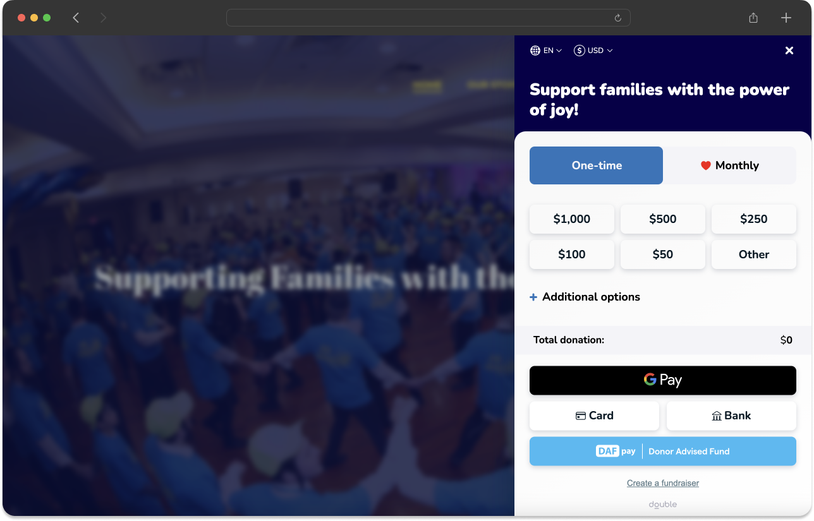

Load Chariot Connect and initialize it with the Connect ID stored for the nonprofit whose form the donor is viewing.

```html
<script src="https://cdn.givechariot.com/chariot-connect.umd.js"></script>
<chariot-connect id="chariot" cid="NONPROFIT_CONNECT_ID"></chariot-connect>
```

| Attribute | Required | Use |
| --- | --- | --- |
| `cid` | Yes | The Connect ID for the nonprofit whose form the donor is viewing. |
| `theme` | No | A built-in or registered custom theme. |

The Connect ID may appear in browser code. The API key may not.

## Prevent tenant mix-ups

Resolve the Connect ID from the same nonprofit record used to render the form. Do not hardcode an ID, store it in process-wide mutable state, reuse the last value loaded, or fall back to a platform default.

If the nonprofit has no enabled Connect, do not render DAFpay. Show the appropriate setup state in the nonprofit's platform settings instead.

## Make DAFpay easy to find

Make DAFpay visible before the donor completes the full donation form.

For Express Checkout, place DAFpay near the amount selection alongside other primary payment methods. For a multi-step form, show DAFpay on the first step or clearly indicate that Donor Advised Fund giving will be available later in the flow.

Do not hide DAFpay behind a generic More or See more control unless the visible label tells donors that DAFpay or Donor Advised Fund giving is available.

Use `DAFpay` as the product name, with that capitalization.


<Frame>
    
</Frame>

Test its placement at mobile widths and across every form and campaign type that supports it.

## Styling

Choose one of the built-in themes:

- `DefaultTheme`
- `LightModeTheme`
- `LightBlueTheme`
- `GradientTheme`

<Frame caption="DefaultTheme">
    
</Frame>

<Frame caption="LightModeTheme">
    
</Frame>

<Frame caption="LightBlueTheme">
    
</Frame>

<Frame caption="GradientTheme">
    
</Frame>

```html
<chariot-connect
  id="chariot"
  cid="NONPROFIT_CONNECT_ID"
  theme="LightModeTheme">
</chariot-connect>
```

You can also register a custom theme:

```javascript
chariot.registerTheme("myTheme", {
  width: "w-12",
  height: "h-9",
  showExtendedText: true
});
```

| Property | Use | Allowed value |
| --- | --- | --- |
| `width` | Button width | Up to `w-16` or 64px |
| `height` | Button height | `h-9` through `h-12` |
| `showExtendedText` | Show the longer button label | `true` or `false` |

Do not target internal component markup.

Next: [Content Security Policy](/guides/dafpay/accept/install)

## Content Security Policy

Chariot Connect loads its script from Chariot's CDN. Depending on the browser and viewport, DAFpay opens in a cross-origin frame or popup at `https://secure.dafpay.com`.

If your donation pages send a Content Security Policy, merge these sources into the applicable directives:

```text
Content-Security-Policy:
  default-src 'self';
  script-src 'self' https://cdn.givechariot.com;
  frame-src https://secure.dafpay.com;
  font-src 'self' https://cdn.givechariot.com;
  style-src 'self' 'unsafe-inline' https://cdn.givechariot.com;
  img-src 'self' https://cdn.givechariot.com data:;
```

This is an example, not a complete policy. Merge each source into your existing response header. Do not replace your full policy with this block.

The parent page does not need to add Chariot to `connect-src`. DAFpay API traffic originates inside the cross-origin frame.

If your security policy cannot allow inline styles, confirm the supported nonce or hash approach with Chariot before launch.

## Troubleshoot CSP

If the button does not render or clicking it does nothing:

1. Check the browser console for a blocked script, frame, font, style, or image.
2. Check the Network panel for requests blocked to `cdn.givechariot.com` or `secure.dafpay.com`.
3. Test with the same response headers used in production.
4. Check both enforced and report-only policies.

When CSP is delivered through a `<meta http-equiv="Content-Security-Policy">` tag, `frame-ancestors`, `report-uri`, `report-to`, and `sandbox` are ignored. Use a response header when possible.

Next: [Send Donation Data](/guides/dafpay/accept/donation-data)
