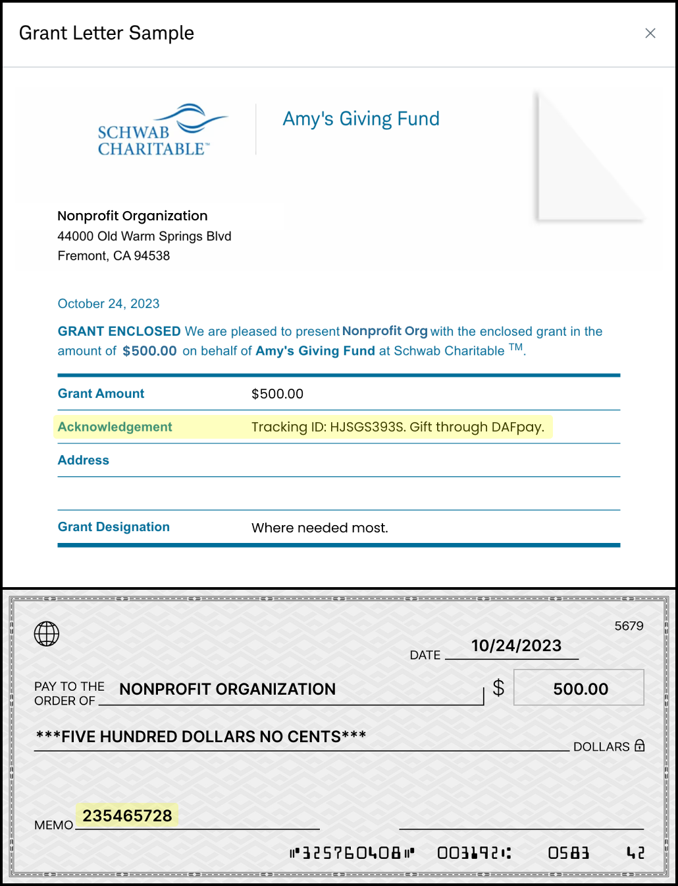
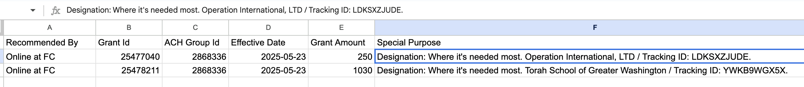

<Note>
  **For nonprofits.** This page is for nonprofits integrating their own donation form. If you are a fundraising platform offering DAFpay across many nonprofits' forms, see [Displaying DAFpay Gifts](/guides/dafpay/accept/displaying-gifts) instead.
</Note>

## Find the Donation

A donation record is created after the Grant, and the Donation is the record you will use to track the gift through processing. Once the Donation exists, its ID is added to the corresponding grant. This happens asynchronously, so `donationId` may not be present if you retrieve the Grant immediately. If it is empty, retrieve the Grant again with Get Grant rather than treating the Donation as missing.

A donation carries no grant ID of its own. To go the other way, call List Grants with `donation_id` set to the Donation you are holding, or filter List Donations on `initiation.dafpay_tracking_id`.

Store `donationId` on your record as soon as the Grant returns it. It is the link that is present for every provider, and reading it once is cheaper than looking the Grant up again later.

Every Grant has a Donation, but not every Donation has a Grant. A donor who gives from their provider's own app, without ever touching your form, produces a Donation and no Grant. That gift arrives complete: there is no authorization to capture, no 15-minute window, and no Create Grant call to make.

We recommend building your processing on Donations rather than Grants, so the same logic handles DAFpay gifts and gifts from your other connected payment sources, which for most nonprofits is the larger volume. A Donation with no `initiation` data is one of those gifts and should follow the same workflow.

## Payment status on the Donation

The Grant tells you what the donor authorized. The Donation's `payment_status` tells you where the money is.

| Value | What it means |
| --- | --- |
| `INCOMING_TO_CHARIOT` | The funds are on their way into your Chariot account. |
| `INCOMING_OUTSIDE_CHARIOT` | The funds are on their way to you directly from the provider, so Chariot cannot see them land. |
| `RECEIVED_IN_CHARIOT` | The funds arrived in your Chariot account. |
| `RECEIVED_OUTSIDE_CHARIOT` | Receipt was confirmed outside Chariot, by you or by a connected source. |
| `CANCELED` | The gift will not be paid. |

Chariot derives this status from the Donation's settlement and payment source. It is read-only over the API, so there is no endpoint that sets it.

The grant's `paymentChannel` does not decide the status. A `direct` gift reads as `INCOMING_TO_CHARIOT` whenever Chariot expects to receive the funds for that provider and organization, for example through a lockbox. Read the status and settlement data rather than inferring receipt from the channel.

The two paths differ in who does the work. When funds arrive in your Chariot account, Chariot matches them to the initiated gift and moves it to `RECEIVED_IN_CHARIOT` on its own — you never touch a tracking ID. When funds arrive anywhere else, Chariot cannot see them, so someone on your team marks the gift received once it lands.

## Settlement timestamps

A Donation can read as received before the money is usable. Check the timestamps when your workflow depends on funds being available.

| Field | What it marks |
| --- | --- |
| `created_at` | When Chariot created the Donation record. |
| `initiation.initiated_at` | When the gift was initiated through DAFpay. |
| `settlement.received_at` | When Chariot received the transfer data. |
| `settlement.settled_at` | When the funds settled and became available. |
| `settlement.deposit_id` | The Deposit the funds arrived in. |

Use `settlement.settled_at` for the date funds became available. It can be later than the date the Donation appeared in Chariot, because a connected source's payment data can arrive ahead of the money.

## Retrieving Donations and Deposits

List Donations returns gifts across every connected payment source on the account. It pages with `next_page_token`, which you pass back as `page_token` with the same filters, and the maximum page size is 100. You can filter by `payment_source_id`, `deposit_id`, and `dafpay_tracking_id`.

<Warning>
  List Donations filters on `created_at`, not `updated_at`. A query for newly created gifts will never surface a change to a gift created earlier, so pair it with update events rather than using it as your only sync.
</Warning>

List Deposits uses the same paging pattern but different date filters, `settled_at.after` and `settled_at.before`. Use the Deposit ID to tie settlement information to the Donations whose funds it carried; one Deposit can cover many gifts.

## Record what your own systems did

To write your own status back to Chariot, for example to record that a gift has been entered in your CRM, create a property in the Chariot dashboard and set it with [Assign a Property](/api/properties/assign). Properties are the writable part of a Donation, and you can retrieve them alongside the rest of the Donation data.

## Where DAFpay funds arrive

DAFpay submits the request but does not hold the donor's DAF funds. Read the Grant's `paymentChannel` to know how a given gift will be paid.

| `paymentChannel` | How the funds move |
| --- | --- |
| `direct` | The DAF provider sends the funds directly to the intended recipient nonprofit, by electronic transfer or mailed check. |
| `dafpay_network` | The DAF provider sends the funds to the DAFpay Network 501(c)(3) nonprofit organization (EIN 93-1372175), which reviews and processes the Grant and then sends the funds to the intended recipient. |

An Unintegrated Grant always carries a third value, `offline`, because Chariot cannot confirm how the donor submits the gift.

`paymentChannel` is read-only and set per Grant, so do not assume one route for all of a nonprofit's gifts. Because funds may pass through DAFpay Network rather than arriving straight from the provider, do not tell nonprofits that every DAFpay gift arrives directly from their donor's DAF provider.

On the `direct` channel, the provider's own remittance carries the DAFpay identifiers. These examples show where the tracking ID and the "Gift via DAFpay" callout appear in the memo, which is what your support team matches against.

<Frame caption="A check grant on the direct channel. The DAF provider pays the nonprofit; DAFpay does not handle the funds on this route.">
    
</Frame>

<Frame caption="A Fidelity grant on the direct channel, showing the same DAFpay identifiers in the provider's remittance.">
    
</Frame>

A `dafpay_network` gift does not look like this: the nonprofit receives the funds from DAFpay Network rather than from the provider, so do not build matching logic that assumes the provider's own remittance format.

Use the Grant's `fundId` with [Get DAF](/api/donor-advised-funds/get) when you need to show the provider name. Store the fund ID, but do not display it on its own to nonprofit users. Retrieve and display the fund's human-readable name, such as Fidelity Charitable or DAFgiving360.

## Matching a payment that arrives outside Chariot

| Identifier | Where to find it | Use |
| --- | --- | --- |
| Donation ID | Donation `id`, or the Grant's `donationId` | Update the same gift in your CRM. |
| DAFpay Tracking ID | Grant `trackingId`, or Donation `initiation.dafpay_tracking_id` | Match the provider's remittance to the initiated gift. |
| Provider Grant ID | Grant `externalGrantId` | Match the provider's own grant record when the tracking ID is absent. |
| Your transaction ID | `initiation.dafpay_metadata` | Find the original form submission. |

If no identifier appears with the payment, compare the donor's fund name, amount, date, and designation, and review an uncertain match before marking the Donation received. Make the tracking ID and provider Grant ID searchable in your own tools.

## Cancellations and refunds

A donor may be able to cancel a pending grant through their DAF provider before disbursement, subject to that provider's rules. Direct them to their provider rather than offering a refund action of your own, and contact us at [integrations@givechariot.com](mailto:integrations@givechariot.com) if you need operational help. Canceled Grants incur no processing fees.

A gift that has not arrived yet is not the same as a canceled one, so wait for the API data to show the cancellation before updating your own record.

---

Chariot is a financial technology company, not a bank. Chariot Accounts come with a Demand Deposit Account through our banking services partner, Column N.A., Member FDIC. Deposits in Chariot Accounts are eligible for FDIC insurance up to $250,000 per depositor, for each insurable capacity in which the account is held.

Next: [Webhooks](/guides/dafpay/accept/webhooks)
