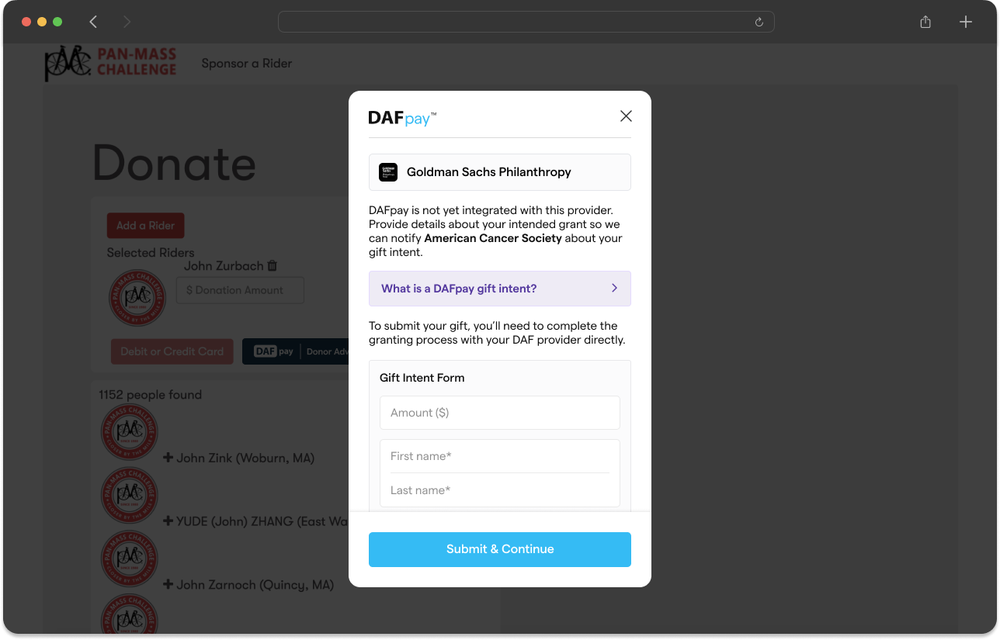
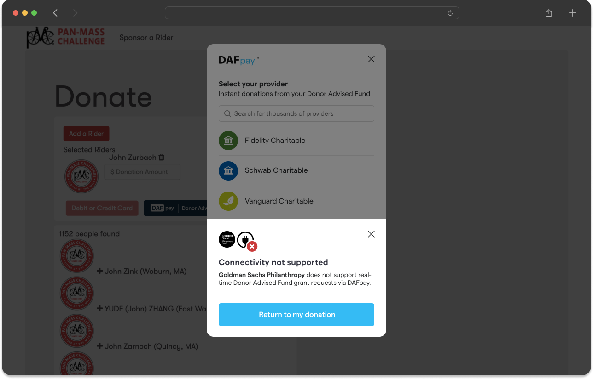
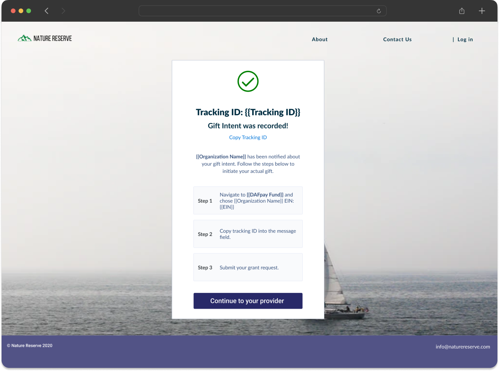
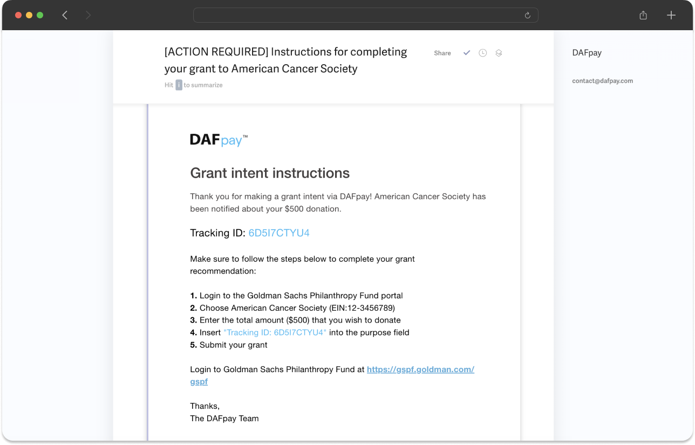

Some DAF providers cannot accept a Grant directly through DAFpay. Choose one behavior in your [Connect configuration](/guides/dafpay/accept/connect-configuration):

1. Return the donor to your form to choose another payment method.
2. Record the donor's intent and help them complete the Grant in the provider's portal.

The second option does not produce a completed DAFpay Grant. Keep the platform transaction in an unconfirmed state unless later evidence shows that the gift was made.

<Frame caption="Left: record the donor's intent. Right: return the donor to your form to pick another payment method.">
    
    
</Frame>

## How the confirmation arrives

Confirming an unintegrated Grant is delivered as a `CHARIOT_EXIT` event with the reason `UNINTEGRATED_GRANT_CONFIRMED`, not as `CHARIOT_SUCCESS`. Handle it in your exit listener even though the donor completed the step.

Chariot creates the Unintegrated Grant record itself when that event fires. There is no endpoint for you to call, and none is needed. You read Unintegrated Grants and subscribe to their events; you never create one.

## What the event carries

The exit event's `detail` carries the Unintegrated Grant that Chariot just created, so everything your confirmation page needs is already in hand:

```json
{
  "reason": "UNINTEGRATED_GRANT_CONFIRMED",
  "workflowSessionId": "79e772be-547d-4c9c-8b76-4ac4ed4c441a",
  "unintegratedGrant": {
    "id": "67d66b89-51a0-4f17-a7b3-18c5dbac5361",
    "workflowSessionId": "79e772be-547d-4c9c-8b76-4ac4ed4c441a",
    "trackingId": "7H2KNQ4R",
    "amount": 25000,
    "fundId": "bbf485dd-a056-4a9d-89a8-06e201cdbf7f",
    "firstName": "Michael",
    "lastName": "Scott",
    "email": "michael@example.org",
    "metadata": { "platformTransactionId": "txn_123" },
    "fund": {
      "id": "bbf485dd-a056-4a9d-89a8-06e201cdbf7f",
      "name": "Example Charitable",
      "redirectUrl": "https://provider.example.com/grants/new"
    }
  }
}
```

Join it to your own record on `workflowSessionId`, which you stored when the session started. Store `unintegratedGrant.id` as well, because that is the key the `unintegrated_grant.updated` events arrive on and the ID you read the record back with.

Use `fund.redirectUrl` for the provider link and `fund.name` for the provider's name rather than showing the raw `fundId`.

## Confirmation experience

When `CHARIOT_EXIT` has the reason `UNINTEGRATED_GRANT_CONFIRMED`, show:

- the nonprofit's name and EIN;
- the intended amount and designation;
- the DAF provider link; and
- the tracking ID with the `Tracking ID:` prefix and a copy control.

Tell the donor that they still need to submit the Grant through their provider and should include the complete tracking ID in the provider's note or purpose field.

<Frame caption="Unintegrated Grant confirmation page">
    
</Frame>

DAFpay also emails the donor the same instructions. Check whether Chariot's own confirmation screen is on for your Connect before you build this page: with both on the donor sees two confirmations, and with both off they leave without a tracking ID.

<Frame caption="Unintegrated Grant donor instructions email">
    
</Frame>

An Unintegrated Grant's `status` is `Unknown`, `Completed` or `Canceled`. `Unknown` is the normal resting state, not an error: the donor left DAFpay to finish the gift, so Chariot cannot confirm what happened unless the funds later arrive.

Use the unintegrated-grant resources and events in the API reference for this separate object type.

<EndpointRequestSnippet endpoint="GET /v1/unintegrated_grants" />

Next: [Displaying DAFpay Gifts](/guides/dafpay/accept/displaying-gifts)
