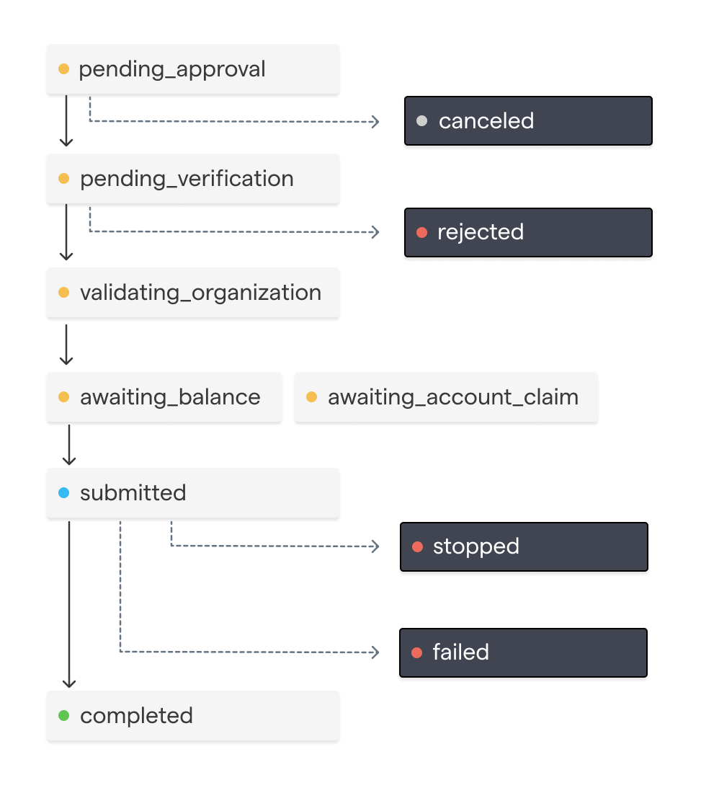
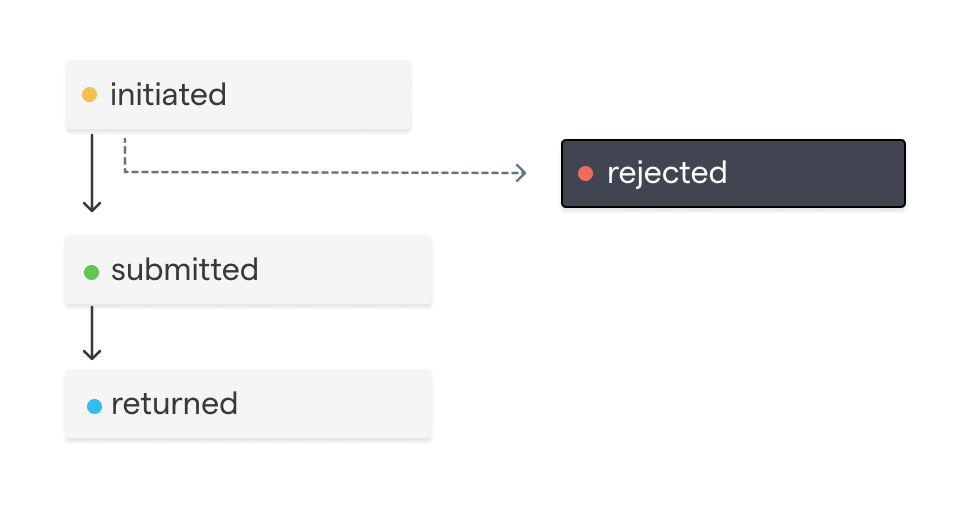
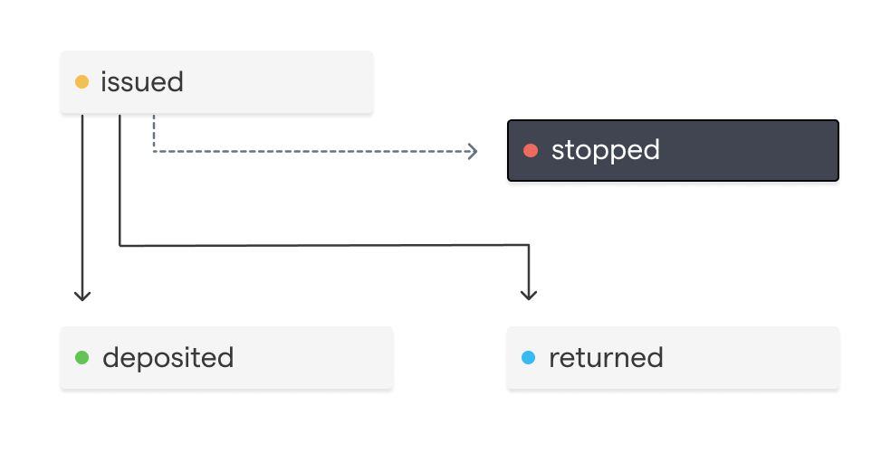

## Disbursement `Status` Lifecycle
A Disbursement's `status` represents a workflow lifecycle.

It tracks whether a Disbursement has been approved or canceled by your organization based on your organization's configured approval rules.
Additionally, it tracks if the Disbursement has been verified by the Chariot team.

Once a Disbursement's status is `submitted`, a request will be made to the preferred payment rail to initiate the payment.
A Disbursement with a `submitted` status will have at least one item in the `transfers` array.

Once a Disbursement is `submitted`, it can no longer be canceled. Instead, depending on the payment rail the disbursement may be able to be stopped.
<Frame>
    
</Frame>

 Status | Description |
|--------|-------------|
| `pending_approval` | The disbursement is awaiting approval from the grantmaker |
| `canceled` | The disbursement was canceled by the grantmaker |
| `awaiting_verification` | The disbursement is awaiting verification from Chariot |
| `rejected` | The disbursement was rejected by Chariot before being submitted|
| `validating_organization` | Validating recipient organization's payment and contact information before submission |
| `awaiting_account_claim` | The disbursement is awaiting account claim by the nonprofit or check delay expiration |
| `awaiting_balance` | The disbursement is awaiting sufficient grantmaker balance |
| `submitted` | The disbursement has been submitted to the payment rail |
| `stopped` | The disbursement payment was stopped after it was submitted |
| `completed` | The disbursement payment has been completed and funds have been received by the receiving organization |
| `failed` | The disbursement payment failed or the receiving organization did not receive the payment |

## Just-In-Time (JIT) Disbursements

Just-In-Time disbursements enable grantmakers to create and send disbursements without needing to pre-fund their <Tooltip tip={<span>Chariot is a financial technology company, not a bank. Banking services provided by Column N.A., Member FDIC. <a href="https://help.givechariot.com/onboarding/compliance-verification/chariot-deposit-accounts" target="_blank" rel="noreferrer">Full disclosure</a></span>}>Chariot Deposit Account</Tooltip>. When a disbursement with auto-funding enabled is approved, Chariot automatically creates an inbound transfer for the exact disbursement amount by immediately initiating an ACH debit.

<Note>
JIT disbursements is an optional feature that must be enabled on a per-account basis. Contact Chariot to enable this feature for your account.
</Note>

### How JIT Disbursements Work

1. **Create Disbursement**: Create a disbursement with `auto_fund` set to `true`
2. **Approval & Auto-Funding**: When the disbursement is approved (either manually or via auto-approval), Chariot automatically creates an inbound transfer for the disbursement amount
3. **Execution**: By default, the disbursement is not tied to the specific auto-funded transfer. Instead, it executes like any other disbursement when the required funds are available in your account. To reserve the auto-funded transfer for the disbursement, use a [funding earmark](#funding-earmarks)

This eliminates the need to manually manage the funding of your account for each disbursement.

### Funding Earmarks

Your account's balance is one shared pool. A JIT disbursement's funding lands in that pool, and Chariot sends disbursements as funds become available, so a smaller or newer disbursement can spend the funds before the larger disbursement they were raised for. That disbursement then waits in `awaiting_balance` until your account has enough funds again.

A funding earmark prevents this. Set `earmark_funding` to `true` alongside `auto_fund` when you [create a disbursement](/api/disbursements/create) and Chariot holds the disbursement's auto-funded transfer for that disbursement only.

```json
{
  "organization_id": "org_01jpjenf5q6cawy43yxfcrxhct",
  "amount": 5000000,
  "auto_fund": true,
  "earmark_funding": true,
  "transactions": [...]
}
```

#### How Funding Earmarks Work

1. **Hold placed**: When Chariot initiates the ACH debit for the disbursement, it places a hold on those funds.
2. **Hold takes effect**: When the ACH debit settles, the held funds are excluded from your available balance. Other disbursements and withdrawals can't spend them.
3. **Hold released**: When the disbursement's first transfer is created, the held funds pay for it and the hold is released in the same step.

An earmark never delays a disbursement. If your available balance can cover the disbursement before its ACH debit settles, the disbursement is sent from your available balance without waiting. Its hold is then released, so the debit's funds go to your available balance when they settle.

| Event | What happens to the earmark |
|-------|-----------------------------|
| The disbursement is canceled or rejected | The hold is released and the funds return to your available balance |
| The ACH debit fails or is returned | There are no funds to hold. The disbursement draws from your available balance like any other |
| The disbursement's payment is stopped or returned after it was sent | The earmark was used by the first transfer. If the disbursement is retried, it draws from your available balance like any other |

<Note>
Held funds can't be withdrawn. To return earmarked funds to your available balance, cancel the disbursement.
</Note>

## Payment Rail Lifecycle

Once a Disbursement is `submitted`, a payment is initiated through a specific payment rail. Each payment rail follows its own distinct payment lifecycle.

<AccordionGroup>
    <Accordion title="In-Network Payments">
        Payments sent from one <Tooltip tip={<span>Chariot is a financial technology company, not a bank. Banking services provided by Column N.A., Member FDIC. <a href="https://help.givechariot.com/onboarding/compliance-verification/chariot-deposit-accounts" target="_blank" rel="noreferrer">Full disclosure</a></span>}>Chariot Deposit Account</Tooltip> to another Chariot Deposit Account can be made 24 hours a day, 7 days a week and, once approved, will settle instantly.
    </Accordion>
    <Accordion title="ACH">
        ACH transfer represents a credit (push) payment using the Automated Clearing House (ACH) network.
        This transfer method is used if the receiving organization is not available for In-Network Account Transfers.
        Funds availability is typically 1-2 days.

        <Frame>
            
        </Frame>
        | Status         | Description |
        |----------------|-------------|
        | `initiated`    | The ACH transfer has been initiated and is pending submission to the Federal Reserve |
        | `rejected`     | The ACH transfer was rejected |
        | `submitted`    | The ACH transfer has been submitted to the Federal Reserve |
        | `completed`    | The ACH transfer has settled |
        | `returned`     | The ACH transfer was returned by the receiving organization |
    </Accordion>
    <Accordion title="Mailed Check">
        A check transfer represents a physical check that is mailed to the receiving organization.
        This is the transfer method used when the receiving organization does not have a Chariot account.
        <Frame>
            
        </Frame>

        | Status | Description |
        |--------|-------------|
        | `issued` | The check has been mailed and is pending delivery |
        | `stopped` | A stop payment was requested on the check |
        | `deposited` | The check has been deposited by the receiving organization |
        | `returned` | The check has been returned by the receiving organization |
    </Accordion>

</AccordionGroup>