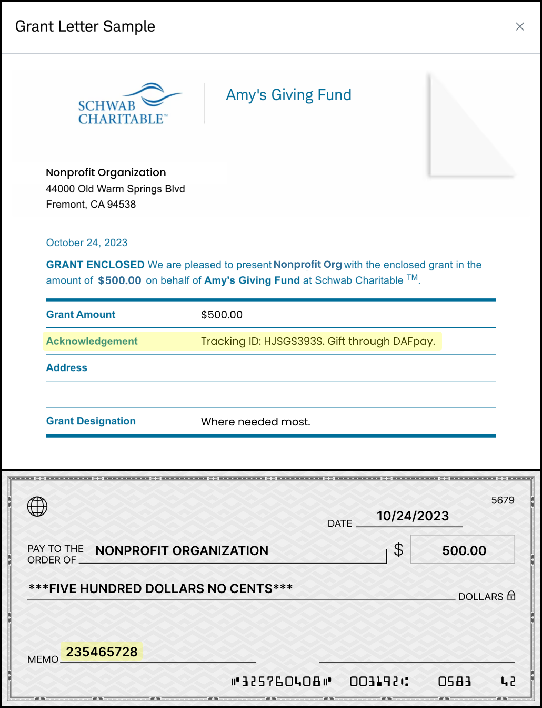
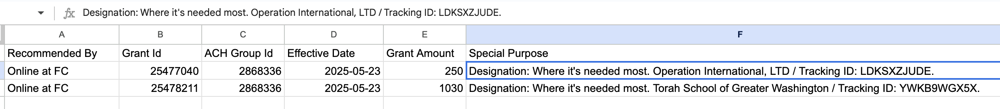

Store every Chariot identifier as soon as it becomes available. Your support team should be able to move from an incoming provider payment to the Chariot Grant and then to the platform transaction without searching only by donor name and amount.

## Identifier map

| Identifier | Created by | How to use it |
| --- | --- | --- |
| Platform transaction ID | Your platform | Locate the checkout in your system. |
| Workflow session ID | DAFpay | Connect the donor authorization to Create Grant and support logs. |
| Grant ID | Chariot | Durable API identifier returned by Create Grant. |
| Donation ID | Chariot | Connect the Grant to Chariot's Donation record when available. |
| `trackingId` | DAFpay | Match a provider payment to the DAFpay Grant. It may appear in the provider note or purpose as `Tracking ID:`. |
| `externalGrantId` | DAF provider | Match the provider's own Grant or payment record when the DAFpay tracking ID is absent. |

Make `trackingId` and `externalGrantId` searchable in your transaction and support tools.

## A gift from checkout to payment

1. Create your platform transaction against the current nonprofit record.
2. Render DAFpay using that nonprofit's Connect ID.
3. Store `workflowSessionId` on the transaction when `CHARIOT_SUCCESS` fires.
4. Call Create Grant and store the returned Grant ID.
5. Retrieve and store the Donation ID when it becomes available.
6. When the provider payment arrives, use `trackingId` to locate the Grant or Donation in Chariot.
7. Use the stored Chariot ID to find the platform transaction.

If no DAFpay tracking ID appears, try `externalGrantId`. If neither is available, fall back to the donor's fund name, amount, date, designation, and other Grant details.

## How funds arrive

DAFpay submits the request but does not hold the donor's DAF funds. Read the Grant's `paymentChannel` to know how a given gift will be paid.

| `paymentChannel` | How the funds move |
| --- | --- |
| `direct` | The DAF provider sends the funds directly to the intended recipient nonprofit, by electronic transfer or mailed check. |
| `dafpay_network` | The DAF provider sends the funds to the DAFpay Network 501(c)(3) nonprofit organization (EIN 93-1372175), which reviews and processes the grant and then sends the funds to the intended recipient. |

`paymentChannel` is read-only and set per Grant, so do not assume one route for all of a nonprofit's gifts. Because funds may pass through DAFpay Network rather than arriving straight from the provider, do not tell nonprofits that every DAFpay gift arrives directly from their donor's DAF provider.

On the `direct` channel, the provider's own remittance carries the DAFpay identifiers. These examples show where the tracking ID and the "Gift via DAFpay" callout appear in the memo, which is what your support team matches against.

<Frame caption="A check grant on the direct channel. The DAF provider pays the nonprofit; DAFpay does not handle the funds on this route.">
    
</Frame>

<Frame caption="A Fidelity grant on the direct channel, showing the same DAFpay identifiers in the provider's remittance.">
    
</Frame>

A `dafpay_network` gift does not look like this: the nonprofit receives the funds from DAFpay Network rather than from the provider, so do not build matching logic that assumes the provider's own remittance format.

Use the Grant's `fundId` with [Get DAF](/api/donor-advised-funds/get) when you need to show the provider name.

Before launch, document which status and date control platform billing, how cancellations and adjustments are handled, and which reconciliation data is available to nonprofits and support.

Next: [Grant Statuses](/guides/dafpay/gifts/statuses)
