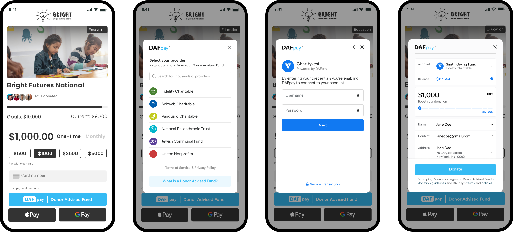

This guide is for fundraising platforms adding DAFpay on behalf of the nonprofits they serve. If you are a nonprofit putting DAFpay on your own form, start with [For Nonprofits](/guides/nonprofits).

## How it works

DAFpay handles the whole grant submission: credential verification, multi-factor authentication, error management and fee collection, for every DAF provider we support.

<Steps>

### Create a connect

Search Chariot's database for the nonprofit and create a connect. You get a Connect ID (CID) back, one per nonprofit.

### Initialize Chariot Connect

Use the CID to render the DAFpay button on the donation form.

### Capture the grant

Your backend turns the donor's authorized intent into a grant, and you query Chariot's APIs for everything Connect produced.

</Steps>

<Frame>
    
</Frame>

## Where to start

Work through the [Integration Checklist](/guides/dafpay/integrating-dafpay/checklist). Everything is built in [sandbox](/guides/dafpay/sandbox) first, and [production keys](/guides/dafpay/integrating-dafpay/prod-keys) come at the end.

## Try it out

Try the [DAFpay Demo](https://secure.dafpay.com/demo) and see what it looks like on a live form before you build anything.

## Are you a DAF provider?

If you are a Donor Advised Fund provider integrating with DAFpay (rather than a nonprofit accepting DAFpay donations), see the [Donor Accounts overview](/guides/donor-accounts/overview) for the API surface and operational flows tailored to DAFs — including manual approval, token verification, and pre-established access flows.
